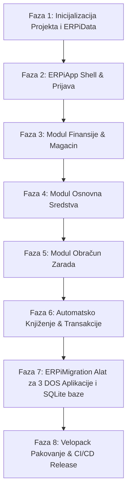

# 🚀 ERPi — Integrisani Poslovni Sistem (Finansije, Osnovna Sredstva i Zarade)

> **Jedinstveni, moderan ERP poslovni sistem** razvijen u **C# / .NET 8 / WPF / EF Core 8**, koji u jednoj aplikaciji i jedinstvenoj bazi podataka po preduzeću kombinuje sve modulske funkcionalnosti finansijskog knjigovodstva, robno-materijalnog poslovanja, e-Faktura, e-Fiskalizacije, osnovnih sredstava i obračuna zarada.

---

## 🏛️ 1. Vizija i Arhitektura Sistema

### 🌟 Glavni ciljevi integracije:
1. **Jedna baza podataka po preduzeću (`ERPi_Firma001.db`)**:
   - Menjaju se dosadašnja 3 odvojena SQLite fajla po firmi (`baza.db`, `sredstva.db`, `plata.db`).
   - Svi moduli dele jedinstvene matične podatke (Partneri, Kontni plan, Mesta troška, Korisnici).
2. **Direktno transakciono knjiženje (ACID) u realnom vremenu**:
   - Obračun zarada i amortizacija osnovnih sredstava automatski kreiraju naloge u Glavnoj knjizi unutar iste baze. Nema više izvoza i uvoza fajlova.
3. **Jedinstvena prijava (Single Sign-On)**:
   - Korisnik se prijavljuje jednom, bira aktivnu firmu i kroz moderan Sidebar vrši sve poslovne operacije.
4. **Dva puta uvoza podataka, prema stvarnom stanju svakog modula**:
   - **DOS / DBF uvoznik** iz 3 nezavisne legacy DOS aplikacije (DOS Finansije, DOS Sredstva, DOS Zarade), uz automatsko spajanje i deduplikaciju partnera i konta — dovoljan za Finansije i Sredstva, jer ta dva modula još nemaju produkcione korisnike.
   - **Direktan ERPiZarade uvoznik** (EF Core → EF Core) iz postojeće produkcione `ERPiZarade` baze — jedinog modula koji je danas stvarno u upotrebi (v1.16.0, realni radnici i isplate) — jer se ti podaci ne smeju voditi kroz DOS/DBF put.
5. **Pojednostavljen Deployment & Auto-Update**:
   - Jedinstveni instalacioni i update paket (`ERPiSetup.exe`) putem **Velopack-a**.

---

## 📁 2. Struktura Projekta (`c:\ERPi\ERPi`)

```text
c:\ERPi\ERPi\
├── ERPi.slnx                         # Solution fajl (.NET 8 Solution)
├── Directory.Build.props             # Zajedničke verzije biblioteka i konfiguracija
├── version.txt                       # Verzija izdanja (startuje od 2.0.0)
├── ANALIZA_I_PLAN.md                 # Detaljan arhitekturni plan i roadmap
├── README.md                         # Uputstvo za razvoj i korišćenje
├── publish.ps1                       # Skripta za pravljenje Velopack izdanja
│
├── ERPiApp/                          # 🚀 Glavni WPF Desktop Projekat (Executable)
│   ├── Views/
│   │   ├── Shell/                    # MainWindow.xaml (Glavni prozor sa Sidebar-om)
│   │   ├── Auth/                     # LoginWindow.xaml (Prijava)
│   │   ├── Firma/                    # CompanySelectWindow.xaml (Izbor aktivne firme)
│   │   ├── Dashboard/                # Radna tabla sa konsolidovanom statistikom
│   │   ├── Finansije/                # Glavna knjiga, konta, nalozi, partneri, bilansi
│   │   ├── Magacin/                  # Robno/materijalno, kalkulacije, nivelacije, fakture
│   │   ├── SefPfr/                   # SEF e-Fakture (UBL 2.1) i e-Fiskalizacija (PFR)
│   │   ├── Sredstva/                 # Osnovna sredstva, kartice, amortizacija, popis, bar-kodovi
│   │   ├── Zarade/                   # Radnici, radni sati, isplate, ugovori, virmani, PPP-PD
│   │   └── Podesavanja/              # Backup/Restore, podešavanja firme i UvozWizardView.xaml
│   └── Services/                     # Navigation, PDF Report, Print, Auto-Update servisi
│
├── ERPiData/                         # 🗄️ Data Access Layer (EF Core 8)
│   ├── ErpiDbContext.cs              # Objedinjeni DbContext
│   ├── Models/                       # Svi entiteti (Core, Finansije, Sredstva, Zarade)
│   └── Migrations/                   # EF Core migracije za jedinstvenu bazu
│
├── ERPiData.Tests/                   # 🧪 Unit i integracioni testovi (xUnit)
└── ERPiMigration/                    # 🔄 Objedinjeni alat za migraciju
    ├── Parsers/                      # Binarni dBase III parser (Latin1 / YUSCII / CP852)
    ├── Importers/
    │   ├── DosFinansijeImporter.cs   # Uvoznik iz DOS Finansija (KORxx) — nema produkcionih podataka
    │   ├── DosSredstvaImporter.cs    # Uvoznik iz DOS Osnovnih Sredstava — nema produkcionih podataka
    │   ├── DosZaradeImporter.cs      # Uvoznik iz DOS Obračuna Zarada (za nove firme bez postojeće ERPiZarade baze)
    │   └── ErpiZaradeProdukcijaImporter.cs  # EF Core → EF Core prenos iz POSTOJEĆE produkcione ERPiZarade
    │                                        # SQLite baze (PlataDbContext, v1.16.0) u novu ERPi bazu — jedini
    │                                        # modul sa stvarnim produkcionim podacima danas.
    └── DosImportFacade.cs            # Glavna fasada koja koordiniše sve uvoze
```

---

## 📊 3. Shema Podataka (Model Baze)

### A. Matični podaci (Core Schema)
* **`Firme`**: Naziv, PIB, MB, žiro računi, adresa, JBKJS, SEF API parametre, PFR parametri.
* **`Korisnici`**: Korisničko ime, PBKDF2 osoljeni heš lozinke, uloga (`Administrator` / `Operater`), aktivnost.
* **`Partneri`**: Objedinjena tabela partnera — dobavljači, kupci, radnici (fizička lica), banke, Poreska uprava. Sadrži PIB, MB, JMBG, žiro račune, tekuće račune.
* **`Konta`**: Jedinstveni kontni plan preduzeća (sintetika i analitika).
* **`MestaTroska`**: Mesta troška za analitiku rashoda.

### B. Finansije & Magacin (FIN & MAT/ROB)
* **`Nalozi` & `StavkeNaloga`**: Dnevnik glavne knjige sa živom proverom ravnoteže i stanjem naloga (`Nacrt`, `Proknjižen`).
* **`Magacini` & `Artikli`**: Šifarnik magacina i artikala po prosečnoj nabavnoj ceni.
* **`Kalkulacije` & `StavkeKalkulacije`**: Ulazne veleprodajne i maloprodajne kalkulacije (ROB1-ROB3, MAT1-MAT7).
* **`RacuniOtpremnice` & `Nivelacije`**: Izlazni računi, predračuni i nivelacije cena.
* **`PdvPrijave` & `POPdvStavke`**: KIR, KPR i ePorezi PP-PDV XML generisanje.
* **`DokumentiDMS`**: Skenirani ugovori i PDF prilazi uz naloge i fakture.

### C. Osnovna Sredstva (OS)
* **`Sredstva` & `KarticeSredstava`**: Osnovna sredstva, nabavna/otpisana/sadašnja vrednost po MRS 16.
* **`AmortizacioneGrupe`**: Poreske grupe I–V sa zakoniskim stopama (Obrazac OA).
* **`Popisi` & `PopisneKomisije`**: Godišnji popisi, viškovi/manjkovi i generisanje popisnih listi.

### D. Obračun Zarada (ZARADE)
* **`Radnici`**: Matični podaci o zaposlenom, koeficijenti, ugovorene zarade.
* **`Isplate` & `StavkeIsplata`**: Obračunatske liste zarada po mesecima i isplatama.
* **`RadniSati`**: Redovni, prekovremeni, noćni rad, bolovanja, godišnji odmori.
* **`Ugovori`**: Ugovori van radnog odnosa (delo, autorski, privremeni/povremeni).
* **`Olaksice`**: Poreske olakšice (čl. 21c, 21d, itd.).

---

## 📦 4. Objedinjeni DOS / DBF Uvoz i Migracija (Legacy Migration Engine)

U dosadašnjim projektima postojala su tri nezavisna migratora (`ERPiFinansijeMigration`, `ERPiSredstvaMigration`, `ERPiZaradeMigration`), jer su stari podaci dolazili iz **tri odvojene DOS aplikacije**. 

U novom **`ERPi`** sistemu, uvođenje podataka iz DOS/Clipper-a objedinjeno je u podfleksibilan interfejs u modul **`ERPiMigration`** (`DosImportFacade.cs`).

> Sistem je trenutno u fazi testiranja, **osim modula Zarade** — `ERPiZarade` je jedini u
> stvarnoj produkciji (v1.16.0, realni radnici i isplate). Finansije i Sredstva nemaju
> produkcione podatke, pa je za njih dovoljan DOS import. Za Zarade postoji **dodatni, direktan
> put uvoza** iz postojeće produkcione SQLite baze (`PlataDbContext`) — ne preko DOS/DBF-a, nego
> EF Core → EF Core prenosom, da se ne izgubi ništa od modela koji tamo već postoji (npr. rod
> isplate `Zarada` / `VanRadnogOdnosa` za PPP-PD, verzije obračuna, audit).

### ⚙️ Dva puta uvoza podataka

**A. DOS / DBF import** (Finansije, Sredstva, i Zarade za nove firme bez postojeće ERPi baze) —
direktno iz 3 DOS aplikacije (po putanjama foldera):
- Korisnik u interfejsu može po želji selektovati 1, 2 ili sve 3 putanje odvojenih DOS aplikacija na disku:
  - **Putanja DOS Finansije**: npr. `C:\KNJIGE\FINANSIJE\KOR01` (Čita `KONTNI.DBF`, `NALOGI.DBF`, `PARTNERI.DBF`, `MATERIJA.DBF`, `MAGACIN.DBF`, `ULAZI.DBF`, `TREBOV.DBF`...).
  - **Putanja DOS Osnovna Sredstva**: npr. `C:\KNJIGE\SREDS\KOR01` (Čita `OSNOVNA.DBF`, `KARTICE.DBF`, `AMORTIZ.DBF`, `DOBAVLJ.DBF`...).
  - **Putanja DOS Obračun Zarada**: npr. `C:\KNJIGE\ZARADE\KOR01` (Čita `RADNICII.DBF`, `RADNICI.DBF`, `OBRACUNI.DBF`, `RAD_SATI.DBF`, `POREZII.DBF`, `BANKEI.DBF`, `SAMODOP.DBF`, `KORISNIC.DBF`...).
- **Smart Cross-Module Deduplikacija Partnera i Konta**: Prilikom uvoza iz 3 odvojene DOS aplikacije, uvoznik u memoriji vrši mapiranje:
  - Spaja partnere iz DOS Finansija, DOS Sredstava i DOS Zarada prema **PIB-u**, **JMBG-u** ili **Matičnom broju** u **jedan jedinstveni zapis** u novoj tabeli `Partneri`.
  - Spaja šifarnike konta prema broju konta u jedinstvenu tabelu `Konta`.

**B. Produkcioni ERPiZarade import** (`ErpiZaradeProdukcijaImporter.cs`) — za firme koje već
rade u živoj `ERPiZarade` aplikaciji:
- Korisnik bira putanju do postojeće `plata.db` (ili je aplikacija sama pronalazi po istoj logici
  kojom je danas nalazi `ERPiHub`).
- Uvoznik otvara staru bazu preko **postojećeg** `PlataDbContext` (iz `ERPiZaradeData`, referenciran
  kao zavisnost projekta, ne prepisivan) i prenosi entitete 1:1 u novu ERPi bazu:
  - `Radnik` → `Radnici` (zadržava period-verzionisanje po Godina/Mesec).
  - `Isplata`/`ObracunPlate`/`Ugovor`/`ObracunVerzija`/`ObracunAudit` → odgovarajuće nove tabele,
    bez gubitka `RodIsplate` (Zarada / VanRadnogOdnosa) niti audit istorije.
  - `Firma`/`Korisnik` iz Zarade se **spajaju** sa (bogatijim) `Firma`/`Korisnik` iz Finansija po
    PIB-u — Finansije nose SEF/PFR polja koja Zarade nema, pa taj zapis „pobeđuje" gde postoji.
  - `KontoKnjizenja.Konto` (danas string) se pri uvozu **razrešava u pravi strani ključ** ka
    novoj `Konta` tabeli — ovo je i mesto gde uvoz prvi put stvarno ostvaruje ono zbog čega se
    baze i spajaju (Faza 6, automatsko knjiženje).
- Ovo je **jedini** deo uvoznog alata koji dira stvarne, žive korisničke podatke — zato ide uz
  probni uvoz u kopiju baze i vizuelni izveštaj razlika pre potvrde, ne direktno prepisivanje.

### 🖥️ UI Čarobnjak u Aplikaciji (`UvozWizardView.xaml`):
U tabu **`Podešavanja -> Uvoz Podataka`** ugrađen je vizuelni čarobnjak koji omogućava izbor sve tri DOS aplikacije odjednom ili pojedinačno:

```text
┌────────────────────────────────────────────────────────────────────────┐
│  📥 Uvoz podataka iz starih DOS / Clipper aplikacija                   │
├────────────────────────────────────────────────────────────────────────┤
│                                                                        │
│  [x] DOS Finansije & Magacin:                                          │
│      Putanja: [ C:\KNJIGE\FINANSIJE\KOR01                 ] [ Pretraži ]│
│                                                                        │
│  [x] DOS Osnovna Sredstva:                                             │
│      Putanja: [ C:\KNJIGE\SREDS\KOR01                     ] [ Pretraži ]│
│                                                                        │
│  [x] DOS Obračun Zarada:                                               │
│      Putanja: [ C:\KNJIGE\ZARADE\KOR01                    ] [ Pretraži ]│
│                                                                        │
│ ────────────────────────────────────────────────────────────────────── │
│  Statistika pronađenih podataka:                                       │
│  • Finansije: 1.250 naloga, 340 konta, 180 partnera                   │
│  • Osnovna sredstva: 450 kartica opreme                                │
│  • Zarade: 35 zaposlenih, 12 obračunskih perioda                      │
│ ────────────────────────────────────────────────────────────────────── │
│                                                                        │
│  [ 🔍 Analiziraj Putanje ]            [ ⚡ Pokreni Objedinjeni Uvoz ]   │
│                                                                        │
└────────────────────────────────────────────────────────────────────────┘
```

---

## 🗺️ 5. Fazni Roadmap Implementacije



### 📋 Detaljan opis faza:

#### 🔹 Faza 1: Inicijalizacija Rešenja i Data Sloja
- Kreiranje `.slnx` strukture u `c:\ERPi\ERPi`.
- Izrada `ERPiData` projekta sa `ErpiDbContext.cs`.
- Definisanje core entiteta (`Firma`, `Korisnik`, `Partner`, `Konto`, `MestoTroska`).
- Generisanje početne EF Core migracije.

#### 🔹 Faza 2: WPF Shell & Prijava
- Izrada modernog `MainWindow.xaml` sa levo pozicioniranim Sidebar-om i gornjom trakom sa podacima o aktivnoj firmi.
- Izrada ekrana za prijavu korisnika (`LoginWindow`) i izbor firme (`CompanySelectWindow`).

#### 🔹 Faza 3: Integracija Finansija i Magacina
- Preuzimanje i prilagođavanje Views/Services iz `ERPiFinansije`:
  - Glavna knjiga, kontni plan, nalozi, kartice konta.
  - Partneri (IOS, otvorene stavke, kamate).
  - Robno i materijalno poslovanje (kalkulacije, nivelacije, fakture).
  - SEF e-Fakture (UBL 2.1 XML API) i e-Fiskalizacija (PFR).
  - PDV evidencija i PP-PDV XML izvoz.

#### 🔹 Faza 4: Integracija Osnovnih Sredstava
- Preuzimanje i prilagođavanje Views/Services iz `ERPiSredstva`:
  - Kartice osnovnih sredstava.
  - Računovodstvena (MRS 16) i poreska (OA) amortizacija.
  - Revalorizacija i popisne komisije.
  - Generisanje bar-kod nalepnica (ZXing.Net).

#### 🔹 Faza 5: Integracija Obračuna Zarada
- Preuzimanje i prilagođavanje Views/Services iz `ERPiZarade`:
  - Matična evidencija radnika i radni sati.
  - Obračun plata i ugovora van radnog odnosa.
  - Generisanje šifrovanih PDF platnih listića.
  - Virmani za banke (Halcom TXT / ePP JSON) i PPP-PD XML za Poresku upravu.

#### 🔹 Faza 6: Unutrašnja Transakciona Integracija
- Povezivanje direktnog automatskog knjiženja:
  - Zaključenje isplate zarade direktno kreira nalog knjiženja u tabeli `Nalozi` unutar `ErpiDbContext`.
  - Zaključenje amortizacije direktno kreira nalog u Glavnoj knjizi.

#### 🔹 Faza 7: Objedinjeni ERPiMigration Alat
- Razvoj `DosFinansijeImporter.cs`, `DosSredstvaImporter.cs`, `DosZaradeImporter.cs` i koordinatora `DosImportFacade.cs`.
- Automatsko spajanje partnera i konta iz 3 DOS direktorijuma po PIB-u / JMBG-u.
- Razvoj `ErpiZaradeProdukcijaImporter.cs` — direktan EF Core → EF Core prenos iz **postojeće
  produkcione** `ERPiZarade` baze (jedini modul sa realnim korisnicima danas), sa probnim uvozom
  i izveštajem razlika pre potvrde.
- Izrada UI čarobnjaka `UvozWizardView.xaml` u tabu Podešavanja: 3 polja za DOS putanje + posebna
  opcija „Uvezi iz postojeće ERPiZarade instalacije".
- *(Bez posebnog uvoznika za v1.x SQLite baze Finansija/Sredstava — ti moduli su u fazi
  testiranja, pa je za njih DOS import jedini potreban put.)*

#### 🔹 Faza 8: Pakovanje i Ažuriranje
- Konfigurisati Velopack za automatsko ažuriranje sa GitHub Releases.
- Pisanje `publish.ps1` skripte za lansiranje verzije 2.0.0.

---

## 🛠️ Tehnički Stog

| Komponenta | Tehnologija |
| :--- | :--- |
| **Framework** | .NET 8.0 / C# 12 |
| **UI Okvir** | WPF (Windows Presentation Foundation) |
| **Baza Podataka** | SQLite (po jedna baza po firmi) / Opciono PostgreSQL |
| **ORM** | Entity Framework Core 8 |
| **Legacy DBF Parser** | Sopstveni binarni dBase III parser (Latin1 / YUSCII / CP852) |
| **Izveštaji / PDF** | QuestPDF |
| **Excel Izvoz** | ClosedXML |
| **Bar-kodovi** | ZXing.Net |
| **Pakovanje / Update** | Velopack |
| **Testiranje** | xUnit |
