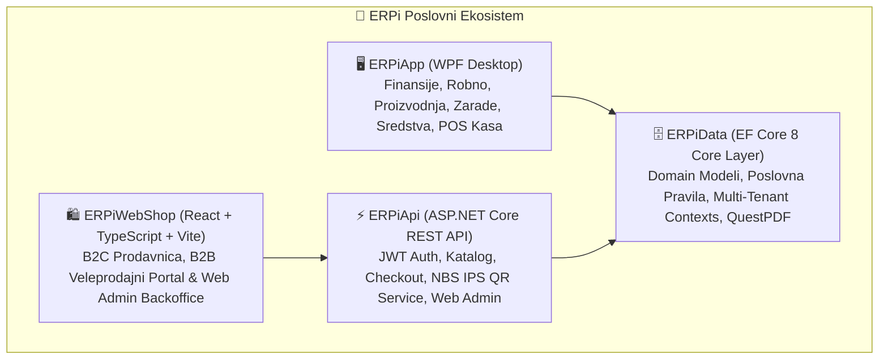
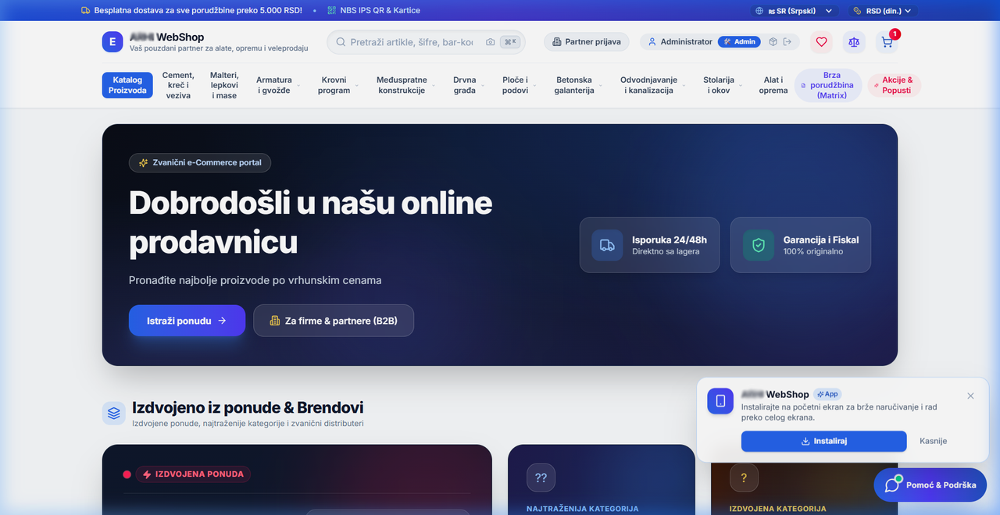
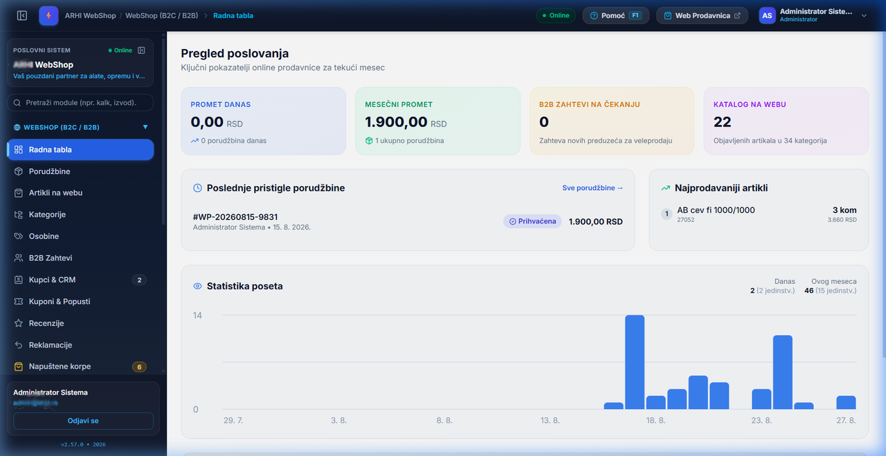

<div align="center">

# ⚡ ERPi Enterprise Business Suite
### Celoviti, Hibridni Poslovni Informacioni Sistem & e-Commerce Platforma

[](CHANGELOG.md)
[](https://dotnet.microsoft.com/)
[](ERPiApp)
[](ERPiWebShop)
[](README.md#-projekat-u-brojkama--inženjerska-metrika)
[](docs/ARCHITECTURE.md)
[-10B981.svg?style=for-the-badge&logo=checkmarx&logoColor=white)](ERPiData.Tests)
[](https://github.com/blagojevicboban/ERPi/releases)

<p align="center">
  <strong>Objedinjeno finansijsko i materijalno knjigovodstvo, robno poslovanje, proizvodnja, obračun zarada, osnovna sredstva, SEF e-Fakture, e-Fiskalizacija i omni-channel B2C / B2B WebShop.</strong>
</p>

<p align="center">
  
</p>
<p align="center">
  <sub>🎬 <a href="docs/showreel/erpi-master-showreel.webm">Pun kvalitet (video, .webm)</a> — GitHub ne pušta autoplay na &lt;video&gt; tagu, GIF iznad radi svuda.</sub>
</p>

[Metrika Projekta](#-projekat-u-brojkama--inženjerska-metrika) • [Ključni Moduli](#-ključni-moduli-sistema) • [Arhitektura](#-arhitektura-i-tehnologije) • [WebShop & B2B](#-integrisani-webshop--b2b-portal) • [Vizuelni Prikaz](#-korisnički-interfejs-i-vizuelni-prikaz) • [Baze Podataka](#-multi-dbms-i-mrežni-rad) • [Dokumentacija](#-tehnička-dokumentacija)

</div>

---

## 📊 Projekat u Brojkama & Inženjerska Metrika

<div align="center">

| 📏 Obim Koda | 🗄️ Baza Podataka | 🖥️ Desktop Klijent | 🌐 Web & API | 🧪 Kvalitet & Testovi |
| :---: | :---: | :---: | :---: | :---: |
| **~400.000**<br/><sub>linija ručno pisanog koda</sub> | **120+ Modela**<br/><sub>91 EF migracija</sub> | **211 Ekrana**<br/><sub>WPF prozori i dijalozi</sub> | **34 Kontrolera**<br/><sub>276 React komponenti</sub> | **2.254 Testa**<br/><sub>100% prolaznost</sub> |

</div>

<br/>

### 🔍 Tehnološka i Arhitektonska Struktura Koda

```
┌──────────────────────────────────────────────────────────────────────────────────────────┐
│  UKUPAN KODNI SKLOP:  ~400.000 LOC ručno pisanog koda  •  1.950+ Fajlova  •  68 Verzija  │
└──────────────────────────────────────────────────────────────────────────────────────────┘
```

<sub>Metrika broji ručno pisan kod; ~90 EF Core `*Designer.cs` / `ModelSnapshot.cs` (generisano) nije uračunato.</sub>

| Tehnološki Sloj | Datoteke | Linije Koda (LOC) | Ključne Odlike i Komponente |
| :--- | :---: | :---: | :--- |
| **Backend & Poslovna Logika (C#)** | `629` | **140.700** | .NET 8, EF Core 8, 135 servisa, SEF UBL 2.1, EPP, SUF QR, WMS, MRP, AI NLP, 44 QuestPDF šablona |
| **WebShop & Web Backoffice (TSX/TS)** | `317` | **96.200** | React 18, Vite, TypeScript, Tailwind CSS v4, WMS, Manifesti, Marketplace, AI chat |
| **Desktop Korisnički Interfejs (C# + XAML)** | `494` | **94.100** | WPF, code-behind (bez MVVM), brzi unos na tastaturi, napredni gridovi, svetla i tamna tema |
| **Testni Suite (.NET + React)** | `220` | **46.400** | 2.254 automatizovana testa (1.931 xUnit .NET + 323 Vitest/React) |
| **Integrisana Pomoć & Dokumentacija** | `40+` | **20.000+** | F1 HTML kontekstualna pomoć (6 vodiča), 15+ internih `docs/` vodiča, arhitektonska specifikacija |
| **Konfiguracija & Skripte** | `20+` | **7.500+** | Multi-DBMS šeme (SQLite, PostgreSQL, MS SQL), Velopack deployment, CI skripte |

<br/>

### 🏛️ Arhitektonski Elementi & Sistemske Komponente

| Arhitektonski element | Količina | Opis i nivo zrelosti |
| :--- | :---: | :--- |
| **Baza podataka / EF Modeli** | **120+ modela** | Kompletan relacioni domen (Finansije, Zarade, Sredstva, Robno, Proizvodnja, WebShop, Kasa) |
| **EF Core Migracije** | **91 migracija** | Dvosmerna podrška: SQLite, PostgreSQL, Microsoft SQL Server |
| **REST API Kontroleri** | **34 kontrolera** | Skalabilan ASP.NET Core REST backend za WebShop, integracije i mobilne klijente |
| **Poslovni servisi (Services)** | **135 servisa** | Poslovna logika: obračuni zarada, amortizacija, lager, SEF, SUF, NBS, porezi, EFT POS |
| **WPF Pogledi & Dijalozi** | **211 prozora** | Brzi desktop ERP klijent sa prečicama, naprednim gridovima i pretragama |
| **WebShop & Web Strane** | **276 komponenti** | React 18 + TypeScript, Tailwind v4, REST klijent, B2B korpa i katalog |
| **QuestPDF Izveštaji** | **44 dokumenta** | Vektorski PDF-ovi: Fakture, Nalozi za knjiženje, KEP, Isplatni listići, Popisne liste |

---

## 🌟 Zašto ERPi?

**ERPi** je projektovan od nule kao savremena alternativa zastarelim legacy knjigovodstvenim softverima. Pruža maksimalnu ergonomiju i brzinu rada na tastaturi (F1–F12 prečice, automatski fokus, lookup modali), intuitivan vizuelni doživljaj u tamnom i svetlom režimu, robusnu višekorisničku pouzdanost i 100% usaglašenost sa propisima Republike Srbije:
- **Zakon o računovodstvu i MRS/MSFI** (kontni plan, automatsko dvojno knjiženje, zaključni list, bruto bilans, bilans stanja i uspeha).
- **Zakon o elektronskom fakturisanju (SEF)** — dvosmerna UBL 2.1 integracija, masovno slanje, automatsko preuzimanje i knjiženje ulaznih e-faktura.
- **Zakon o fiskalizaciji** — sertifikovan ESIR sa podrškom za lokalni (L-PFR) i virtuelni (V-PFR) procesor, simulator kase i termalnu štampu (ESC/POS).
- **Zakon o porezu na dodatu vrednost (PDV)** — automatska evidencija prethodnog i izlaznog poreza, POPDV, KIR i KPR obrasci.
- **Zakon o radu i e-Porezi** — obračun zarada i ugovora van radnog odnosa, automatsko generisanje zvaničnih **PPP-PD** i **PPP-PO** XML datoteka.



---

## 🏢 Ključni Moduli Sistema

<div align="center">

| Modul | Ikona | Opis & Ključne Funkcionalnosti |
| :--- | :---: | :--- |
| **Glavna Knjiga & Finansije** | 📊 | Dvojno knjigovodstvo, automatsko kontiranje, masovno proknjižavanje i rasknjižavanje selekcije, IOS obrasci sa e-mail slanjem, zatvaranje otvorenih stavki, kamatni obračun, devizno valviranje, bruto bilans i finansijski izveštaji. |
| **Robno i Materijalno** | 📦 | Veleprodajne i maloprodajne kalkulacije, uvozni troškovi i zavisni troškovi nabavke, nivelacije cena, KEP knjiga, kartice robe/materijala, trebovanja, međumagacinski transferi, računi-otpremnice i e-Transport. |
| **WebShop & B2B Portal** | 🌐 | Omni-channel internet prodavnica sa **NBS IPS QR** plaćanjem, **3D Secure** karticama, **SMS/Viber** notifikacijama, marketing automatizacijom (napuštene korpe), paketima/setovima artikala, B2B partnerskim cenovnicima i 1-klik fakturisanjem. |
| **CMS & Brending** | 🎨 | Vizuelno prilagođavanje web prodavnice direktno u WebShop administraciji: boje teme, slogani, hero baneri, promotivne trake, cenovnici dostave i pragovi besplatne isporuke. |
| **Proizvodnja & Radni Nalozi** | 🏭 | Sastavnice (BOM) sa normativima, tehnološke faze i operacije, radni nalozi, automatsko razduženje sirovina i zaduženje gotovih proizvoda, automatsko kontiranje u Glavnu knjigu. Obračun cene koštanja po **stvarnom** trošku (materijal, rad, mašinski rad, režija). |
| **Obračun Zarada & HR** | 👥 | Evidencija zaposlenih i ugovora (radni odnos, ugovor o delu, autorski, PP poslovi), automatski obračun poreza i doprinosa, generisanje zvaničnih XML fajlova za Poresku upravu (**PPP-PD** / **PPP-PO**), šabloni ugovora sa PDF štampom i isplatni listići. |
| **Osnovna Sredstva** | 🏗️ | Šifarnik opreme i nekretnina, računovodstvena (MRS 16) i poreska amortizacija (čl. 10b, Obrazac OA/PB-1), godišnji popis sa bar-kod skenerima, reversi, rashodovanja i automatsko knjiženje. |
| **SEF e-Fakture & e-Otpremnice** | ⚡ | Direktna dvosmerna integracija sa SEF portalom (UBL 2.1), masovno slanje i preuzimanje faktura, e-Transport otpremnice sa prevoznicima i automatsko evidentiranje poreza. |
| **Maloprodajna Kasa (POS)** | 🧾 | ESIR kasa usklađena sa **PFR v3 protokolom** Poreske uprave (L-PFR i V-PFR), brza pretraga artikala, barkod skeneri, vagana roba, refundacije, smene, pazar i direktna ESC/POS termalna štampa. **EFT POS PinPad** naplata karticom po ECR protokolu (Ingenico / Nexgo / Castles) — iznos ide na terminal, račun se ne izdaje dok banka ne odobri. Ugrađeni lokalni PFR i EFT POS simulatori za obuku osoblja. |
| **Izvodi Banke & Auto-Knjiženje** | 🏦 | Automatski uvoz i parsiranje elektronskih izvoda (Halcom, Asseco, Pexim), automatsko prepoznavanje partnera po PIB/računu i automatsko zatvaranje otvorenih stavki u Glavnoj knjizi. |
| **DMS & PDF Izveštaji** | 📄 | Digitalna arhiva dokumenata i priloga uz naloge i artikle, profesionalni PDF izveštaji generisani putem **QuestPDF** endžina sa ugrađenim NBS IPS QR kodom. |

</div>

---

## 🌐 Integrisani WebShop & B2B Portal

ERPi sadrži kompletan e-Commerce podsistem koji radi direktno nad centralnom ERP bazom podataka bez potrebe za eksternim sinhronizatorima:

```
                                  ┌───────────────────────────┐
                                  │   ERPiWebShop (React)     │
                                  └─────────────┬─────────────┘
                                                │
                      ┌──────────────────────────┴──────────────────────────┐
                      ▼                                                     ▼
         🛍️ B2C Maloprodaja                                    🏢 B2B Veleprodajni Portal
   • Responzivni katalog sa fasetiranim filterima       • Prikaz ugovorenih partnerskih cena bez PDV-a
   • Dinamičko stablo kategorija sa auto-scrollom       • Registracija i odobravanje B2B partnera
   • 🎁 Paketi i setovi artikala sa uštedom             • Uvid u otvorene stavke, dospeća i limite
   • ⚡ Ekspresna kupovina „Kupi odmah” (1-klik)        • 📄 Preuzimanje PDF e-Faktura & IOS obrazaca
   • 🔔 Obaveštenja o zalihi („Back-in-Stock”)          • Quick Order masovni tabelarni unos šifara
   • 📱 NBS IPS QR Instant plaćanje telefonom           • 🔄 Re-order (ponavljanje prethodnih porudžbina)
   • 💳 3D Secure 2.0 kartično plaćanje                 • Direktan prenos porudžbine u Račun-Otpremnicu
   • 🛒 Praćenje i oporavak napuštenih korpi            • Automatska kontrola kreditnog limita
   • 🚚 Integracija sa kurirskim službama               • Instant generisanje PDF predračuna
   • 📢 Marketing XML feedovi (Google/Meta/ePonuda)     • 📦 Magacinski nalozi za pakovanje robe (Pick-list)
```

---

## 🗄️ Multi-DBMS i Mrežni Rad

ERPi omogućava fleksibilan izbor baze podataka prilagođen infrastrukturi preduzeća:

| Provajder | Režim Rada | Karakteristike |
| :--- | :--- | :--- |
| **SQLite** | 🏠 Lokalno / Jedan računar | Nulta konfiguracija. Baza je jedan fajl unutar `%LocalAppData%\ERPi\Baze\*.db`. Idealan za prenosivost na USB i brzi backup. |
| **Microsoft SQL Server** | 🏢 Lokalna Mreža (LAN) | Puna podrška za SQL Server 2019/2022 (Express, Standard). Ugrađen instalacioni servis i automatsko podešavanje firewall portova. |
| **PostgreSQL** | 🌐 Cloud / Dedicated Server | Skalabilno rešenje za višekorisničke serverske instalacije, remote lokacije i Linux hosting. |
| **Mrežna Radna Stanica** | 💻 Klijentski režim | 1-klik povezivanje radnih stanica u magacinu/kancelarijama na centralni ERPi server. |

---

## 🛠️ Arhitektura Rešenja

```
ERPi Solution (ERPi.slnx)
 ├── 🖥️ ERPiApp          → WPF Desktop aplikacija (.NET 8 Windows, XAML, code-behind)
 ├── ⚡ ERPiApi          → ASP.NET Core 8 Web API (JWT Bearer, REST, Swagger, NBS IPS QR)
 ├── 🛍️ ERPiWebShop      → React 18 + TypeScript + Vite + Tailwind CSS v4 (Storefront & Admin)
 ├── 🗄️ ERPiData         → EF Core 8 biblioteka sa domain modelima, servisima i QuestPDF štampom
 ├── 🔄 ERPiMigration    → Uvoznik starih Clipper/FoxPro DBF baza (CP852 kodni raspored)
 └── 🧪 ERPiData.Tests   → xUnit automatizovani testovi (1.931 backend testova prolazi)
```

## 📸 Korisnički Interfejs i Vizuelni Prikaz

<div align="center">

### 🛍️ ERPi WebShop & B2B Veleprodajni Portal
<p align="center">
  <em>Moderan, ultra-brz React 18 + Tailwind B2C WebShop i B2B portal sa integrisanim platnim metodama (NBS IPS QR, Kartice) i live sinhronizacijom zaliha.</em>
</p>



<br/><br/>

### ⚙️ ERPi Web Admin Backoffice
<p align="center">
  <em>Centralizovana Web administracija za upravljanje katalozima, porudžbinama, partnerskim cenovnicima, marketing banerima i CMS podešavanjima.</em>
</p>



</div>

---

## 📚 Tehnička Dokumentacija

Za detaljnije vodiče pogledajte dokumentaciju u direktorijumu `docs/`:

- 🖥️ **[Sistemski zahtevi](docs/SYSTEM_REQUIREMENTS.md)** — OS, CPU, RAM i prostor na disku za radno mesto i server.
- 🏗️ **[Arhitektura sistema i baze podataka](docs/ARCHITECTURE.md)** — Slojno razdvajanje, konekcije i EF Core šeme.
- 🌐 **[WebShop Vodič & NBS IPS QR](docs/WEBSHOP.md)** — Integracija B2C prodavnice, B2B portala i plaćanja.
- 📋 **[Plan nastavka](PLAN_NASTAVKA.md)** — Pregled stanja i roadmap preostalih funkcionalnosti.
- 📝 **[Istorija izmena (Changelog)](CHANGELOG.md)** — Detaljan pregled svih verzija po datumima.

---

<div align="center">

**ERPi — Pouzdan temelj modernog poslovanja.**  
© 2026 ERPi Team. Sva prava zadržana.

</div>
