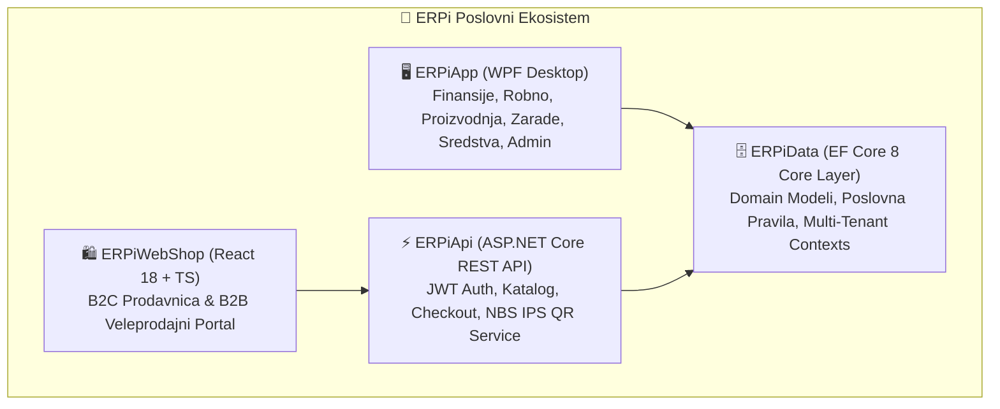

<div align="center">

# ⚡ ERPi Enterprise Business Suite
### Celoviti, Hibridni Poslovni Informacioni Sistem & e-Commerce Platforma

[](CHANGELOG.md)
[](https://dotnet.microsoft.com/)
[](ERPiApp)
[](ERPiWebShop)
[](docs/ARCHITECTURE.md)
[](ERPiData.Tests)
[](docs/DEPLOYMENT.md)

<p align="center">
  <strong>Objedinjeno knjigovodstvo, robno poslovanje, proizvodnja, plate, osnovna sredstva, SEF e-Fakture, e-Fiskalizacija i omni-channel B2C / B2B WebShop.</strong>
</p>

[Ključni Moduli](#-ključni-moduli-sistema) • [Arhitektura](#-arhitektura-i-tehnologije) • [WebShop & B2B](#-integrisani-webshop--b2b-portal) • [Baze Podataka](#-multi-dbms-i-mrežni-rad) • [Brzi Početak](#-brzi-početak-i-razvoj) • [Dokumentacija](#-tehnička-dokumentacija)

</div>

---

## 🌟 Zašto ERPi?

**ERPi** je projektovan od nule kao moderna alternativa zastarelim legacy knjigovodstvenim programima. Pruža maksimalnu brzinu na tastaturi, intuitivan vizuelni doživljaj, robusnu pouzdanost i potpunu usaglašenost sa zakonodavstvom Republike Srbije (Zakon o računovodstvu, Zakon o PDV, Zakon o elektronskom fakturisanju — SEF, Zakon o fiskalizaciji — PFR, Zakon o radu — PPP-PD).



---

## 🏢 Ključni Moduli Sistema

<div align="center">

| Modul | Ikona | Opis & Ključne Funkcionalnosti |
| :--- | :---: | :--- |
| **Glavna Knjiga & Finansije** | 📊 | Dvojno knjigovodstvo, automatsko kontiranje, IOS obrasci sa e-mail slanjem, zatvaranje otvorenih stavki, kamatni obračun, devizno valviranje, bruto bilans, bilans stanja i uspeha. |
| **Robno-Materijalno** | 📦 | Veleprodajne i maloprodajne kalkulacije, uvozni troškovi, nivelacije, KEP knjiga, kartice robe/materijala, trebovanja, međumagacinski transferi, predračuni i nalozi. |
| **WebShop (B2C & B2B)** | 🌐 | Omni-channel prodavnica sa **NBS IPS QR**, **3D Secure karticama**, **SMS notifikacijama**, **Marketing automatizacijom (Cross-Sell / Abandoned Cart)**, SEO sitemap/robots, GA4 & Meta Pixel, B2B portalom i 1-klik fakturisanjem. |
| **Proizvodnja & Sastavnice** | 🏭 | Sastavnice (BOM) sa normativima, tehnološke faze i operacije, radni nalozi, automatsko razduženje sirovina i zaduženje gotovih proizvoda, automatsko kontiranje u Glavnu knjigu, rasknjižavanje završenog naloga (potpuno ili samo Glavna knjiga). Cena koštanja se računa po **stvarnom** trošku: materijal po ponderisanoj ceni sa kartice, rad po satnici iz obračuna zarada, mašine po proknjiženoj amortizaciji, režija po raspodeli proknjiženih opštih troškova iz Glavne knjige. |
| **Obračun Zarada & HR** | 👥 | Evidencija radnika i ugovora, automatski obračun poreza i doprinosa, generisanje zvaničnih XML fajlova za Poresku upravu (**PPP-PD**), e-banking virmani i isplatni listići. |
| **Osnovna Sredstva** | 🏗️ | Šifarnik opreme i nekretnina, računovodstvena i poreska amortizacija (čl. 10b), popis inventara sa bar-kod skenerima, reversi, rashodovanja i automatsko knjiženje. |
| **SEF e-Fakture & PFR** | ⚡ | Direktna dvosmerna komunikacija sa državnim SEF portalom (UBL 2.1), masovno slanje izlaznih faktura i praćenje statusa, automatsko knjiženje ulaznih e-Faktura, e-Fiskalizacija (ESIR/PFR) sa štampom fiskalnih računa. |
| **Maloprodajna kasa (POS)** | 🛒 | Puna kasa sa **e-fiskalizacijom prema protokolu v3** Poreske uprave (L-PFR i V-PFR), živom pretragom artikala (nalazi i bez kvačica), čitačem barkoda, barkodovima vagane robe, split-plaćanjem, refundacijom, obuka-režimom, smenom i pazarom, i štampom isečka na termalnom štampaču (ESC/POS). Ugrađen **lokalni simulator PFR-a** za obuku bez priključenog uređaja. |
| **Kontroling & Cash-Flow** | 📈 | Projekcije likvidnosti po koficama dospeća (0–90+ dana), analiza novčanog toka, automatsko slanje opomena dužnicima i IOS obrazaca putem SMTP servisa. |
| **DMS & Pametni OCR** | 🔍 | Digitalna arhiva dokumenata uz automatsko OCR prepoznavanje podataka sa skeniranih računa (PIB, brojevi, iznosi, PDV stope). |

</div>

---

## 🌐 Integrisani WebShop & B2B Portal

ERPi sadrži kompletan e-Commerce podsistem koji radi nad istom bazom podataka:

```
                                  ┌───────────────────────────┐
                                  │   ERPiWebShop (React)     │
                                  └─────────────┬─────────────┘
                                                │
                      ┌──────────────────────────┴──────────────────────────┐
                      ▼                                                     ▼
         🛍️ B2C Maloprodaja                                    🏢 B2B Veleprodajni Portal
   • Responzivni katalog sa Mega Menijem                • Prikaz ugovorenih cena bez PDV-a
   • Stablo kategorija neograničene dubine              • Online zahtev za registraciju pravnih lica
   • Fasetirani filteri po tehničkim atributima         • Uvid u otvorene stavke i dospeća
   • ❤️ Lista želja (Wishlist) & ⚖️ Upoređivanje       • 📄 Preuzimanje PDF e-Faktura & IOS obrasca
   • 📱 NBS IPS QR Instant plaćanje telefonom           • Tabelarni Quick Order unos više šifara
   • 💳 3D Secure 2.0 kartično plaćanje (Visa/Master)   • 🔄 Re-order (ponavljanje porudžbina 1-klikom)

   • ✉️ SMS & Viber notifikacije (Infobip/BulkSMS)      • Direktan prenos u ERP Račun-Otpremnicu
   • 🎁 B2C Loyalty program (bodovi & nivoi)            • Automatska kontrola kreditnog limita
   • 🛒 Marketing automatizacija & Napuštene korpe      • Pregled statusa i istorije porudžbina
   • 🚚 API kurirske službe (PostExpress, DExpress...)  • Specijalni ugovoreni partnerski cenovnici
   • 📧 Automatski transakcioni email servis            • Instant generisanje PDF predračuna
   • 🔔 SystemTray zvučne i vizuelne notifikacije       • Upravljanje više lokacija isporuke
```

---

## 🗄️ Multi-DBMS i Mrežni Rad

ERPi omogućava fleksibilan izbor baze podataka u zavisnosti od veličine i infrastrukture preduzeća:

| Provajder | Režim Rada | Karakteristike |
| :--- | :--- | :--- |
| **SQLite** | 🏠 Lokalno / Jedan računar | Nulta konfiguracija. Baza je jedan fajl unutar `%LocalAppData%\ERPi\Baze\*.db`. Idealan za prenosivost na USB i brzi backup. |
| **Microsoft SQL Server** | 🏢 Lokalna Mreža (LAN) | Puna podrška za SQL Server 2022 (Express, Developer, Standard). Ugrađen instalacioni servis i automatsko otvaranje Firewall portova. |
| **PostgreSQL** | 🌐 Cloud / Dedicated Server | Skalabilno rešenje za višekorisničke serverske instalacije i udaljene lokacije. |
| **Mrežna Radna Stanica** | 💻 Klijentski režim | 1-klik čarobnjak za povezivanje računara u kancelariji/magacinu na centralni ERPi server. |

---

## 🛠️ Arhitektura i Tehnologije

```
ERPi Solution (ERPi.slnx)
 ├── 🖥️ ERPiApp          → WPF Desktop aplikacija (.NET 8 Windows, MVVM, XAML)
 ├── ⚡ ERPiApi          → ASP.NET Core 8 Web API (JWT Bearer, Swagger, NBS IPS QR)
 ├── 🛍️ ERPiWebShop      → React 18 + TypeScript + Vite + Modern UI Design System
 ├── 🗄️ ERPiData         → EF Core 8 biblioteka sa modelima i poslovnom logikom
 ├── 🔄 ERPiMigration    → Uvoznik starih Clipper/FoxPro DBF baza (CP852)
 └── 🧪 ERPiData.Tests   → xUnit automatizovani testovi (901/901 prolazi)
```

---

## 🚀 Brzi Početak i Razvoj

### Preduslovi
- [.NET 8.0 SDK](https://dotnet.microsoft.com/download/dotnet/8.0)
- [Node.js v20+](https://nodejs.org/) i `npm`
- Visual Studio 2022 / VS Code / Antigravity IDE

### 1. Kloniranje i Izgradnja .NET Rešenja
```powershell
# Klonirajte repozitorijum
git clone https://github.com/username/ERPi.git
cd ERPi/ERPi

# Izgradite celokupno rešenje
dotnet build ERPi.slnx

# Pokrenite automatske testove
dotnet test ERPiData.Tests/ERPiData.Tests.csproj
```

### 2. Pokretanje Desktop Aplikacije
```powershell
dotnet run --project ERPiApp/ERPiApp.csproj
```

### 3. Pokretanje WebShop API-ja i React Frontend-a
```powershell
# Pokrenite ASP.NET Core API servis
dotnet run --project ERPiApi/ERPiApi.csproj

# U drugom terminalu pokrenite React WebShop
cd ERPiWebShop
npm install
npm run dev
```
> WebShop će se otvoriti na `http://localhost:5173`, a Swagger API dokumentacija na `http://localhost:5000`.

---

## 📚 Tehnička Dokumentacija

Za detaljnije vodiče i specifikacije pogledajte prateću dokumentaciju u direktorijumu `docs/`:

- 🏗️ **[Arhitektura sistema i baze podataka](docs/ARCHITECTURE.md)** — Slojno razdvajanje, konekcije i šeme.
- 🌐 **[WebShop Vodič & NBS IPS QR](docs/WEBSHOP.md)** — Integracija B2C prodavnice, B2B portala i plaćanja.
- 🛒 **[Maloprodajna kasa i e-Fiskalizacija](docs/KASA.md)** — ESIR ↔ PFR protokol, POS, čitač barkoda i štampa isečka.
- 🖥️ **[WebShop Hosting](docs/WEBSHOP_HOSTING_GUIDE.md)** — Objavljivanje prodavnice i API servisa na server.
- 💻 **[Vodič za razvoj i standarde koda](docs/DEVELOPMENT.md)** — Pravila razvoja, MVVM obrasci i testiranje.
- 📦 **[Pakovanje i Objavljivanje (Velopack)](docs/DEPLOYMENT.md)** — CI/CD, kreiranje instalera i auto-update.
- 🔄 **[Uvoz iz starih DBF baza](docs/DBF_MIGRATION.md)** — Migracija sa DOS/FoxPro sistema.
- 📋 **[Dnevnik razvoja (Plan nastavka)](PLAN_NASTAVKA.md)** — Zapisnik svih realizovanih funkcija po fazama.
- 📝 **[Istorija izmena (Changelog)](CHANGELOG.md)** — Detaljan pregled svih verzija.

---

<div align="center">

**ERPi — Pouzdan temelj modernog poslovanja.**  
© 2026 ERPi Team. Sva prava zadržana.

</div>
