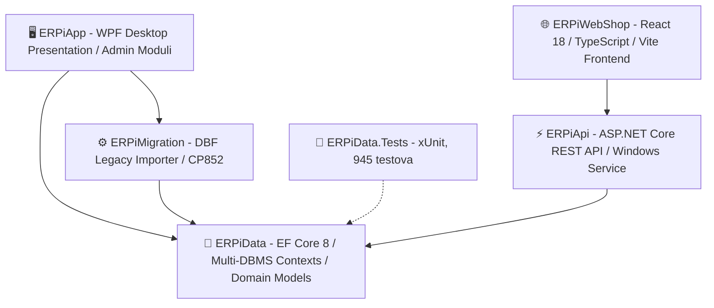
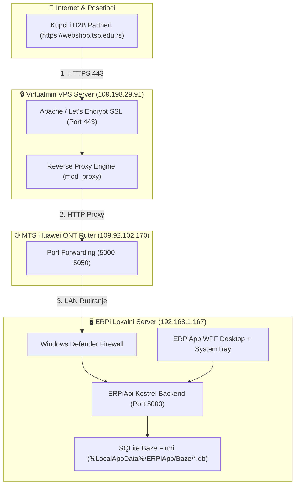
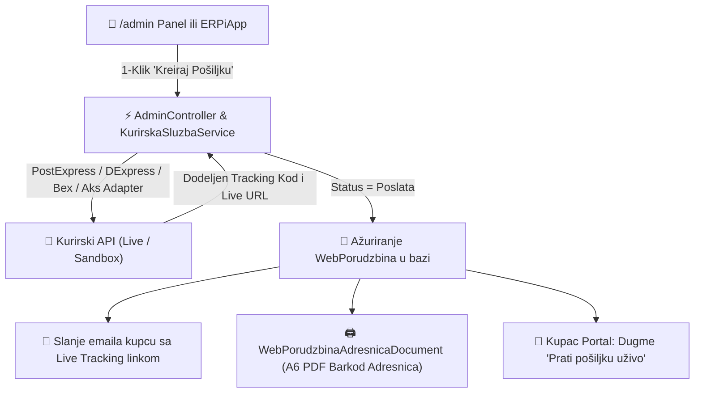
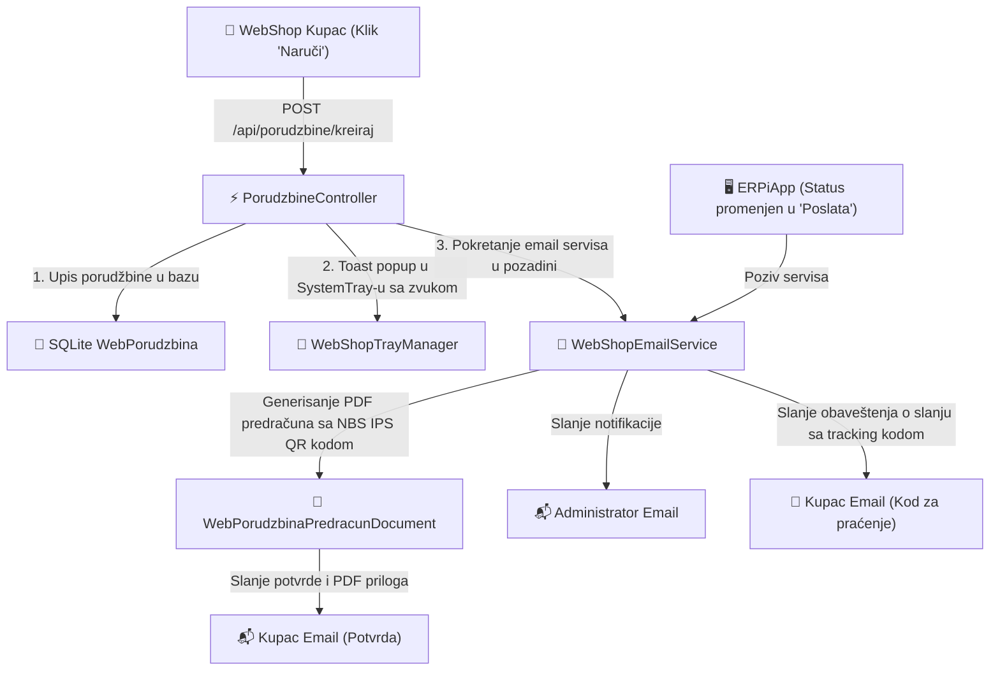
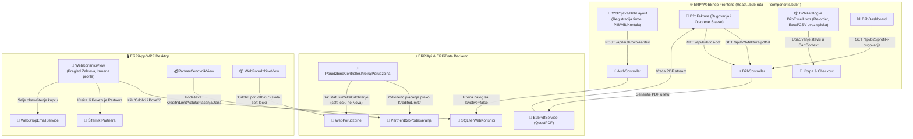
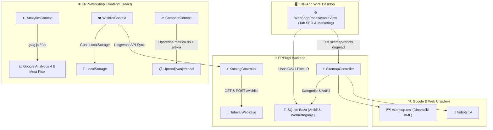
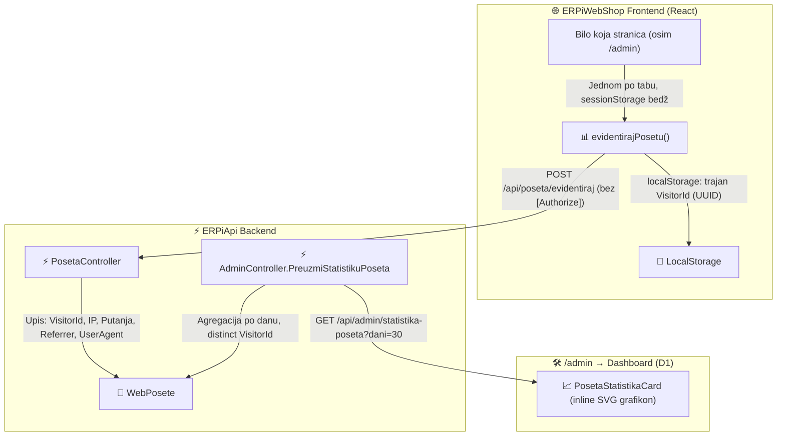
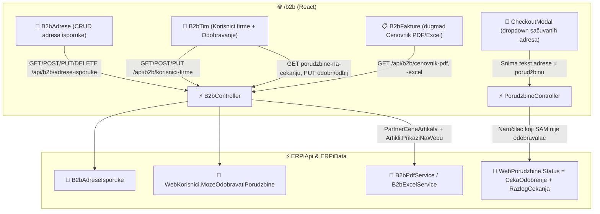
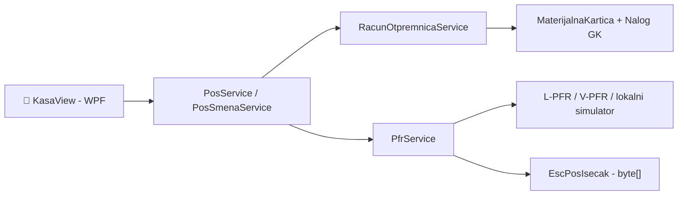

# 🏗️ ERPi — Arhitektura Sistema i Šema Baze Podataka

Ovaj dokument pruža tehnički pregled arhitekture integrisanog **ERPi** poslovnog sistema, slojnog razdvajanja projekata, dizajna baze podataka i podrške za više preduzeća (multi-tenancy).

---

## 📌 1. Pregled Rešenja i Slojna Arhitektura

**Dopunjeno 15.08.2026 (v2.22.0)** — dodati su dijagrami slojeva, mrežne infrastrukture, kurirskog podsistema (Live API cene, tracking kodovi), transakcionih email & SMS/Viber notifikacija, marketing automatizacije (Cross-Sell, Volume Discounts, Abandoned Carts), višekanalnog Live Chat vidžeta, višejezičnosti i viševalutnosti (SR/EN/DE, RSD/EUR/USD/BAM, NBS kursna lista), ocena i recenzija, B2C Loyalty programa, 3D Secure 2.0 kartičnog plaćanja i B2B veleprodajnog portala.

**Dopunjeno 16.08.2026 (v2.29.0)** — dodata statistika poseta (`WebPoseta`/`PosetaController`, §1.7) i editovanje profila web/B2B korisnika sa ručnim povezivanjem ERP partnera, iz oba admin klijenta — WPF i React (§1.6).

ERPi rešenje je organizovano u 6 ključnih projekata i aplikacija (`ERPi.slnx` + `ERPiWebShop`):



---

## 🌐 1.1 WebShop Hosting & Mrežna Arhitektura



---

## 🚚 1.2 Logistika & Integracija sa Kurirskim Službama



---

## 📧 1.3 Automatski Transakcioni Email Servis & Notifikacije



---

## 🏢 1.4 B2B Veleprodajni Portal i Tok Verifikacije



`/b2b` je od v2.19.x odvojena ruta sa sopstvenim shell-om (isti obrazac kao `/admin`), ne modal preko
B2C prodavnice — prijava, dashboard, katalog, brzo naručivanje i fakture/IOS su prave stranice.
Kreditni limit je **soft-lock**: prekoračenje ne blokira kupca, samo prebacuje porudžbinu u status
čekanja dok je admin ne oslobodi.

---

## 📈 1.5 SEO, Analitika, Marketing, Wishlist & Upoređivanje Artikala



---

## 🛠️ 1.6 WebShop Backoffice Administratorska Arhitektura (`/admin`)

```mermaid
graph TD
    subgraph Browser["🌐 Browser Admin Klijent (/admin/:tab — adresa je izvor istine)"]
        AL["🔐 Admin Login (Email/Lozinka)"]
        AP["🛠️ AdminPanel (~360 linija, samo meni + routing)"]
        D1["📊 1. Dashboard + Low-Stock Alert (Zalihe ≤ 5) + Statistika poseta"]
        D2["📦 2. Porudžbine — /admin/porudzbine/:id je stranica, ne modal"]
        D3["🛍️ 3. Artikli na webu — /admin/artikli/:id stranica, PDF prilozi (upload)"]
        D4["📂 4. Stablo kategorija (uvlačenje po dubini, roditeljska kategorija)"]
        D5["🏢 5. B2B Zahtevi (1-Klik Odobravanje)"]
        D6["👥 6. Kupci & CRM (LTV Promet, editovanje profila + ručno povezivanje partnera)"]
        D7["🎟️ 7. Kuponi & Promocije (Popusti u korpi)"]
        D8["🎨 8. CMS & Brending (Boje/Teme/Hero/Dostava)"]
        EXP["📥 CSV / Excel Multi-module Export Engine"]
        AP --> D1 & D2 & D3 & D4 & D5 & D6 & D7 & D8 & EXP
    end

    subgraph API["⚡ ERPiApi Backend & Servisi"]
        AC["⚡ AdminController ([Authorize(Roles='Admin')])"]
        AUC["⚡ AuthController (Admin Login & JWT Token)"]
        PDF["📄 WebPorudzbinaAdresnicaDocument (QuestPDF A6)"]
        KS["📦 KarticaService (Proračun stanja zaliha)"]
        JWT["🔒 JwtService (Persistiran ključ u %ProgramData%/ERPiApi/jwt.secret)"]
    end

    subgraph Desktop["🖥️ ERPiApp WPF Desktop"]
        WPS["⚙️ WebShopPodesavanjaView (Tab 1: Backoffice Nalog & /admin Dugme)"]
    end

    subgraph Baza["💾 SQLite Baza Preduzeća"]
        T1["WebShopPodesavanja (Admin nalog, lozinka, brending)"]
        T2["WebKorisnici (Kupci, B2B firme, IsAdmin)"]
        T3["WebPorudzbine & Stavke"]
        T4["WebKuponi"]
        T5["RacuniOtpremnice & RobnoKretanje (ERP Robni modul)"]
        T6["Artikli & Magacini"]
        T7["WebPosete (Statistika poseta, v. §1.7)"]
    end

    AL -->|POST /api/auth/admin-login| AUC --> JWT
    AP --> AC
    AC --> T1 & T2 & T3 & T4 & T5 & T6 & T7
    AC --> PDF
    AC --> KS
    WPS -->|Podešavanje admin email/lozinke| T1
```



Deset tabova (D1-D8 + dodatni) žive kao samostalne komponente u `ERPiWebShop/src/components/admin/`
— svaki učita svoje podatke i drži svoje stanje, ne zna da ostali tabovi postoje.
`admin/AdminKontekst.tsx` nosi ono što tabovi dele (toast, "Osveži" signal, prelazak na tab); nema
više jednog centralnog `AdminPanel.tsx` stanja (bilo je ~3930 linija, ~21% `src`).

---

## 📊 1.7 Statistika Poseta (Visitor Tracking)



- Beleži se **jedna poseta po sesiji pregledača**, ne svaki API poziv/pregled stranice — obrazac je
  eksplicitan poziv sa frontenda pri prvom mount-u, ne middleware koji presreće sve zahteve.
- `/admin` ruta se namerno ne broji, da sopstvene provere admina ne naduvavaju statistiku.
- Gosti i prijavljeni kupci se broje podjednako; `WebKorisnikId` se upisuje samo ako JWT nosi
  identitet, ali nije uslov za upis.

---

## 🏢 1.8 Multi-user B2B: Adrese Isporuke, Personalizovani Cenovnik i Odobravanje Porudžbina



- **Sačuvane adrese isporuke** (`B2bAdreseIsporuke`, FK na `Partneri`, BEZ FK na `WebPorudzbine`) —
  porudžbina uvek snima adresu kao tekst u trenutku poručivanja, brisanje/izmena sačuvane adrese
  ne menja retroaktivno već poslate porudžbine.
- **Personalizovani cenovnik** (PDF preko QuestPDF, Excel preko ClosedXML) — ista formula cene kao
  katalog/checkout (`PartnerCeneArtikala` ako postoji zapis, inače standardna web cena svedena na
  neto), obe strane dele `B2bController.PripremiCenovnikAsync`.
- **Multi-user odobravanje**: `WebKorisnik.MozeOdobravatiPorudzbine` (default `true`, nazad-
  kompatibilno) razdvaja odobravaoce od običnih naručilaca u istoj firmi (isti `PartnerId`).
  Naručilac koji sam nije odobravalac dobija porudžbinu sa statusom `CekaOdobrenje` — ISTI enum
  koji već koristi kreditni-limit soft-lock (§9 u `WEBSHOP.md`), razlikovanje ide preko
  `WebPorudzbina.RazlogCekanja`. Odobrava/odbija se na `/b2b/tim` (kolega u firmi), ne u WPF-u.
  Pojedinačni B2B nalog (jedini korisnik svoje firme) ostaje bez ikakvog trenja.

---

### 1.1 `ERPiData` (Modeli i Baza Podataka)
- Sadrži EF Core 8 `DbContext` klase, entitete, migracije i repozitorijume.
- Modeli: Finansije, Robno, Proizvodnja, Zarade, Sredstva, **WebShop (`WebKategorija`, `Atribut`, `WebPorudzbina`, `WebKorisnik`, `WebShopPodesavanja`, `WebZelja`, `WebPoseta`, `B2bAdresaIsporuke`)**.
- Nema zavisnosti od WPF-a ili Web-a, čista .NET 8 biblioteka klasa.
- **Multi-DBMS od v2.15.0**: `ErpiDbContext.ConfigureOptions` bira EF Core provajder
  (`UseSqlite`/`UseNpgsql`/`UseSqlServer`) na osnovu eksplicitnog `DatabaseProviderType` ili
  auto-detekcije formata konekcionog stringa (`DetectProvider`, v. §2). I dalje važi princip
  "jedna baza (fajl ili šema) po firmi" — nema posebne master baze (v. §2).

### 1.2 `ERPiApi` (ASP.NET Core REST API Servis)
- ASP.NET Core 8 Web API sa Swagger/OpenAPI dokumentacijom i JWT Bearer autentifikacijom.
- REST kontroleri za katalog, stablo kategorija, autentifikaciju, checkout, sitemap/robots i B2B ugovorene cene.
- **`NbsIpsQrService`**: Generisanje zvaničnog **NBS IPS QR koda** Narodne banke Srbije za instant plaćanje telefonom (m-banking).
- **`SitemapController`**: Dinamičko generisanje `/sitemap.xml` i `/robots.txt` za pretraživače.
- **Slike artikala se serviraju preko `/slike` (`PhysicalFileProvider` u `Program.cs`)**, sa diska
  uz bazu firme — **ne** iz `wwwroot`, jer Velopack primena briše/zamenjuje `current/` pri svakom
  ažuriranju i obrisala bi ih (isti razlog zašto SQLite baze firmi žive u `%LocalAppData%`, v. §1.1).

### 1.3 `ERPiWebShop` (React 18 Frontend Prodavnica & B2B Portal)
- React 18 + TypeScript + Vite moderna web aplikacija sa custom design systemom.
- B2C online prodavnica (Mega Meni, pretraga, fasetirano filtriranje po atributima, korpa sa trakom za besplatnu dostavu, NBS IPS QR, lista želja ❤️, upoređivanje artikala ⚖️).
- Google Analytics 4 i Meta Pixel skripte i praćenje događaja kroz `AnalyticsContext`.
- B2B veleprodajni portal (cene bez PDV-a, otvorene stavke, tabelarni Quick Order unos).
- Live Theme Customizer sa 4 gotove teme i Dark/Light modom.

### 1.4 `ERPiMigration` (Uvoznik starih DBF podataka)
- Biblioteka zadužena za čitanje legacy Clipper/FoxPro DBF datoteka iz starih programa (`ERPiFinansije`, `ERPiSredstva`, `ERPiZarade`).
- Dekodira **CP852** (DOS Latin-2) preko `CodePagesEncodingProvider`. YUSCII se **ne** dekodira —
  u kodu ne postoji nijedna takva konverzija, uprkos ranijim tvrdnjama u dokumentaciji.
- **Uvek dva koraka, nikad direktno u ERPi bazu:** DBF → privremena SQLite baza u šemi starog
  programa (`AccountingDbContext` / `SredstvaDbContext` / `PlataDbContext`, gradi se na `%TEMP%` i
  briše posle uvoza) → `Erpi*ProdukcijaImporter` → `ErpiDbContext`. Dedup prema trajnoj bazi postoji
  isključivo u drugom koraku. Detalji i mapiranje fajlova: [`DBF_MIGRATION.md`](DBF_MIGRATION.md).
- `Legacy/*/Models/` drži **šeme starih programa**, ne ERPi entitete — te klase se namerno ne
  usklađuju sa `ERPiData` modelima.

### 1.5 `ERPiApp` (WPF Desktop Aplikacija i Poslovna Logika)
- Moderni WPF interfejs sa custom stilizacijom (`SearchTextBoxStyle`, `IconButtonStyle`, `Dark/Light` elementi).
- Servisni sloj (`PdfReportService`, `ExportService`, `BrutoBilansService`, `SefService`, `PfrService`).
- **SEF sloj** (`ERPiData/Services`): `SefApiClient` (HTTP, prima `HttpClient` spolja) → `SefService`
  (poslovna pravila, prima opcioni `SefApiClient` — isti obrazac kao `PfrService`, i jedini način da
  se SEF proveri bez mreže) → `SefFaktureView`. Masovne operacije (`PosaljiViseNaSefAsync`,
  `OsveziStatuseAsync`, v2.44.0) **delegiraju po stavci** na pojedinačne metode i ne nose sopstvenu
  logiku slanja; preskaču ono što je već na SEF-u, jer bi drugo slanje istog prometa tamo otvorilo
  novu fakturu.
- Generator zvanične PDF dokumentacije pomoću **QuestPDF** i Excel export pomoću **ClosedXML**.
- Pakovanje i automatsko ažuriranje aplikacije preko **Velopack-a** (v. i §3 — `WindowsServiceHelper`
  zaustavlja/vraća aktivni `ERPiApi_<šifra>` servis oko primene, inače update tiho ne uspeva jer je
  `.exe` zaključan dok servis radi).
- **`SlikeArtikalaService`/`SlikeArtikalaStorage`**: čuvanje, smanjivanje (1600px) i generisanje
  sličica za slike artikala uz bazu firme (van `wwwroot`, v. §1.2); `MasovniUvozSlikaWindow` uvozi
  ceo folder odjednom, povezujući datoteke sa artiklima po šifri iz naziva fajla.
- `ErpiWebServer` (u `ERPiData.Services`, pokreće ga `ERPiApp`): ugrađeni `HttpListener` REST API
  i mobilni Web Dashboard bez ASP.NET Kestrel zavisnosti, sa nasumičnim Bearer tokenom po sesiji
  servera (odvojen mehanizam od Network Client Mode-a iz §2.3, koji ne prolazi kroz njega).

### 1.6 `ERPiData.Tests`
- xUnit test projekat, **901 test** (100% prolaznost, v. `CHANGELOG.md`); referencira samo `ERPiData` (bez WPF-a),
  pokriva pravila knjiženja (`KnjizenjeService.Pripremi`), proizvodnju (sastavnice, radni nalozi, automatska knjiženja), Fazu 6 (Zarade/Sredstva → GK), PDV
  knjige, kurirske službe i Live API tarifikaciju, WebShop stablo/atribute/porudžbine/recenzije, i maloprodajnu kasu sa e-fiskalizacijom.

---

## 🛒 1.9 Maloprodajna kasa i e-Fiskalizacija (ESIR ↔ PFR)

**Dodato 17.08.2026 (v2.45.0).** Puna dokumentacija: **[`docs/KASA.md`](KASA.md)**. Ovde samo ono što
je bitno za razumevanje arhitekture.



**Četiri odluke koje objašnjavaju oblik modula:**

1. **Kasa nema svoj dokument.** Maloprodajni promet ide kroz `RacunOtpremnica`, jer
   `RacunOtpremnicaService.KnjiziRacunAsync` već razdužuje robnu karticu i knjiži nalog. Poseban POS
   entitet bi značio drugu, paralelnu implementaciju istog knjiženja.
2. **Fiskalni račun je zaseban entitet** (`FiskalniRacun`), a ne kolone na dokumentu — jedan promet
   kroz život dobije više fiskalnih računa (predračun → avans → promet → kopija → refundacija).
3. **Porez na isečku računa PFR**, ne ESIR. `FiskalniRacunPorez` se puni isključivo iz `taxItems`;
   naš obračun ostaje za glavnu knjigu i PDV evidenciju. Dva odvojena obračuna koja se ne mešaju.
4. **Redosled u `ZakljuciRacunAsync`:** sačuvaj → fiskalizuj → **tek na uspeh** proknjiži. Obrnuto bi
   posle neuspele fiskalizacije ostavilo razduženu robu bez fiskalnog računa.

**Generator isečka vraća `byte[]` i živi u `ERPiData`** (`net8.0`), dok slanje na štampač ostaje u
ERPiApp-u (`winspool.drv`, koji traži `net8.0-windows`). Podela znači da se ceo isečak proverava
testom bez ijednog štampača.

**Pretraga bez kvačica** koristi kolonu `Artikli.NazivPretraga` (latinica, mala slova), jer se takvo
poređenje u SQL-u ne može izvesti prenosivo preko SQLite-a, PostgreSQL-a i SQL Servera. Puni je
`ErpiDbContext.SaveChanges`, a ne pojedinačni servisi — artikli u ERPi ulaze sa desetak strana i svaka
od njih bi pre ili kasnije zaboravila da je popuni.

---

## 🗄️ 2. Multi-Tenant, Multi-DBMS i Auth Arhitektura (Rad sa više firmi)

**Ispravljeno 10.08.2026, dopunjeno 14.08.2026 (v2.15.0) posle provere protiv koda.** I dalje
nema posebne "master baze" u smislu jedne zajedničke EF Core šeme za sve firme — svaka firma je i
dalje sopstveni, samostalan `ErpiDbContext` (SQLite fajl **ili**, novo od v2.15.0, šema na
PostgreSQL/SQL Server serveru). Ono što je novo u v2.15.0 je jedan **dodatni, potpuno odvojen**
sloj ispred izbora firme: globalna prijava i lokalni JSON registar poznatih firmi.

### 2.1 Tok pri pokretanju aplikacije
`App.xaml.cs` (van `--autologin` režima) otvara redom:

1. **`GlobalLoginWindow`** — prijava na nivou *računara/operatera*, ne na nivou firme. Autentifikaciju
   radi `MasterAuthService` nad `%LocalAppData%\ERPi\master_users.json` (PBKDF2-SHA256 sa solju,
   100000 iteracija), potpuno odvojeno od bilo koje `ErpiDbContext` baze — ako se sve firme
   izbrišu, ovaj fajl i dalje postoji. Pri prvom pokretanju kreira podrazumevanog `admin`/`admin`
   naloga (`EnsureDefaultAdminExists`).
2. **`CompanySelectWindow`** — čita listu firmi iz **`CompanyRegistryService`**
   (`%LocalAppData%\ERPi\companies.json`), *ne* skeniranjem foldera. Svaki red (`CompanyEntry`)
   nosi `Naziv`/`Pib`/`Sifra`, `Provider` (`DatabaseProviderType.Sqlite`/`PostgreSql`/`SqlServer`)
   i ili `DbPath` (SQLite fajl) ili `ConnectionString` (Postgre/MSSQL). Lista se pre prikaza
   filtrira kroz `MasterAuthService.HasAccessToCompany(trenutniGlobalniKorisnik, entry)` — admin
   vidi sve, običan operater samo firme iz svog `GlobalUser.DodeljeneFirme`.
3. Po izboru firme, `AppConfig.DbPath`/`Provider` se postavljaju i otvara se `MainWindow` nad tim
   `ErpiDbContext`-om — i dalje važi da je to *jedina* aktivna konekcija za tu sesiju programa
   (nema paralelnog rada sa dve firme u istom procesu).

```
%LocalAppData%\ERPi\
├── master_users.json      <-- globalni operateri (GlobalUser), PBKDF2 hash, DodeljeneFirme
├── last_login.json        <-- poslednje korisničko ime, za predpopunjavanje login ekrana
├── companies.json         <-- registar poznatih firmi (CompanyEntry: Naziv/Provider/DbPath|ConnString)
└── Baze\
    ├── firma_100188310_PSSS_PIROT_DOO_PIROT.db     <-- SQLite firma = ceo ErpiDbContext
    ├── firma_...ARHIBEL.db
    └── ...                                          (PostgreSQL/SQL Server firme nemaju lokalni fajl)
```

- **`FirmaMasterContext`/`FirmaMaster.db` i dalje ne postoje** — `companies.json`/`master_users.json`
  su obični JSON fajlovi koje čita `ERPiApp`, ne EF Core šema.
- **Dva odvojena, neuparena RBAC sloja** (namerno, nisu ista tabela ni isti model):
  - **Globalni** (`GlobalUser` u `master_users.json`): `Administrator`/`Operater` uloga plus lista
    firmi kojima operater sme da pristupi (`DodeljeneFirme`) — kontroliše *koje firme se uopšte
    vide* u `CompanySelectWindow`.
  - **Po firmi** (`Korisnik` u samoj `ErpiDbContext` bazi te firme, v. §2.2): `UlogaKorisnika` +
    granularni `Pravo*` flegovi (`PravoFinansije`, `PravoRobno`, `PravoProizvodnja`, ...) —
    kontroliše *šta sme da radi unutar* već izabrane firme. `PostaviPodrazumevanaPravaZaUlogu`
    postavlja standardni profil flegova po ulozi, sa mogućnošću ručne izmene (`Prilagodjeno`).
- **`AppSession`** (statička klasa) drži `TrenutnaFirma`/`TrenutniKorisnik` (po-firmi `Korisnik`)
  **i** `TrenutniGlobalniKorisnik` (`GlobalUser`) — **ne drži** `ErpiDbContext` instancu.
  `AppSession.IsAdministrator` i `ImaPravo*` propertiji kombinuju oba sloja (globalni admin
  zaobilazi sve provere; inače se gleda `TrenutniKorisnik.Pravo*`).

### 2.2 `ErpiDbContext` — sadrži sve module jedne firme
- **Finansije & Robno**: `Nalog`, `StavkaNaloga`, `Konto`, `Partner`, `RacunOtpremnica` (radi
  dvostruku ulogu fakture/otpremnice/predračuna preko `TipDokumenta`), `SefDokument` (**mrtav
  model** — `SefFaktureView` je u §3w prebačen da čita prave `RacunOtpremnica` zapise; `SefDokument`
  DbSet ostaje u šemi bez ijednog UI potrošača, cleanup kandidat).
- **Proizvodnja** (novo u v2.15.0): `Sastavnica`/`SastavnicaStavka`/`SastavnicaOperacija`
  (normativi materijala i tehnološke faze/operacije), `RadniNalog`/`RadniNalogMaterijal`/
  `RadniNalogFaza` (proizvodni nalozi sa statusima Priprema/Lansiran/U radu/Završen/Storniran,
  automatsko razduženje sirovina i zaduženje gotovih proizvoda preko `Magacin`/`Artikal`).
  Cena koštanja se od v2.21.0 vrednuje po **stvarnom** trošku, ne po planskom: materijal po
  ponderisanoj prosečnoj ceni sa materijalne kartice (`StvarnaVrednostUtroska`), a od v2.23.0 i rad
  po satnici iz obračuna zarada dodeljenog radnika (`Bruto2 / UkupnoSati`), od v2.24.0 i cena sata
  mašine iz proknjižene amortizacije sredstva. Od v2.25.0 i režija (`OstaliTroskovi`) ima izvor:
  `ProizvodnjaService.PripremiRaspodeluRezijeZaNalogAsync` skuplja proknjižene stavke sa konta iz
  `ProizvodnjaPodesavanja.KontaRezije` (podrazumevano `53,55`) i deli ih na radne naloge po
  `KljucRaspodeleRezije` (sati rada / sati mašina / direktan materijal), uz podelu po mestu troška
  kad ga režijske stavke nose. Od v2.26.0 podela ide **po mesecima u kojima je nalog radio**
  (`OsnovaZaRezijuPoMesecima`, datum faze) — nalog koji se prelama preko granice meseca vuče deo
  režije svakog meseca umesto cele režije jednog; nalog u jednom mesecu zadržava staro pravilo
  „poslednji mesec sa režijom zaključno sa mesecom naloga". Sve tri izvedene vrednosti se
  preuzimaju **dugmetom, ne automatski** — namerno (§3bm).
- **Osnovna Sredstva**: `Sredstvo` (ne `OsnovnoSredstvo`), `Prijava`, `Rashod`, `Popis`,
  `Komisija`, `ClanKomisije`, `PopisnaStavka`, `Kartica`.
- **Obračun Zarada**: `Radnik`, `Isplata`, `RadniSati`, `Kredit`, `PppPdPrijava`, `ObracunPlate`.

### 2.3 Multi-DBMS (`DatabaseProviderType`) i Mrežni Klijentski Režim
- **`ErpiDbContext.DetectProvider`/`ConfigureOptions`**: bira EF Core provajder
  (`UseSqlite`/`UseNpgsql`/`UseSqlServer`) eksplicitno preko `DatabaseProviderType` ili
  auto-detekcijom formata konekcionog stringa (npr. `Host=`/`Username=` → PostgreSQL, `Server=` uz
  `Initial Catalog=`/`Trusted_Connection` → SQL Server, sve ostalo → SQLite fajl putanja). Isti
  `ErpiDbContext` model/migracije važe za sva tri provajdera.
- **`SqlServerInstallerService`**: detektuje postojeće SQL Server instance na računaru
  (`MSSQLSERVER`/`SQLEXPRESS`/`LocalDB`) i nudi 1-klik preuzimanje/instalaciju SQL Express-a plus
  otvaranje Windows Firewall portova (TCP 1433, UDP 1434) — koristi se iz čarobnjaka za novu
  firmu/migraciju, ne iz `NetworkClientSetupWindow`.
- **Mrežni klijent (`NetworkClientSetupWindow`)**: radna stanica u kancelariji/magacinu se ne
  povezuje preko posebnog protokola ili `ErpiWebServer`-a (§1.3) — čarobnjak samo popuni
  `CompanyEntry.ConnectionString` (PostgreSQL ili SQL Server, unosom IP-a servera) i test-konektuje
  se pre upisa u `companies.json`. Deljeni pristup u realnom vremenu je time direktna posledica
  Multi-DBMS sloja: SQLite namerno ostaje van ove opcije (fajl-bazirana baza nije bezbedna za
  paralelan LAN pristup), pa je mrežni režim praktično "izaberi Postgre/MSSQL provajder + unesi
  konekcioni string umesto lokalne putanje".

### 2.3b Kako šema baze evoluira (migracije + raw SQL + baseline)

Najzamršeniji, i istorijski najbagovitiji, deo sistema. Nad SQLite bazom `ErpiDbContext.Create`
radi **tri koraka, tim redom**:

1. **`BaselineRawSqlMigracijuAkoTreba(ctx)`** — mora PRE `Migrate()`.
2. **`ctx.Database.Migrate()`** — normalne EF migracije.
3. **`EnsureDbSchemaUpdated(ctx)`** — raw SQL `CREATE TABLE IF NOT EXISTS` + ~123 `EnsureColumn`
   poziva, idempotentno i čisto aditivno. Završava se **`EnsureIndeksi`** (v2.48.0), koji indekse
   dopunjuje **iz modela** — vidi ispod.
4. **`PopuniNazivePretrage`** i **`PodigniTajneNaZasticene`** — podaci, ne šema (§2.5).

Treći korak postoji jer se šema godinama proširivala „u hodu", bez migracija. Zatečene baze kod
korisnika zato imaju **kolone koje nijedna migracija ne opisuje**. To se dvaput nakupilo u pravi
drift i dvaput zatvaralo: 17 tabela + 32 kolone (v2.19.1), pa još 60 WebShop kolona + tabela
`WebNapusteneKorpe` (v2.22.1).

**Zašto baseline, a ne obično `Migrate()`:** migracija koja te kolone opisuje bi nad zatečenom bazom
pukla — `CreateTable` na „table already exists", `AddColumn` na „duplicate column name" (drugu
poruku `Create` **ne** guta, pa se program ne bi pokrenuo). Pošto je šema koju migracija opisuje
dokazano ista kao ona koju je raw SQL već napravio, ispravno je migraciju samo **evidentirati** u
`__EFMigrationsHistory`, bez izvršavanja.

Dva baseline bloka imaju **namerno različitu strogost — ne spajati ih**:

| Migracija | Uslov | Zašto |
| :--- | :--- | :--- |
| `DodajWebShopIProizvodnjuUMigracije` | mora postojati **sve** iz migracije | njen sadržaj je u zatečene baze stigao odjednom; ako išta nedostaje (baza iz ere pre WebShop-a), pušta se `Up()` da odradi posao |
| `DodajWebShopKoloneUMigracije` | dovoljno je **bilo šta** od njenog sadržaja | sadržaj se slegao kroz tri verzije (2.19.2 → 2.22.0), pa baza korisnika koji je preskočio izdanje ima *deo* kolona; sa strogim uslovom bi `Up()` pukao na prvoj postojećoj |

Posledica drugog reda: za baze baseline-ovane sa delimičnim skupom kolona **`EnsureDbSchemaUpdated`
nije više samo sigurnosna mreža nego uslov ispravnosti** — on je jedini koji im dopunjuje ono što
nedostaje. Ne uklanjati ga i ne brisati iz njega kolone „koje migracija već ima".

#### Indeksi su do v2.48.0 izostajali u celini

Ručno pisani `CREATE TABLE` iz koraka 3 prepisan je iz migracije, ali `CREATE INDEX` nije. Tabele su
na zatečenim bazama zato nastajale **gole**: izmereno **60 indeksa** koje raw SQL put nikad nije
napravio, od toga **6 jedinstvenih** (`IX_WebKorisnici_Email`, `IX_WebPorudzbine_BrojPorudzbine`,
`IX_WebKategorije_Slug`, `IX_Sastavnice_Sifra`, `IX_RadniNalozi_BrojNaloga_Godina`,
`IX_ArtikalAtributVrednosti_ArtikalId_AtributId`) — dakle izostala **zaštita od duplikata**, ne samo
sporija pretraga. Dva naloga su na takvoj bazi mogla deliti isti mejl.

`EnsureIndeksi(ctx, conn)` ih dopunjuje **iz `ctx.Model`**, sa `IsUnique` i `GetFilter()`, a ne iz
novog spiska naredbi — spisak koji se održava rukom je i bio uzrok. Tri pravila u njemu:

| | |
| :--- | :--- |
| Kolone se čitaju tek za tabelu kojoj nešto fali | inače 130 `PRAGMA table_info` upita pri svakom pokretanju; na sređenoj bazi prođe jedan upit nad `sqlite_master` |
| Indeks nad kolonom koje još nema se preskače | kolone su posao `EnsureColumn`-a, indeks stigne pri sledećem pokretanju |
| Pad jednog indeksa ne obara ostale | jedinstven indeks pada kad zatečeni podaci već imaju duplikat — to je nalaz za korisnika, ne razlog da program ne uđe u firmu (poruka ide u dnevnik) |

Ista provera je otkrila i **četiri kolone** koje `RadniNalozi` na zatečenoj bazi uopšte nije imao
(`RobnoKretanjeZaduzenjeId`, `RobnoKretanjeRazduzenjeId`, `StvarnaVrednostUtroska`,
`NabavnaCenaArtiklaPre`) — ušle su u model i migraciju, ali ne i u raw SQL, pa je **ceo modul
Proizvodnje** tamo padao na „no such column".

**Zaštita od povratka drifta** — četiri testa u `MigracijeSemaTests`, nijedan sa spiskom imena:

| Test | Šta hvata |
| :--- | :--- |
| `Model_NemaIzmenaBezMigracije` | `HasPendingModelChanges()` — property dodat bez migracije |
| `ZatecenaBaza_RawSqlTabeleImajuSveKoloneIzModela` | kolona koju raw SQL ne pravi |
| `ZatecenaBaza_RawSqlTabeleImajuSveIndekseIzModela` | indeks koji raw SQL ne pravi |
| `ZatecenaBaza_IzvedenSpisakNijePrazan_ISvakaTabelaSeVraca` | da prethodna dva nisu ostala bez predmeta |

Poslednja tri rade nad **stvarnom bazom dovedenom u zatečeno stanje**: tabele se obrišu, a istorija
migracija ostavi puna, pa `Migrate()` nema šta da primeni i vraća ih jedino raw SQL put. Spisak tih
tabela se ne nabraja nego **izvodi** — `EnsureDbSchemaUpdated` se pusti nad praznom bazom, gde sve
`EnsureColumn` grane ćute, pa ostane tačno ono što taj put ume da napravi sam.

#### Postgres / SQL Server idu drugim putem — `ServerSemaSinhronizator`

Ova tri koraka važe **samo za SQLite**. Za ne-SQLite provajdere `Create` zove
`ServerSemaSinhronizator.Sinhronizuj(ctx)` i ništa drugo — ni `Migrate()`, ni
`EnsureDbSchemaUpdated` (on odmah izađe za ne-SQLite).

**Zašto migracije tamo ne mogu da se puste:** svih 77 migracija u `ERPiData/Migrations/` generisano
je SQLite provajderom i nosi njegove tipove **ukucane u kod** — 601 kolona `type: "TEXT"`, 583
`type: "INTEGER"`, 22 fajla sa `.Annotation("Sqlite:Autoincrement", true)`. Na SQL Serveru je `TEXT`
zastareo tip koji ne sme ni u indeks ni u primarni ključ, a `Sqlite:Autoincrement` se na oba tuđa
provajdera tiho ignoriše — kolone primarnih ključeva ne bi dobile identitet. Pravi put je odvojen
migracioni skup po provajderu (zaseban projekat po provajderu, jer EF sve migracije jednog
`DbContext`-a nalazi bez obzira na namespace); dok toga nema, migracije su SQLite-only.

**Šta radi umesto toga:** šemu izvodi **iz modela**, svaki put iznova. `IMigrationsModelDiffer` daje
operacije za pravljenje cele šeme, zadrži se samo ono čega u živoj bazi nema (`information_schema`
za tabele i kolone, `pg_indexes`/`sys.indexes` za indekse), a SQL piše `IMigrationsSqlGenerator` tog
provajdera — pa su tipovi po definiciji ispravni za ciljni DBMS. Drift nije moguć: izvor istine je
model, ne ručno održavana lista.

**Granice, namerne:**

| | |
| :--- | :--- |
| Radi | pravi tabele, kolone i indekse kojih nema — i za novu i za zatečenu bazu, istim putem |
| Ne radi | ne menja tipove postojećih kolona, ne briše i ne preimenuje ništa |
| Zašto | sve migracije u istoriji ovog projekta su `CreateTable`/`AddColumn`; aditivan zahvat ne može da izgubi podatke. Preimenovanje kolone bi ovde izgledalo kao nova kolona pored stare — ako se ikad desi, traži zaseban ručno pisan korak |
| NOT NULL kolone | dobijaju default izveden iz CLR tipa — bez toga `ALTER TABLE ADD COLUMN` pada nad tabelom koja već ima redove, na oba DBMS-a |
| Strani ključevi | za nove tabele idu unutar `CreateTable`; zaseban `AddForeignKeyOperation` nad zatečenom tabelom se **preskače**, jer bi nad podacima koji ga krše oborio start programa |

Verifikovano nad živim serverima (PostgreSQL 17.11, SQL Server 2022 Developer) — vidi
`ServerSemaSinhronizatorTests`. Testovi prolaze prazni kad servera nema, da CI ne mora da vozi dva
DBMS-a.

### 2.3c Prenos firme na drugi DBMS (`DatabaseMigrationService`)

Isti servis vozi dve komande: *Firma → Migracija baze* (SQLite → PostgreSQL/SQL Server) i *Kopiraj
firmu* za firme na serveru. SQLite firma se kopira kao fajl i ovim putem ne ide.

Do v2.46.0 je servis **nabrajao tabele rukom** i pokrivao **40 od ~130**. Sve dodato posle pisanja tog
spiska tiho je izostajalo — izlazni računi, cela Kasa/PFR grupa, ceo WebShop, Zaradini krediti,
isplate, ugovori i bolovanja, popisi, nivelacije, putni nalozi, revizioni trag — a prenos je i dalje
završavao porukom „🎉 Uspešno završena migracija". Dokazano nad zatečenim kodom: u ciljnoj bazi
`RacuniOtpremnice=0`, `PfrRacuni=0`, `WebPorudzbine=0`, `Krediti=0`.

Danas se **obuhvat i redosled izvode iz EF modela**, kao i kod `ServerSemaSinhronizator`-a:

| | |
| :--- | :--- |
| Redosled | topološki po stranim ključevima (roditelj pre deteta) — FK proveravaju sva tri provajdera, EF Core i za SQLite šalje `PRAGMA foreign_keys=ON`. Model danas nema ciklus i test to drži |
| Ključevi | zadržavaju se, pa veze između dokumenata preživljavaju prenos (`SET IDENTITY_INSERT` na SQL Serveru) |
| PostgreSQL sekvence | usklađuju se posle upisa (`setval`) — Npgsql mapira ključ na `GENERATED BY DEFAULT AS IDENTITY`, gde upis zadatog ključa prolazi ali ne pomera sekvencu, pa bi prvi nov dokument udario u postojeći ključ |
| Revizioni trag | `ErpiDbContext.RevizioniTragIskljucen` gasi interceptor za vreme prenosa — inače bi kopija dobila „Kreiran" za svaki prenet artikal, partnera i konto, dok pravi `AuditLogovi` iz izvora nisu ni prelazili |
| Ciljne tabele | brišu se pre upisa. `EnsureDeleted` ume da ne uspe kad je neko drugi na bazi, a `EnsureCreated` je tada bez dejstva — stari kod je svaku nepraznu tabelu preskakao i pravio mešavinu starog i novog |

Tajne se pri prenosu dešifruju i na server odlaze u otvorenom obliku — namerno, jer se tamo zaštita
iz §2.5 ne primenjuje.

### 2.4 Dve različite šeme za pristup DbContext-u unutar iste app (tehnički dug)
- **Finansije/Sredstva ekrani** primaju `ErpiDbContext _db` kroz **konstruktor** (npr.
  `new NaloziView(_db)`), deleći jednu konekciju sa `MainWindow`-om.
- **Zarade ekrani** (~40 fajlova, nasleđe porta iz samostalnog `ERPiZaradeApp`-a) umesto toga
  **svaki poziva `ErpiDbContext.Create(AppConfig.DbPath)` nezavisno**. Ovo je već jednom pravilo
  problem (vidi `PLAN_NASTAVKA.md` §3f — cela Faza 5 je izgledala prazna dok `AppConfig.DbPath`
  nije bio eksplicitno postavljen pri izboru firme) i ostaje otvoren rizik: svaki *novi* Zarade
  ekran koji bi na svoj način izračunao putanju baze (umesto `AppConfig.DbPath`) bi tiho otvorio
  treću, nezavisnu konekciju. Pravi fix (injekcija `_db` kroz konstruktor, kao Finansije/Sredstva)
  je identifikovan ali namerno odložen kao veći refaktor van hitnog obima.

---

### 2.5 Tajne u bazi (`ZasticenaTajna`)

SQLite firma je jedan `.db` fajl koji se kopira na USB, šalje mejlom knjigovođi i vozi u rezervnoj
kopiji. Do v2.50.0 su u njemu u **čistom tekstu** stajali: `SmtpPass`, `SefApiKey`, `PfrPin`,
`PfrPacKod`, `PfrSertifikatLozinka`, `KarticeApiKey`, `KarticeSecretKey`, `KurirApiKey`,
`KurirLozinkaIliSifra`, `SmsApiKey`, `SmsApiSecret`.

Zaštita je **DPAPI sa opsegom mašine** (`DataProtectionScope.LocalMachine`), primenjena EF
`ValueConverter`-om u `OnModelCreating`.

| Odluka | Zašto |
| :--- | :--- |
| Opseg **mašine**, ne korisnika | iste tajne čita `ERPiApp` pod prijavljenim korisnikom i servis `ERPiApi` pod svojim nalogom; korisnički opseg bi značio da servis ne može da pročita ono što je desktop upisao |
| **Samo SQLite** | baza na serveru nije fajl koji putuje, a šifrovanje vezano za mašinu učinilo bi tajne nečitljivim sa ostalih računara u mreži. Grananje po provajderu u `OnModelCreating` je bezbedno jer EF keš modela ide po internom provajderu usluga |
| Heševi lozinki **nisu** obuhvaćeni | `LozinkaHash`, `PasswordHash`, `BackofficeAdminPasswordHash` su jednosmerni i porede se, a ne čitaju — šifrovanje im ne dodaje ništa, a dodalo bi put na kom prijava može da pukne |
| Ništa ne baca | neuspelo šifrovanje vraća otvoren tekst; neuspelo dešifrovanje vraća prazno, pa korisnik unese tajnu ponovo. Drugo je tačno slučaj `.db` fajla donetog sa druge mašine — dakle ono zbog čega zaštita i postoji |

**Cena izbora, izričito:** tajnu može dešifrovati bilo koji nalog **na toj mašini**. Zaštita je od
odnetog fajla, ne od nekoga ko je već na računaru.

**Zatečene baze prevodi `PodigniTajneNaZasticene`** pri otvaranju firme, raw SQL-om. Ne prevodi ih
sledeće snimanje: EF u `UPDATE` šalje samo kolone koje su se promenile, a tajna pročitana kao čist
tekst i vraćena nepromenjena **nije** izmena — pa bi lozinka mejl naloga ostala čitljiva dok je
korisnik ne ukuca iznova. Kolone se nalaze po anotaciji `ERPi:Tajna` na modelu, ne po zasebnom
spisku.

Rezervne kopije napravljene pre v2.50.0 i dalje nose tajne u čistom tekstu — ne mogu se prepraviti
unazad.

## 📋 3. Ključni Servisi i Tehnički Obrasci

- **`AppSession`**: Statička klasa koja drži trenutno aktivnu firmu (`Firma`), po-firmi korisnika
  (`Korisnik`) i globalnog operatera (`GlobalUser`) — **ne** drži `ErpiDbContext` (videti §2.1 za
  stvarni mehanizam).
- **`MasterAuthService`**: Globalna prijava/RBAC nezavisna od firme, PBKDF2-SHA256 nad
  `master_users.json` (videti §2.1).
- **`CompanyRegistryService`**: Lokalni JSON registar poznatih firmi (`companies.json`), zamenio
  skeniranje foldera kao izvor liste za `CompanySelectWindow` (videti §2.1).
- **`SqlServerInstallerService`**: Detekcija/instalacija lokalnih SQL Server instanci i podešavanje
  Firewall-a za timski rad (videti §2.3).
- **`PdfReportService`**: Objedinjeni servis za generisanje PDF dokumentacije. Koristi **QuestPDF** sa fluent API-jem.
- **`DbfHelper` / `DbfMigrator`**: Generički čitač DBF tabela sa podrškom za pretvaranje datuma, numeričkih polja i CP852 srpskih slova (Č, Ć, Ž, Š, Đ).
- **`Velopack` Auto-Update**: Pri pokretanju aplikacije proverava se postojanje novog izdanja na serveru/folderu i nudi tiha pozadinska instalacija nadogradnje. **`WindowsServiceHelper`** pre primene traži i zaustavlja aktivan `ERPiApi_<šifra>` Windows servis (drži `current\ERPiApi\ERPiApi.exe` zaključan, pa bez ovoga Velopack ne bi mogao da ga prepiše i update bi se u nedogled nudio iznova) i vraća ga u pogon posle restarta — marker-fajl (`%LocalAppData%\ERPiApp\servisi_za_ponovno_pokretanje.json`) čuva koje servise treba vratiti ako proces padne pre restarta.
- **Identitet kao opcioni parametar, ne čitanje `AppSession`**: `ERPiData` ne vidi `AppSession`
  (živi u `ERPiApp`), pa servisi koji upisuju revizioni trag ili proveravaju ko je izvršio akciju
  primaju gotov `korisnikId`/`korisnickoIme` kao opcione parametre umesto da ih sami čitaju — isti
  servis je time pozivljiv i sa WPF-a (`AppSession.TrenutniKorisnik`) i sa `ERPiApi`-ja (JWT claim
  preko `User.FindFirstValue(ClaimTypes.NameIdentifier)`). Obrazac: `AuditLogService.Zabelezi`
  (WPF ide preko tanke omotačke `AuditLogHelper`), Zaradini `StornoService`/`KnjizenjeService`/
  `IsplataService`/`UgovorObracunService`/`PreFlightService` (§ „Dizajn-blokada AuditService/
  AppSession rešena", otključala je portovanje cele Zarade grupe na web), i `NalogService`
  ((raz)knjiženje/brisanje/preknjižavanje naloga glavne knjige, 23.08.2026). Provera prava (admin za
  rasknjiži/preknjiži) namerno **ostaje na pozivaocu** — WPF `AppSession.IsAdministrator`, API
  `[Authorize(Roles="Admin")]` — servis sam ne zna ništa o ulogama.
- **Automatsko GK knjiženje iz modula (`Nalog.IzvorModula`/`IzvorId`)**: obrazac koji već koriste
  `BankIzvodService`, `RacunOtpremnicaService`, `BlagajnaService`, `KompenzacijaService`,
  `PutniNalogService`, `PrimopredajaService`, `RobnoKretanjeService`, `KamataService`,
  `DeviznoKnjigovodstvoService`, `NivelacijaService`, `KalkulacijaService`,
  `MaloprodajnaKalkulacijaService`, `UvoznaKalkulacijaService`, `NovaGodinaService` — svaki
  direktno pravi `Nalog`+`StavkaNaloga` u istom `ErpiDbContext`, numerišući `BrojNaloga` po svom
  `VrstaNaloga` prefiksu. **Nijedan od njih do sada nije stvarno popunjavao `IzvorModula`/
  `IzvorId`** (polja postoje u šemi od Faze 1, ali `grep` ne nalazi nijednog pisca pre 10.08.2026)
  — obrazac je bio pripremljen, ali stvarno korišćen tek za Fazu 6 (Zarade/Sredstva → GK), gde je
  idempotencija (ne duplirati automatski nalog) stvarno potrebna jer se isti ekran može otvoriti
  više puta nad istim periodom.

### 3.1 e-Commerce Podsistem & B2C Loyalty Arhitektura (v2.19.3)
- **`KurirskaSluzbaService`**: Višestruki adapter za kurirske službe (*PostExpress*, *DExpress*, *Bex*, *Aks*), dinamički Live API proračun cena transporta na kasi po masi i otkupnini, 1-klik kreiranje pošiljke u `/admin` panelu sa generisanjem A6 PDF barkod adresnica.
- **B2C Loyalty Novčanik (`WebKorisnik.LoyaltyPoeni`)**: Automatsko nagrađivanje 5% povrata u bodovima na svakoj realizovanoj kupovini, 1 bod = 1 RSD popust na kasi, 50 welcome bonus poena pri registraciji / Google prijavi.
- **1-Klik Checkout (`WebKorisnik.SacuvanaAdresaIsporuke`)**: Perzistencija primarne adrese za isporuku na nalogu kupca sa automatskim popunjavanjem forme na kasi.
- **`WebPorudzbinaPredracunDocument` (QuestPDF)**: Zvanični PDF račun/predračun sa integrisanim NBS IPS QR kodom za plaćanje putem m-banking aplikacija domaćih banaka (`GET /api/porudzbine/{id}/predracun-pdf`).

### 3.2 Višekanalna Podrška & Marketing Automatizacija (v2.20.0)
- **`LiveChatWidget` & Upiti o Artiklima**: Višekanalni lebdeći vidžet (WhatsApp, Viber, direktan poziv, email) sa interaktivnom formom za upit koja automatski prilaže šifru i naziv otvorenog artikla i šalje obaveštenje prodajnom timu (`POST /api/katalog/upit` & `WebShopEmailService.PosaljiUpitZaArtikalAsync`).
- **Abandoned Cart Recovery**: Automatsko debounced praćenje korpi posetilaca, backoffice analitika i slanje email/SMS podsetnika sa promo kuponom (`VRATISE5`). Prolaz vodi `NapusteneKorpeOporavakService` (ERPiData), a pokreću ga `NapusteneKorpeBackgroundService` na svakih 15 min i dugme u Backoffice-u — oba kroz isti kod. Kupon se pri slanju zavodi u `WebKuponi`, da popust prođe proveru pri naplati.
- **Cross-Sell & Volume Discounts**: Preporuke paketa na `ProductModal` i automatski obračun rabata na količinu.

### 3.3 Pametna Pretraga & Web Barcode Skener (v2.20.1)
- **Command Palette (`QuickSearchModal.tsx`)**: Globalni `Ctrl+K` / `Cmd+K` / `/` modal sa instant pretragom, tastaturnom navigacijom, statusom lagera i brzim prečicama.
- **Optički Barcode Skener (`BarcodeScannerModal.tsx`)**: HTML5 `MediaDevices` + `BarcodeDetector` skener za EAN-13, Code-128 i QR kodove sa laserskim nišanom, svetlom (Torch) i instant otvaranjem `ProductModal`-a (`GET /api/katalog/barkod/{kod}`).

### 3.5 Web ERP Admin Arhitektura i Unifikacija sa WPF Desktopom (v2.30.0 / 23.08.2026)
- **Enterprise Dark Sidebar & Accordion**: Web Admin panel (`AdminPanel.tsx`) usklađen sa WPF temom (`#0F172A` paleta, company header, user card na dnu, single-open accordion ponašanje).
- **Direktno izlaganje pod-menija**: Svi poslovni moduli (Finansije, Robno, Materijalno, Proizvodnja, Sredstva, Zarade) izlažu svoje pod-stavke direktno kroz bočni meni (`finansijeMeni.tsx`, `magacinMeni.tsx`, `materijalnoMeni.tsx`, `proizvodnjaMeni.tsx`, `sredstvaMeni.tsx`, `zaradeMeni.tsx`).
- **Uklanjanje redundantnih kontrola**: Uklonjene horizontalne trake sa dugmadima iz ekrana; pod-tab stanja se prenose kroz roditeljski `AdminPanel` direktno u namenske pod-tab komponente.
- **Pun 1:1 kodni paritet**: 176 XAML pogleda i 1.150 C# metoda pokriveni kroz 178 REST API endpointa i 680 Web interaktivnih handlera uz deljene servise u `ERPiData`.


