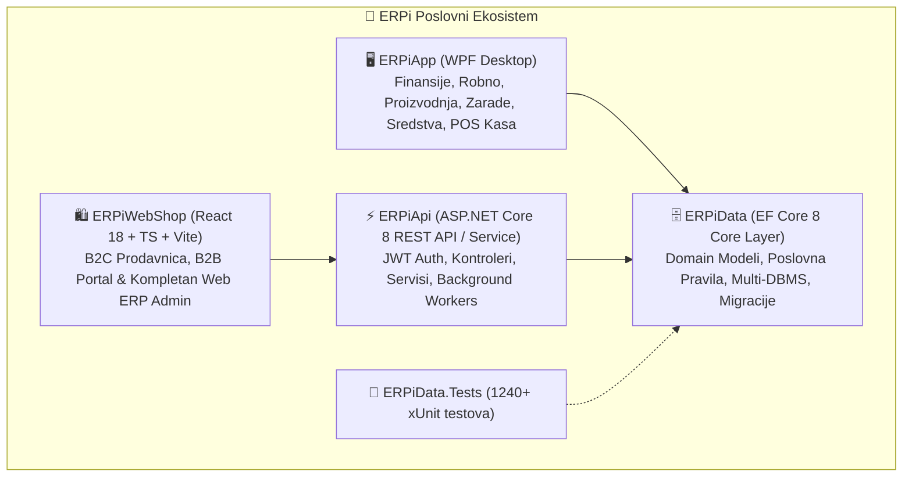
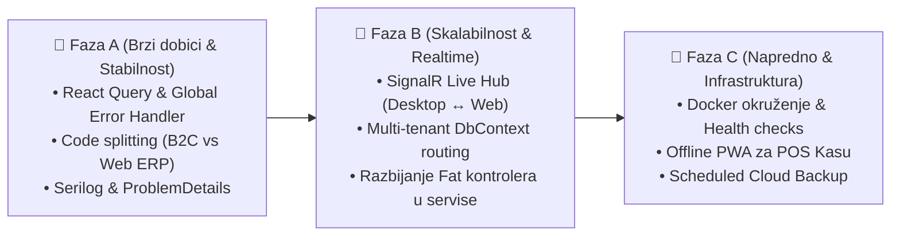

# 🏛️ ERPi Enterprise — Analiza Arhitekture i Strateški Predlozi za Unapređenje

> **Datum kreiranja:** 24.08.2026.  
> **Obuhvat:** `ERPiData` (EF Core 8 / Domain), `ERPiApi` (ASP.NET Core 8 REST / Windows Service), `ERPiApp` (WPF .NET 8 Desktop), `ERPiWebShop` (React 18 / TypeScript / Vite), Baze podataka (SQLite / PostgreSQL / MSSQL), Integracije i DevOps.

---

## 📌 1. Izvršni pregled trenutne arhitekture

ERPi predstavlja savremeni hibridni poslovni informacioni sistem (WPF Desktop + Web ERP + B2C/B2B WebShop) sa jedinstvenim modelom podataka i poslovnom logikom.

### Ključne prednosti postojećeg sistema
1. **Objedinjeni domenski sloj (`ERPiData`)**: Poslovna pravila, kalkulacije cena, amortizacija, platni spiskovi i PDF generatori su centralizovani u `ERPiData` i dele se između Desktopa i Weba.
2. **Multi-DBMS fleksibilnost**: Podrška za nultu konfiguraciju preko lokalnog SQLite-a, mrežni rad na MSSQL-u i robusni višekorisnički/Cloud rad na PostgreSQL-u.
3. **Omni-channel integracija**: Direktan rad nad istom bazom u realnom vremenu (Web porudžbine automatski kreiraju prenosne dokumente i utiču na raspoložive zalihe).
4. **Visoka stabilnost i testiranost**: Preko 1.240 automatizovanih testova koji pokrivaju matematička pravila knjiženja, PDV i robno kretanje.

---

## ⚠️ 2. Identifikovane uske tačke i arhitektonski izazovi

| Oblast | Trenutno stanje | Rizik / Limitacija |
| :--- | :--- | :--- |
| **Backend kontroleri** | „Fat controllers” (npr. `AdminController` ~141KB, `MagacinController` ~138KB, `ZaradeController` ~131KB) | Otežano održavanje, mešanje HTTP protokola, mapiranja i biznis kalkulacija u samim kontrolerima. |
| **Multi-tenancy & biranje baze** | `Program.cs` se oslanja na `aktivna_baza.json` marker fajl ili pogađanje najskorije menjane `.db` datoteke | Ograničava API na rad sa samo jednom bazom/firmom po pokrenutom procesu. Ako više korisnika sa weba želi da bira firmu, potreban je višetennantski kontekst. |
| **Frontend State & Caching** | Ručni `useEffect` + `useState` u React tabovima, bez centralizovanog server-state keša | Redundantni mrežni pozivi, mogućnost „tihih grešaka” (kao nalaz od 21.08. sa neautorizovanim pozivima), otežano optimističko osvežavanje. |
| **Monolitni SPA Bundle** | I javni B2C WebShop i masivni Web Admin ERP (~40+ ekrana) se pakuju u isti bundle | Veći početni `bundle size` za običnog B2C kupca na mobilnim mrežama. |
| **Realtime sinhronizacija** | Desktop i Web klijenti ne komuniciraju u realnom vremenu (npr. promene lagera, nova web porudžbina, izmene statusa) | Oslanjanje na periodični polling ili ručno osvežavanje (`F5`). |
| **Konkurentnost & Zaključavanje** | `WebShopPorudzbinaLockService` je in-memory C# zaključavanje unutar jednog procesa | Ne pruža distribuirano zaključavanje ako se API horizontalno skalira ili koristi direktan upis iz WPF-a. |

---

## 🚀 3. Detaljni predlozi za unapređenje arhitekture

---

### 🔹 Sloj 1: Backend & API (`ERPiApi` + `ERPiData`)

1. **Refaktoring na CQRS / MediatR ili čiste domenske servise (Izdvajanje logike iz kontrolera)**
   - Izdvojiti poslovnu logiku iz masivnih kontrolera (`MagacinController`, `ZaradeController`, `AdminController`) u handlerske ili namenske servisne klase.
   - Kontroleri treba da budu isključivo tanki entry-point-i: prijem DTO-a, validacija, poziv servisa i vraćanje standardizovanog `IResult` / `ActionResult`.
2. **Uvođenje `FluentValidation` za ulazne DTO objekte**
   - Umesto ručnih `if (string.IsNullOrEmpty(...))` i provera unutar tela metoda, uvesti automatsku deklarativnu validaciju kalkulacija, naloga, plata i porudžbina pre nego što uđu u domenski sloj.
3. **Pravi dinamički Multi-Tenant `DbContextFactory` (Rad sa više firmi na Webu)**
   - Umesto jednog statičkog konekcionog stringa u `Program.cs`, uvesti `TenantProvider` (preko HTTP Headera `X-Company-Id` ili JWT Claim-a `firmaId`).
   - Ovo omogućava da jedan pokrenut `ERPiApi` instancira odgovarajući `ErpiDbContext` u zavisnosti od toga kojoj firmi korisnik pristupa (ključno za knjigovodstvene agencije koje vode 20+ firmi preko weba).
4. **Globalni Middleware za rukovanje greškama i Structured Logging (`Serilog` + OpenTelemetry)**
   - Standardizovani [RFC 7807 Problem Details](https://datatracker.ietf.org/doc/html/rfc7807) format odgovora za sve greške na API-ju.

---

### 🔹 Sloj 2: Realtime sinhronizacija (SignalR Hub)

1. **SignalR komunikacioni kanal (`/hubs/erpi-live`)**:
   - **Notifikacije o novim web porudžbinama**: Trenutni push ka WPF desktopu i Web Adminu (sa zvučnim signalom i iskačućim obaveštenjem).
   - **Live sinhronizacija lagera**: Čim se u POS Kasi ili WPF Robnom proknjiži izlaz/ulaz, WebShop katalog i Web Admin automatski ažuriraju stanje bez ručnog osvežavanja.
   - **Status SEF e-Faktura i Izvoda**: Pozadinski worker obrađuje SEF/izvode i šalje SignalR poruku „Faktura PIB: ... je uspešno prihvaćena na SEF-u".

---

### 🔹 Sloj 3: Frontend arhitektura (`ERPiWebShop`)

1. **Uvođenje `@tanstack/react-query` (React Query)**
   - Zamena ručnih `fetch` + `useState` + `useEffect` u preko 50 komponenti.
   - **Dobitak:** Automatsko keširanje, pozadinsko osvežavanje (`stale-while-revalidate`), deduplikacija poziva, ugrađen `isLoading`, `isError`, i jednostavno optimističko ažuriranje (npr. promena statusa naloga ili cene artikla).
2. **Razdvajanje Bundle-a (Code Splitting / Lazy Loading)**
   - Razdvojiti B2C javnu prodavnicu od `/admin` i `/b2b` portala pomoću `React.lazy()` i `Suspense`.
   - Kupac na mobilnom telefonu preuzima samo lagani paket za katalog i korpu, a teške ERP komponente (`ErpiDataGrid`, SheetJS, PDF viewer, kalkulacije) se učitavaju asinhrono tek pri prijavi administratora.
3. **Globalni Axios/Fetch Interceptor sa Toast sistemom**
   - Centralizovano hvatanje 401 (automatski redirect na login ili refresh tokena), 403 (nedozvoljena rola), i 500 grešaka (prikaz jasne notifikacije korisniku umesto praznog ekrana).
4. **PWA & Offline Kasa POS Podrška**
   - Dodavanje Service Worker-a i lokalnog `IndexedDB` skladišta za Web POS Kasu.
   - Omogućava nesmetano izdavanje računa u slučaju trenutnog prekida internet konekcije, uz automatsku sinhronizaciju čim se veza uspostavi.

---

### 🔹 Sloj 4: Baze podataka, konkurentnost i performanse

1. **Optimizacija EF Core upita (Split Queries & AsNoTracking)**
   - U izveštajima (Bruto bilans, KEP knjiga, Kartica robe) masivni upiti sa `.Include()` relacijama mogu praviti kartezijanski proizvod. Korišćenje `.AsNoTracking().AsSplitQuery()` i indeksirani kompozitni ključevi.
2. **Distribuirano zaključavanje / Optimistic Concurrency**
   - Dodavanje `[Timestamp]` / `RowVersion` polja na ključne dokumente (Kalkulacije, Nalozi, Porudžbine) kako bi se sprečilo da dva korisnika (npr. jedan na Desktopu, drugi na Webu) istovremeno pregaze međusobne izmene.

---

### 🔹 Sloj 5: DevOps, Kontejnerizacija i Sigurnost

1. **Docker Compose okruženje (`docker-compose.yml`)**
   - Za Cloud/Server postavku: pripremljen kontejner za `ERPiApi` (.NET 8 runtime) + `PostgreSQL 16` + `Caddy/Nginx` reverse proxy sa automatskim SSL sertifikatima.
2. **Automatski Scheduled Backup Servis**
   - Za SQLite: integracija online `VACUUM INTO` backup-a u pozadinskom servisu koji automatski noću kreira kompresovanu kopiju baze na definisanu putanju ili Cloud storage (S3/Azure Blob/SFTP).
3. **Health Checks (`/healthz` i `/ready`)**
   - Ugrađeni ASP.NET Core Health Checks koji proveravaju dostupnost baze podataka, disk prostor i SEF API vezu.

---

## 🗺️ 4. Preporučeni redosled prioriteta (Implementacioni Roadmap)

| Faza | Prioritet | Zadaci | Očekivani rezultat |
| :--- | :---: | :--- | :--- |
| **Faza A** | 🔴 Visok | • React Query & Global Error Toast • `React.lazy` razdvajanje B2C i Admin bundle-a • Standardizacija ProblemDetails odgovora | Eliminacija tihih grešaka, drastično brže učitavanje WebShop-a, ujednačeno rukovanje greškama. |
| **Faza B** | 🟡 Srednji | • SignalR Live Hub za Desktop ↔ Web sinhronizaciju • Multi-tenant `TenantProvider` za izbor firme na Webu • Refaktoring masivnih kontrolera u domenske servise | Instant obaveštenja o porudžbinama/lageru bez osvežavanja stranice; rad sa više firmi na Webu. |
| **Faza C** | 🟢 Dugoročni | • `docker-compose.yml` produkcioni stek (API + Postgres + Proxy) • Offline PWA keširanje za POS Kasu • Automatizovani noćni Cloud backup | Jednostavan 1-klik deploy na klijentske Linux/Windows servere i otpornost kase na nestanak interneta. |

---

## 🔍 5. Napomene posle provere protiv koda

Sve činjenične tvrdnje iz odeljaka 1-4 su provere protiv stvarnog stanja repoa (veličine
kontrolera, `package.json`, `Program.cs`, `docs/ARCHITECTURE.md` §2) i **potvrđene tačnim**.
Ono što sledi nisu ispravke grešaka nego kalibracija nekoliko predloga koji, uzeti bukvalno,
ne uzimaju u obzir specifičnosti ovog repoa — eksplicitnu anti-apstrakcija filozofiju
(`CLAUDE.md`, WPF bez MVVM, `Partner` namerno "mršav"), postojeći model "baza po firmi" i
per-firm Windows servis deployment, i Velopack kao primaran distribucioni kanal.

1. **MediatR/CQRS (Sloj 1, t. 1) → obično izdvajanje u servise, bez MediatR sloja.**
   Repo namerno izbegava premature abstractions (WPF bez MVVM, `Partner` "mršav" po dizajnu).
   MediatR dodaje indirection — handler discovery, dodatna DI registracija, teže je Ctrl+klikom
   ispratiti tok od kontrolera do izvršenja — bez dodatne vrednosti nad običnim servisnim
   klasama (`MagacinService`, `ZaradeIsplataService`...) pozvanim direktno iz kontrolera. Isti
   dobitak (tanji kontroleri, testabilnost), manja cena i manja learning curve.

2. **Multi-tenant `TenantProvider` (Sloj 1, t. 3) potcenjuje razmeru posla u roadmap tabeli.**
   Danas je `ERPiApi` per-firm Windows servis (`ERPiApi_<šifra>`) — svaka firma već ima svoju
   instalaciju vezanu za svoju bazu (SQLite fajl ili sopstvenu Postgres/MSSQL šemu; model je
   "baza po firmi", ne deljena šema sa `tenant_id` kolonom — predlog to ispravno prati). Ali
   "jedan pokrenut `ERPiApi` servisira 20 firmi" je promena *proizvoda* (SaaS hosting za
   knjigovodstvene agencije), ne samo refaktor rutiranja konekcije: nosi sopstvenu
   autentifikaciju (JWT `firmaId` claim naspram današnjeg `GlobalLogin`/`CompanySelect` toka),
   sopstveni deployment model, i otvoreno pitanje da li stari per-firm-servis model koegzistira
   ili se gasi. Predlog: izdvojiti kao poseban dizajn-korak *pre* razvoja, ne ubaciti direktno
   kao razvojni zadatak u Fazu B. Bezbednosni rizik ukrštanja podataka firmi ako se
   `X-Company-Id`/JWT ne validira strogo po svakom zahtevu treba tretirati kao blokirajući
   uslov, ne detalj implementacije.

3. **Optimistic concurrency (Sloj 4, t. 2) je ispao iz prioritetne tabele u odeljku 4.**
   Jeftina, aditivna, niskorizična izmena (`RowVersion` kolona + provera pri snimanju) koja
   direktno sprečava gubitak podataka — realniji i hitniji rizik od SignalR-a, koji samo
   obaveštava da se nešto promenilo ali sam po sebi ne sprečava race condition u pisanju.
   Predlog: prebaciti u Fazu A ili sam početak Faze B, pre SignalR-a — SignalR je UX
   poboljšanje (svežina prikaza), `RowVersion` je popravka korektnosti (da se izmene ne
   pregaze).

4. **Code splitting (Sloj 3, t. 2) je već delimično započet.** `React.lazy`/`Suspense`
   postoje u `App.tsx`, `B2bPortalApp.tsx` i `B2bBrzoNarucivanje.tsx`. Predlog treba
   preformulisati kao "proširiti na `AdminPanel.tsx` i njegovih ~40 tabova", ne kao uvođenje
   od nule.

5. **PWA/Offline POS Kasa (Sloj 3, t. 4) — proveriti domet pre ulaska u roadmap.**
   `components/admin/kasa/KasaTab.tsx` postoji, ali `PLAN_NASTAVKA.md` (Faza 12) vodi pravu
   maloprodajnu kasu i PFR v3 fiskalizaciju kroz WPF, ne kroz Web. Ako Web `KasaTab` nije
   prodajno mesto sa fizičkim fiskalnim uređajem, offline fiskalizacija (uređaj mora biti
   dostupan da potpiše račun) je suštinski teže rešiva nego „sinhronizuj po povratku veze"
   sugeriše. Dodati eksplicitnu pretpostavku da li Web Kasa ikad treba da radi sa fiskalnim
   uređajem pre nego što se offline sloj planira.

6. **Docker Compose / Cloud backup (Sloj 5) — imenovati profil klijenta.**
   Primaran distribucioni kanal je Velopack auto-update na Windows radnim stanicama/serverima
   (tipičan klijent: knjigovodstvene agencije i SMB firme u Srbiji). Docker+Postgres+Caddy je
   ispravan predlog za postojeću server/cloud opciju (`docs/ARCHITECTURE.md` §2.3), ali vredi
   eksplicitno reći da cilja tehnički napredniju manjinu klijenata (self-hosting/VPS), ne
   zamenu Velopack toka koji ostaje primaran za većinu.

7. **Razdvojiti dva različita „multi-firm" problema u tabeli iz odeljka 2.**
   (a) više korisnika, ista firma, real-time deljen pristup — već rešeno preko Postgres/MSSQL
   mrežnog režima (`docs/ARCHITECTURE.md` §2.3); (b) više firmi u istom `ERPiApi` procesu —
   nije rešeno, to je predlog iz t. 2 ovog odeljka. Trenutna formulacija ih pomalo meša u
   jednu rečenicu, a rešenja su im potpuno različita.

Sloj 1 t. 2 i 4 (FluentValidation, Serilog+ProblemDetails), Sloj 4 t. 1 (`AsNoTracking`/
`AsSplitQuery`) i Sloj 5 t. 3 (Health checks) ostaju bez primedbe — dobro utemeljeni, nizak
rizik, visoka vrednost, mogu ući u Fazu A bez izmena.
