# 🌐 ERPi WebShop — Tehnički Vodič i Arhitektura Modula

Integrisani B2C i B2B e-Commerce podsistem u okviru ERPi platforme.

---

## 📑 Sadržaj
1. [Pregled Podsistema](#-1-pregled-podsistema)
2. [Pokretanje i Razvoj](#️-2-pokretanje-i-razvoj)
3. [NBS IPS QR Instant Plaćanje](#-3-nbs-ips-qr-instant-plaćanje)
4. [B2B Veleprodajni Režim](#-4-b2b-veleprodajni-režim)
5. [Uređivanje Artikala i Bogati HTML Editor](#-5-uređivanje-artikala-i-bogati-html-editor-sa-live-pregledom)
6. [Integrisano Pokretanje i Debagovanje](#️-6-integrisano-pokretanje-i-debagovanje-ide-run--debug)
7. [Integracija sa Kurirskim Službama i Generisanje Adresnica](#-7-integracija-sa-kurirskim-službama-i-generisanje-adresnica)
8. [Automatski Transakcioni Email Servis i SystemTray Notifikacije](#-8-automatski-transakcioni-email-servis-i-systemtray-notifikacije)
9. [B2B Veleprodajni Portal i Verifikacija](#-9-b2b-veleprodajni-portal-i-verifikacija)
10. [SEO, Analitika, Marketing, Wishlist & Upoređivanje Artikala](#-10-seo-analitika-marketing-wishlist--upoređivanje-artikala)
11. [WebShop Admin Stranica `/admin` i Sistem Kupona](#️-11-webshop-admin-stranica-admin-multi-firma-backoffice-i-sistem-kupona)
12. [Rezervacija Zaliha](#-12-rezervacija-zaliha-zaštita-od-prodaje-iste-robe-dva-puta)
13. [Ocene i Recenzije Artikala](#-13-ocene-i-recenzije-artikala)
14. [Kurirske Službe & API Praćenje Pošiljki](#-14-kurirske-službe--api-praćenje-pošiljki-postexpress-dexpress-bex-aks)
15. [B2C Korisnički Nalozi & Loyalty Program](#-15-b2c-korisnički-nalozi--loyalty-program-program-lojalnosti)
16. [Online Kartično Plaćanje & 3D Secure 2.0](#-16-online-kartično-plaćanje-payment-gateway--3d-secure-20)
17. [Automatske SMS / Viber Notifikacije Kupcima](#-17-automatske-sms--viber-notifikacije-kupcima)
18. [Marketing Automatizacija: Povezani Artikli, Količinski Popusti & Napuštene Korpe](#-18-marketing-automatizacija-povezani-artikli-količinski-popusti--napuštene-korpe)
19. [Live Chat Podrška & WhatsApp / Viber Widget](#-19-live-chat-podrška--whatsapp--viber-widget)
20. [Pametni Quick-Search Modal (Ctrl+K) & Barcode Skener Kamerom](#-20-pametni-quick-search-modal-ctrlk--barcode-skener-kamerom)
21. [Višejezičnost i Viševalutnost](#-21-višejezičnost-i-viševalutnost-multilingual--multi-currency)
22. [Adrese Stranica (URL Rute i Deljivi Linkovi)](#-22-adrese-stranica-url-rute-i-deljivi-linkovi)
23. [Kvalitet Koda: Testovi, Lint i Ponašanje bez Servera](#-23-kvalitet-koda-testovi-lint-i-ponašanje-bez-servera)

---

## 📌 1. Pregled Podsistema

WebShop modul se sastoji iz tri komplementarne komponente:

1. **`ERPiData` (Modeli & Baza)**:
   - EF Core entiteti (`WebKategorija`, `Atribut`, `WebPorudzbina`, `WebKorisnik`, `WebShopPodesavanja`).
   - Automatska migracija za SQLite (`EnsureWebShopTables`) i višekorisničke baze (PostgreSQL/SQL Server).
2. **`ERPiApp` (WPF Desktop Administracija)**:
   - Upravljanje stablom kategorija (`WebKategorijeView`).
   - Katalog artikala za web sa slikama, PDF tehničkim listovima i akcijama (`WebShopKatalogView`, `WebArtikalEditWindow`).
   - Inbox porudžbina sa jednoklikovnim generisanjem **Računa-Otpremnice** koji se odmah i knjiži — razdužuje magacin i pravi nalog prodaje u glavnoj knjizi (`WebPorudzbineView`, vidi §12).
   - Konfiguracija tema, boja, magacina za zalihe i troškova dostave (`WebShopPodesavanjaView`).
3. **`ERPiApi` (.NET 8 ASP.NET Core REST API)**:
   - REST kontroleri (`Katalog`, `Auth`, `Porudzbine`, `B2b`).
   - JWT autentifikacija sa claims podrškom za B2B partnere.
   - **`NbsIpsQrService`**: Generisanje instant NBS IPS QR koda Narodne banke Srbije za m-banking aplikacije domaćih banaka.
4. **`ERPiWebShop` (React 18 + Vite + TypeScript Frontend)**:
   - B2C moderna prodavnica (Mega Meni, pretraga, fasetirano filtriranje po atributima, korpa sa trakom za besplatnu dostavu).
   - B2B veleprodajni portal (VP cene bez PDV-a, uvid u neizmirene račune i finansijsko stanje, tabelarni **Quick Order** unos).
   - **Live Theme Customizer**: Prebacivanje između gotovih šablona (*Modern Retail*, *Industrial B2B*, *Minimal Luxury*, *Fresh & Green*) uz tamni i svetli režim.

---

## ⚙️ 2. Pokretanje i Razvoj

### Pokretanje Backend API Servisa (`ERPiApi`):

⚠️ **Preporučeno**: dugme **"Pokreni Servis"** u `ERPiApp` → *Podešavanja → WebShop*. Ono automatski prosleđuje `--db` sa putanjom do baze **trenutno aktivne firme** (`AppConfig.DbPath`). Ako se servis pokrene bez `--db` (npr. golim `dotnet run` ispod), API sam pokušava da pogodi bazu i pri više firmi u `%LocalAppData%\ERPi\Baze\` lako pogodi pogrešnu (ili praznu legacy `erpi.db`) — katalog na sajtu tada izgleda prazan iako su artikli u ERPiApp-u označeni "Na Web-u", bez ijedne vidljive greške. API sada ispisuje upozorenje u konzoli kad se ovo desi.

Ručno pokretanje (dev, van ERPiApp-a) — uvek eksplicitno navesti bazu:
```powershell
cd c:\ERPi\ERPi\ERPiApi
dotnet run -- --db "C:\Users\<korisnik>\AppData\Local\ERPi\Baze\<naziv_firme>.db"
```
API će biti dostupan na `http://localhost:5000` uz interaktivnu Swagger dokumentaciju na `http://localhost:5000/swagger`.

### Pokretanje Frontend Prodavnice (`ERPiWebShop`):

**U dev okruženju** (izvorno stablo, hot-reload):
```powershell
cd c:\ERPi\ERPi\ERPiWebShop
npm run dev
```
Frontend aplikacija se otvara na `http://localhost:5173`.

Port i API cilj se mogu prepisati env promenljivama — potrebno kad se pokreće **više nezavisnih
instanci prodavnice** (jedna po firmi), svaka vezana za svoj `ERPiApi`:
```powershell
$env:VITE_PORT=5174; $env:VITE_API_TARGET="http://localhost:5002"; npm run dev
```

Ostale skripte (`package.json`):

| Komanda | Šta radi |
| :--- | :--- |
| `npm run build` | `tsc` provera tipova + produkcijski build u `dist/` |
| `npm test` | Vitest, jednokratno (vidi §23) |
| `npm run test:watch` | Vitest u režimu praćenja izmena |
| `npm run lint` | ESLint (kapija je **0 grešaka**; upozorenja su dozvoljena) |
| `npm run lint:strict` | ESLint sa `--max-warnings 0` |

**U instaliranoj (produkcijskoj) verziji** posebnog frontend procesa nema — `publish.ps1` /
CI (`.github/workflows/release.yml`) rade `npm run build` i kopiraju gotov `ERPiWebShop/dist` u
`ERPiApi/wwwroot`, pa `ERPiApi` sam servira prodavnicu na istom portu kao API (npr.
`http://localhost:5000/`). `AppTrayService` ovo prepoznaje automatski (bundled `ERPiApi.exe` +
`wwwroot` postoje) i ne pokušava da pokrene `npm run dev` na korisnikovoj mašini.

---

## 📱 3. NBS IPS QR Instant Plaćanje

Format stringa koji se generiše u skladu sa specifikacijom NBS:
```
K:PR|V:01|C:1|R:84000000000000000|N:NAZIV PRIMAOCA|I:RSD12500,00|SF:289|S:Web porudzbina WP-20260814-1001|RO:001001
```

Kupac u mobilnoj bankarskoj aplikaciji (Intesa Mobi, Moja mBanka OTP, Raiffeisen RaiPay, Poštanska itd.) skenira generisani QR kod i odmah vrši prenos sredstava bez ručnog prepisivanja podataka.

**QR na porudžbini (`CheckoutModal`)** koristi `NbsIpsQrService.GenerisiIpsString(WebPorudzbina, Firma)`
— server ga vraća kao `ipsQrBase64` iz `PorudzbineController`.

**QR na ponudi/predračunu iz korpe (`PonudaPdfModal`)** — pre nego što porudžbina uopšte postoji u
bazi, pa nema ID za `/api/porudzbine/{id}/ips-qr`. Rešeno anonimnim endpoint-om
`GET /api/katalog/ponuda-qr?iznos=&pozivNaBroj=`, koji isti `NbsIpsQrService` poziva sa primitivnim
overload-om (`GenerisiIpsString(decimal iznos, string svrha, string pozivNaBroj, Firma firma)`).
Ranije je ovde stajao QR crtan na frontu preko spoljnog servisa (`api.qrserver.com`) sa tvrdo
ukucanim računom `160000000012345678` i primaocem „ERPi Commerce d.o.o." — izmišljenim vrednostima
koje bi navele kupca da uplati na nepostojeći račun. Rešenje **nije** dodalo nova polja u
`WebShopPodesavanja` (nije trebalo — `Firma` već ima `Naziv`/`Pib`/`MaticniBroj`/`ZiroRacun`/
`Adresa`, iste vrednosti koje se štampaju na svakoj fakturi): `WebShopPodesavanjaDto` i anonimni
`/api/katalog/podesavanja` sad nose i njih (`pravniNazivFirme`, `pibFirme`, `maticniBrojFirme`,
`ziroRacunFirme`, `adresaFirme`) — javni podaci, isto što stoji na svakom računu, ne tajna.
`PonudaPdfModal` prikazuje QR (`ipsQrDostupan`) samo kad je `dozvoliIpsQrPlacanje` uključeno I
`ziroRacunFirme` stvarno podešen; dok Firma nije popunjena, zaglavlje ponude i dalje prikazuje samo
`NazivShopa`/`Slogan`/`LogoUrl`, bez QR-a i bez izmišljenih pravnih podataka.

---

## 🔒 4. B2B Veleprodajni Režim

- Kupci koji se prijave sa nalogom povezanim na `PartnerId` u ERP-u vide:
  - Veleprodajne cene (bez PDV-a) sa uračunatim partnerskim ugovorenim rabatima (`PartnerCenaArtikla`, ugovorena neto cena po paru partner/artikal).
  - Tabelu neizmirenih e-Faktura sa datumima dospeća i preostalim iznosima.
  - Mogućnost brzog tabelarnog poručivanja unoseći više šifara i količina odjednom, ili uvozom spiska iz Excel/CSV fajla.
- Cela ova radna tabla živi na zasebnoj ruti `/b2b`, potpuno odvojenoj od B2C prodavnice — vidi [§9](#-9-b2b-veleprodajni-portal-i-verifikacija) za detalje arhitekture i rutiranja.

---

## 📝 5. Uređivanje Artikala i Bogati HTML Editor sa Live Pregledom

U okviru desktop ekrana `WebArtikalEditWindow` (Tab *Opis & Specifikacija*):
- **Format traka sa alatkama**:
  - `Bold`, `Italic`, `Podvučeno`, `H2 Naslov`, `H3 Podnaslov`, `• Lista`, `📊 Tabela specifikacija`, `💡 Info boks`.
- **Dvodelni Split View sa Live Web Preview-om**:
  - Leva strana: HTML editor izvornog koda sa sintaksnim komandama.
  - Desna strana: Ugrađeni WebBrowser koji u realnom vremenu renderuje opis proizvoda identično onome kako ga vidi kupac na WebShop-u.

---

## 🛠️ 6. Integrisano Pokretanje i Debagovanje (IDE Run & Debug)

U radnom prostoru konfigurisani su gotovi profili u `.vscode/launch.json`:
- **`🚀 Full-Stack WebShop (API + React Frontend)`**: Jednim klikom (`F5`) istovremeno pokreće i backend API (port 5000) i React Vite frontend (port 5173).
- **`🛍️ ERPiWebShop (React Frontend)`**: Pokreće samo React prodavnicu uz automatsko otvaranje browsera.
- **`⚡ ERPiApi (ASP.NET Core API Backend)`**: Pokreće C# REST API sa Swagger UI dokumentacijom.
- **`🌟 Kompletan ERPi Sistem`**: Pokreće Desktop WPF aplikaciju, REST API i WebShop odjednom.

---

## 🚚 7. Integracija sa Kurirskim Službama i Generisanje Adresnica

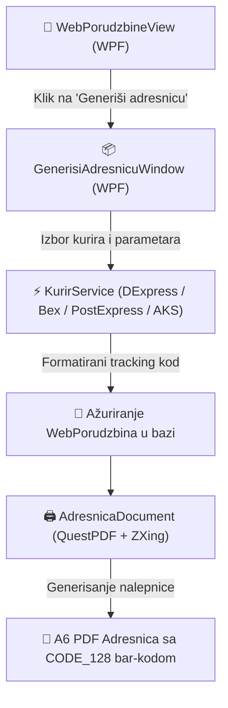

U okviru desktop ekrana `WebPorudzbineView`:
- **Dugme `📦 Generiši adresnicu`**:
  - Otvara dijalog za izbor kurirske službe (**DExpress**, **Bex Express**, **Post Express**, **AKS Express Kurir**).
  - Automatski izračunava i popunjava otkupninu (za porudžbine pouzećem) i broj paketa/težinu.
  - Slanje podataka kuriru uz generisanje jedinstvenog koda za praćenje (Tracking ID: `DEX-...`, `BEX-...`, `PE-...`, `AKS-...`).
- **Štampa PDF nalepnice sa bar-kodom (`AdresnicaDocument`)**:
  - Standardizovani format (100x150 mm / A6) spreman za termalne i standardne štampače.
  - Sadrži **`CODE_128` bar-kod** broja pošiljke, podatke pošiljaoca i primaoca, vrednost, otkupninu i napomenu za kurira.

---

## 📧 8. Automatski Transakcioni Email Servis i SystemTray Notifikacije

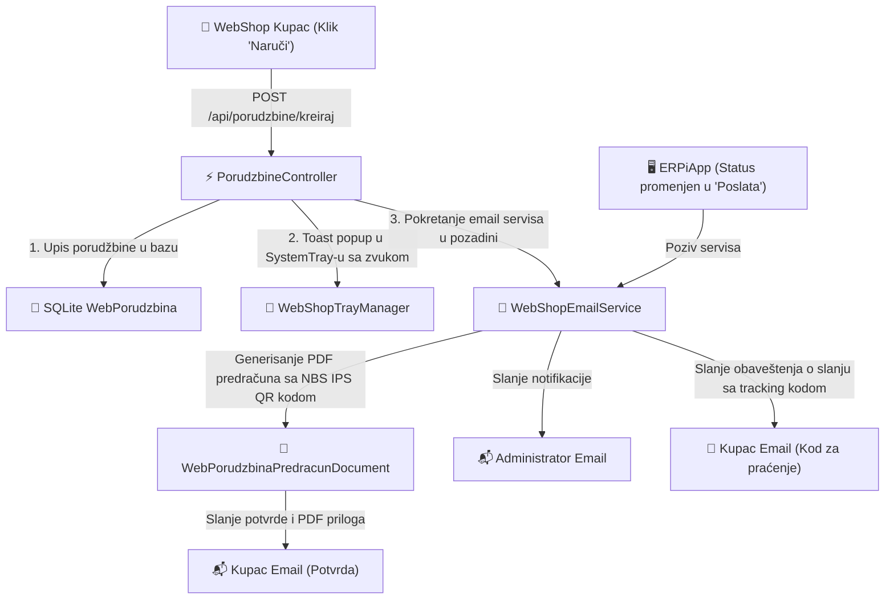

1. **Email Potvrda Kupcu (sa PDF Predračunom)**:
   - Čim kupac napravi porudžbinu, automatski dobija HTML potvrdu sa specifikacijom i priloženim PDF predračunom (`WebPorudzbinaPredracunDocument`) koji sadrži **NBS IPS QR kod** za instant plaćanje.
2. **Email Obaveštenje o Slanju Pošiljke**:
   - Pri generisanju adresnice ili promeni statusa u `Poslata`, kupac dobija email sa nazivom kurirske službe i kodom za praćenje.
3. **Notifikacija Administratoru**:
   - Email notifikacija na administrativnu adresu.
   - **Windows SystemTray Toast Popup sa zvukom** (`SystemSounds.Asterisk`): desktop obaveštenje o novoj porudžbini sa iznosom i podacima kupca.
4. **Obaveštenje „artikal je ponovo na stanju"** (`PosaljiObavestenjeODostupnostiAsync`, §3dz):
   - Ne šalje ga porudžbina nego pozadinski prolaz koji prati zalihu — vidi odeljak 18, tačka 4.
   - Za razliku od gornja tri, ovaj email ne izaziva korisnička radnja u trenutku slanja, pa je
     jedini kome se rok ne meri u sekundama nego u jednom intervalu prolaza (10 minuta).

---

## 🏢 9. B2B Veleprodajni Portal i Verifikacija

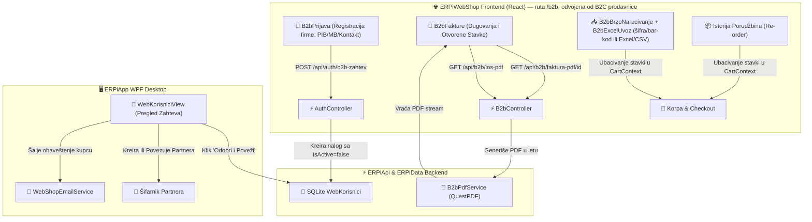

1. **Online B2B Registracija pravnih lica**: unos PIB/MB, kontakt osobe i adrese uz status na čekanju.
2. **Desktop odobrenje u `ERPiApp`**: ekran `WebKorisniciView` za automatsko povezivanje ili kreiranje Partnera u šifarniku.
3. **Preuzimanje PDF Faktura & IOS-a**: direktno preuzimanje PDF dokumenta za svaki račun ili zbirnog IOS izvoda.
4. **Re-order (Naruči ponovo)**: ponavljanje stavki iz prethodne narudžbenice jednim klikom.
5. **Excel/CSV uvoz u Brzo naručivanje**: dugme *"📥 Uvezi spisak iz Excel/CSV-a"* na `/b2b/brzo-narucivanje` prepoznaje kolone Šifra/Bar-kod i Količina (`.xlsx`/`.xls`/`.csv`/`.txt`), pre ubacivanja u korpu prikazuje pregled sa tri stanja po redu (pronađeno / smanjeno na raspoloživo stanje / nepoznata šifra) i automatski zaokružuje na pun paket ako artikal ima korak količine (`Artikal.KorakKolicine`).
6. **Kreditni limit (soft-lock)**: partner dobija opcioni `KreditniLimit`/`ValutaPlacanjaDana` (ekran `PartnerCenovnikView` u `ERPiApp`). Porudžbina na *"Odloženo plaćanje (B2B)"* koja bi premašila limit (dug iz fakturisanih računa + već otvorene nefakturisane porudžbine na odloženo) NE bude odbijena — kreira se sa statusom **Čeka odobrenje**, admin je ručno oslobađa dugmetom *"✅ Odobri porudžbinu"* u `WebPorudzbineView`. Avans/IPS QR/kartica se nikad ne proveravaju (plaćaju se odmah). Bez podešenog limita (ili `KreditniLimit ≤ 0`) partner nikad nije zadržan.
7. **Sačuvane adrese isporuke** (§3ci): tab `/b2b/adrese` — partner čuva više mesta isporuke (magacini, filijale), svako sa nazivom, adresom, kontakt osobom/telefonom i opcionom oznakom "podrazumevana". Birane pri checkout-u (dropdown u `CheckoutModal`) umesto ručnog unosa svaki put — ručan unos i dalje radi neizmenjen. `B2bAdresaIsporuke` tabela je namerno bez FK ka `WebPorudzbina`: porudžbina snima TEKST adrese u trenutku poručivanja, brisanje/izmena sačuvane adrese ne menja retroaktivno već poslate porudžbine.
8. **Personalizovani cenovnik (PDF/Excel)**: dugmad na `/b2b/fakture` generišu ceo cenovnik (svi artikli vidljivi na webu) sa cenom koju baš taj partner vidi — ugovorena (`PartnerCenaArtikla`) gde postoji, inače standardna web cena svedena na neto, ista formula kao katalog/checkout. PDF preko `B2bPdfService` (QuestPDF), Excel preko `B2bExcelService` (ClosedXML) — obe strane cenovnika dele istu pripremu podataka (`B2bController.PripremiCenovnikAsync`).
9. **Multi-user nalozi i odobravanje porudžbina** (§3ci): `WebKorisnik.MozeOdobravatiPorudzbine` (podrazumevano `true`) razdvaja "odobravaoce" od običnih naručilaca u istoj firmi (isti `PartnerId`). Tab `/b2b/tim` — odobravalac dodaje kolege (`POST /api/b2b/korisnici-firme`, podrazumevano NE odobravaoci — least privilege) i menja uloge/aktivnost, uz zaštitu da firma ne može ostati bez ijednog aktivnog odobravaoca. Porudžbina naručioca koji SAM nije odobravalac dobija status **Čeka odobrenje** (isti enum kao kreditni limit soft-lock, razlikuju se preko `WebPorudzbina.RazlogCekanja`) — čeka kolegu na `/b2b/tim` (`odobri`/`odbij`), ne WPF admina. Pojedinačni B2B nalozi (jedini korisnik svoje firme) ostaju bez ikakvog trenja — sami sebi su odobravalac.

### Ključne mogućnosti B2B Portala (`/b2b`):
1. **Potpuno odvojena ruta/shell od B2C prodavnice** — isti obrazac kao Admin stranica: `/b2b` (ili `/b2b/:tab`) učitava samostalan portal preko celog ekrana, bez `AnnouncementBar`/`Header`/`HeroBanner`/`Footer`/`MobileBottomNav` B2C prodavnice. Sopstveno zaglavlje pokazuje naziv i šifru partnera, dospeo dug, korpu, "Moje porudžbine", profil i odjavu.
2. **Tabovi po adresi**: `/b2b` je Početna (dashboard sa karticama partnera/duga), `/b2b/katalog`, `/b2b/brzo-narucivanje`, `/b2b/fakture`, `/b2b/adrese`, `/b2b/tim` — isti princip kao `/admin/:tab`.
3. **Tri stanja pri poseti `/b2b`**:
   * Nije prijavljen → `B2bPrijava` (samo prijava i B2B zahtev, BEZ B2C registracije — ta ostaje isključivo u generičkom nalog modalu na prodavnici).
   * Prijavljen, ali nalog nije B2B partner → `B2bNijePartner`, jasna poruka i izbor (nazad na prodavnicu / odjava pa novi B2B zahtev) umesto polomljenog dashboard-a.
   * Prijavljen kao B2B partner → puna radna tabla.
4. **Ulaz sa prodavnice**: amber dugme *"B2B Portal"/"Partner prijava"* u `Header`-u i CTA *"Za firme & partnere (B2B)"* u `HeroBanner`-u uvek vode direktno na `/b2b`. Obično dugme *"Prijava"* (gosti) otvara generički nalog modal (prijava/registracija/B2B zahtev) — B2B se odatle prebacuje na portal tek posle odobrenja, klikom na amber dugme.
5. **Deljeno sa B2C**: `CartContext`/`AuthContext`, `apiService`, cenovna logika (`efektivnaCenaBezPdv`, ugovorena cena partnera) i checkout tok — B2B portal ne duplira ove slojeve, samo dodaje sopstveni shell i stranice iznad njih.

---

## 📈 10. SEO, Analitika, Marketing, Wishlist & Upoređivanje Artikala

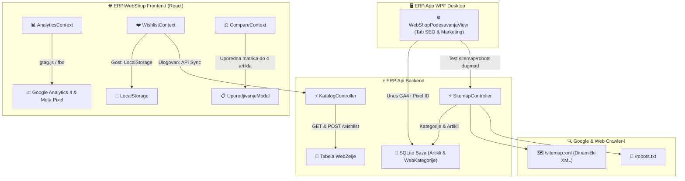

1. **Automatski `sitemap.xml` i `robots.txt`**:
   - Dinamičko generisanje XML sitemap-a iz baze artikala (`/sitemap.xml`) i pretraživačkih pravila (`/robots.txt`) za trenutno indeksiranje proizvoda i kategorija.
   - **Slike ulaze u mapu** (`image:image` ekstenzija): sve slike artikla iz `SlikeJson` i naslovna
     slika kategorije, pretvorene u pune adrese. Time proizvodi ulaze i u Google Images.
   - **`lastmod` samo kad postoji stvarna izmena**, iz audit traga nad `Artikal`-om — `Artikal` nema
     svoje polje sa vremenom izmene, a današnji datum na svakom artiklu je signal koji pretraživači
     prestanu da uzimaju u obzir.
   - **Sitemap indeks** kad katalog pređe granicu od jednog fajla (`/sitemap-osnovno.xml` +
     `/sitemap-proizvodi-{n}.xml`); manje prodavnice dobijaju jedan fajl.
   - `robots.txt` zabranjuje `/admin`, `/b2b`, `/swagger`, `/api/auth/`, `/api/b2b/` i `/api/admin/`.
     **`/api/katalog/` ostaje dozvoljen namerno** — prodavnica je SPA i Googlebot podatke o artiklu
     dobija tek kad mu se u pregledaču dozvoli taj poziv; zabrana bi mu ostavila praznu stranicu.
   - Pravila su u `SitemapGenerator` (ERPiData), odvojena od kontrolera da bi bila pokrivena testom
     (`SitemapGeneratorTests`) bez podizanja servera.
2. **Google Analytics 4 & Meta Pixel integracija**:
   - Polja za unos GA4 Measurement ID i Meta Pixel ID u `WebShopPodesavanjaView` bez potrebe za rekompajliranjem ili promenom koda.
   - `AnalyticsContext` na frontendu automatski prati preglede stranica, pregled artikala (`view_item`), dodavanje u korpu (`add_to_cart`) i realizovane kupovine (`purchase`).
3. **Ocene i recenzije artikala** — vidi §13 (samo verifikovani kupci, uz moderaciju u `/admin`).
4. **Lista želja (Wishlist) & Upoređivanje artikala**:
   - Čuvanje omiljenih artikala u `LocalStorage`-u za neregistrovane posetioce i u bazi podataka (`WebZelje`) za prijavljene korisnike.
   - Matrični uporedni prikaz do 4 artikla istovremeno (`UporedjivanjeModal`) sa specifikacijama, cenama i dostupnošću na zalihama.
5. **Google Rich Snippets (Schema.org JSON-LD)** (§3dw):
   - `SeoMeta` i `seoHelpers.ts` dinamički injektuju `Product`, `Offer`, `AggregateRating`, `Review`, `BreadcrumbList` i `WebSite` JSON-LD skripte u `<head>`.
   - Obogaćeni podaci: automatski brend iz atributa artikla (`Brend`/`Proizvođač`/`Brand`), čišćenje HTML opisa, GTIN bar-kodovi (`gtin13`/`gtin8`), lager status (`InStock`/`OutOfStock`), cene sa uračunatim PDV-om, standardni 14-dnevni rok za povrat robe i uslovi besplatne dostave.

---

## 🛠️ 11. WebShop Admin Stranica `/admin` (Multi-Firma Backoffice) i Sistem Kupona

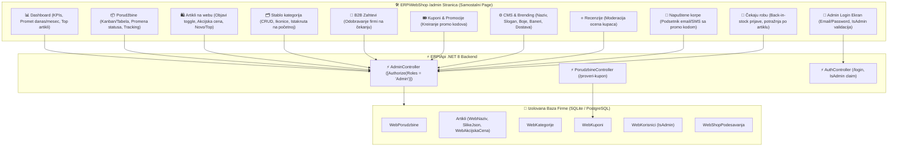

### Ključne mogućnosti Admin Stranice (`/admin`):
1. **Posebna samostalna stranica (Standalone Page), sa pravim rutama po tabu**:
   * URL `/admin` (ili `#/admin`) učitava potpuno odvojenu administrativnu stranicu preko celog ekrana — bez renderovanja prodavnice u pozadini.
   * Svaki tab živi na svojoj adresi: `/admin` je Dashboard, ostali nose svoje ime (`/admin/porudzbine`, `/admin/artikli`, `/admin/kategorije`, `/admin/osobine`, `/admin/b2b`, `/admin/kupci`, `/admin/kuponi`, `/admin/recenzije`, `/admin/reklamacije`, `/admin/napustene-korpe`, `/admin/obavestenja-zaliha`, `/admin/cms`). Klik u meniju menja adresu, ne samo prikaz — "Nazad"/"Napred" u pregledaču rade, adresa se može poslati kolegi ili obeležiti.
   * Uređivanje artikla i detalji porudžbine su zasebne stranice, ne modali: `/admin/artikli/:id` i `/admin/porudzbine/:id`. Osvežavanje stranice (F5) vraća na isti zapis umesto da tiho zatvori formu.
   * U gornjoj navigaciji nalazi se taster **`← Prodavnica`** za povratak na javni izlog (`/`) i taster **`Odjava`** za odjavu administratora.
2. **Namenski Admin Login ekran**:
   * Ukoliko korisnik nije ulogovan kao administrator, `/admin` prikazuje zaštićeni prozor za prijavu sa validacijom uloge (`IsAdmin = true`).
   * Prikaz naziva tekuće firme, upozorenje za naloge bez administratorskih ovlašćenja i dugme za brzu prijavu sa podrazumevanim nalogom (`admin@erpi.rs` / `admin123`).
3. **Potpuna izolacija po firmi (Multi-Firma / White-label)**:
   * Svaka firma konfiguriše sopstveni vizuelni identitet, boje, slogane, cene dostave i promo kupone koji se upisuju u bazu te firme.
4. **10 integrisanih modula u browseru**:
   * **Dashboard**: Finansijski pokazatelji prometa, broj porudžbina, B2B zahtevi na čekanju, top prodavani artikli i **⚠️ Artikli na izmaku zaliha (Low-Stock)**.
   * **Porudžbine**: Pretraga, filtriranje po statusu, stranica detalja (`/admin/porudzbine/:id`), štampa kurirskih adresnica (PDF), 1-klik kreiranje pošiljke kod kurirske službe, 1-klik kreiranje fakture u ERP-u i eksport u CSV.
   * **Artikli na webu**: Lista (kartice na mobilnom, tabela na desktopu) nosi sličicu prve slike artikla (§3dt) — do tada je red bio samo tekst, bez vizuelnog prepoznavanja artikla. Prekidač *"Objavi na webu"*, marketinški naziv i opis, akcijska cena, video, min. količina/korak količine, PDF prilozi (upload sa diska), bedževi *Novo* i *Top preporuka*, **masovna objava/sklanjanje** za više izabranih artikala odjednom, eksport kataloga u CSV, i **📷 masovni uvoz slika iz foldera** (§3dv, `MasovniUvozSlikaModal.tsx`) — folder na disku korisnika bira browser (`<input webkitdirectory>`), datoteke se po šifri iz naziva mapiraju na artikle (isto pravilo kao WPF `MasovniUvozSlikaWindow`), pa se pregled potvrđuje pre nego što ijedna slika ode na server; nezavisno od izbora redova, radi nad celim katalogom. Uređivanje jednog artikla (`/admin/artikli/:id`) je od §3dn podeljeno u 7 tabova po uzoru na PrestaShop — **Opis** (naziv/kategorija/opis/slike — upload, prevlačenje, adresa ili direktno fotografisanje kamerom telefona/tableta preko dugmeta „Fotografiši" (`AdminGalerijaSlika.tsx`, `capture="environment"`) —, video), **Detalji** (EAN/MPN/UPC/ISBN — polja EAN/UPC/ISBN se mogu popuniti i skeniranjem kamerom preko `BarkodSkenerModal.tsx`, isti `BarcodeDetector`/`getUserMedia` obrazac kao skener sa §20, samo bez pretrage kataloga, PDF prilozi, varijante), **Isporuka** (dimenzije pakovanja, težina, tekst na stanju/nema na stanju, dodatni trošak dostave, dozvoljene kurirske službe), **Zalihe** (trenutno stanje, prag za email upozorenje o niskoj zalihi, datum dostupnosti, dozvola porudžbine bez zalihe), **Cene** (akcijska cena, povezani artikli, količinski popusti), **SEO** (meta title/description sa brojačem karaktera, slug, tagovi) i **Opcije** (vidljivost svuda/samo katalog/samo pretraga/nigde, "samo na internetu", dobavljači vezani za artikal).
   * **Stablo kategorija**: Prikaz kao pravo stablo (uvlačenje po dubini, skupljanje/širenje grana), dodavanje podkategorije direktno iz reda roditelja, izbor roditeljske kategorije (sa zaštitom od ciklusa), URL slug, ikonica, oznaka *Istaknuta na početnoj*, **predloženi/obavezni atributi po kategoriji** (vidi odeljak „Predloženi/obavezni atributi po kategoriji"). Slika kategorije (§3dt) se od sada šalje sa diska (klik/prevlačenje, isti obrazac kao slike artikala, poseban `/slike/kategorije/{id}/` folder) ili unosi kao adresa — pre toga je postojalo samo golo tekstualno polje za URL, upload je dostupan tek posle prvog čuvanja nove kategorije (treba joj ID).
   * **B2B Zahtevi**: dva pod-taba (`B2bTab.tsx`) — **Zahtevi za naloge** (pregled pristiglih registracija pravnih lica, odobravanje/odbijanje jednim klikom) i **Cenovnik i limiti** (§3dv, `B2bCenovnikPodTab.tsx`): po partneru, ugovorene (bez PDV) cene po artiklu, kreditni limit i rok plaćanja — do §3dv se ovo moglo menjati samo iz WPF `PartnerCenovnikView`, sad isti `PartnerCenovnikService` (`ERPiData`) stoji iza oba ekrana, kroz `admin/b2b/partneri/{id}/…` endpointe.
   * **Kupci & CRM**: Centralni pregled svih registrovanih kupaca, B2B partnera, istorije porudžbina, ukupnog prometa (LTV), aktivacije naloga i B2B privilegija uz eksport u CSV, plus **ručno otvaranje B2B naloga iz šifarnika partnera** (dugme „Novi B2B nalog" — vidi odeljak ispod).
   * **Kuponi & Promocije**: Kreiranje promo kodova sa procentualnim ili fiksnim popustom, minimalnim iznosom korpe i datumskim rokom važenja.
   * **Recenzije**: Moderacija ocena kupaca — nove recenzije se ne objavljuju automatski, admin ih odobrava ili briše.
   * **Napuštene korpe**: Pregled korpi koje kupac nije pretvorio u porudžbinu, sa KPI pokazateljima (izgubljen prihod, stopa oporavka) i slanjem podsetnika (email/SMS) sa promo kodom.
   * **Čekaju robu** (§3dz, `/admin/obavestenja-zaliha`): Prijave kupaca na „obavesti me kada artikal bude na stanju" — koliko kupaca čeka, koliko je spremno za slanje (roba je stigla), spisak **najtraženijih rasprodatih artikala** kao lista za nabavku, i dugme „Pošalji sada" koje odmah pokreće isti prolaz koji pozadinski servis radi na svakih 10 minuta. Detalji u odeljku 18.
   * **CMS & Brending**: Izmena naziva šopa, slogana, tema, primarne i sekundarne boje, hero tekstova, banera, kurirskih/platnih/SMS integracija, loyalty programa i **📊 analitike/marketinga** (§3dv: Google Analytics ID, Meta Pixel ID, Google Client ID za prijavu Google nalogom — polja su od ranije postojala u modelu i na WPF tabu, samo ih web admin nije prikazivao).
5. **Obračun kupona na Checkout-u**:
   * Kupac na Checkout modalu može uneti promo kod (npr. `LETO2026`), sistem ga u realnom vremenu proverava preko `POST /api/porudzbine/proveri-kupon` i odmah umanjuje ukupan iznos korpe.
6. **Direktno podešavanje Backoffice naloga u desktop aplikaciji (`ERPiApp`)**:
   * U `WebShop Podešavanja` u desktop aplikaciji (`ERPiApp -> Podešavanja -> WebShop -> Tab 1: Osnovno & Plaćanja`), dodat je panel **🛠️ WebShop Backoffice Administratorski Pristup**.
   * Korisnik može direktno definisati `Admin Email` i postaviti novu lozinku za pristup `/admin` stranici za tu firmu (podrazumevano: `admin@erpi.rs` / `admin123`).
   * Taster **`🛠️ /admin`** u gornjem toolbar-u i u kartici omogućava jednoklikovno otvaranje Backoffice stranice u podrazumevanom web pregledaču.
7. **Generisanje i Štampa Kurirskih Adresnica (PDF)**:
   * U tabeli porudžbina i na stranici detalja porudžbine (`/admin/porudzbine/:id`) u Backoffice-u ugrađeno je dugme **`🖨️ Štampaj Adresnicu (PDF)`**.
   * Sistem dinamički generiše standardnu A6 kurirsku nalepnicu (`WebPorudzbinaAdresnicaDocument`) koja sadrži:
     * **Podatke o pošiljaocu:** Naziv firme, adresa, mesto, telefon i PIB.
     * **Podatke o primaocu:** Ime/naziv kupca, adresa isporuke, grad, poštanski broj, telefon i email.
     * **Finansijski status i otkupninu:** Istaknut iznos otkupnine (RSD) za pouzeće ili oznaka *"PLAĆENO UNAPRED"* za bezgotovinska plaćanja.
     * **Detalje o pošiljci i kuriru:** Broj porudžbine, izabrani kurir (PostExpress, Bex, DExpress, Aks), tracking broj i napomena kupca za kurira.
     * **QR Kod:** Skenabilni QR kod sa struktuiranim podacima o pošiljci.
8. **1-Klik Kreiranje i Knjiženje Fakture u ERP-u (`RacunOtpremnica`)**:
   * Dugme **`🧾 Kreiraj Račun u ERP-u`** u modalu porudžbine generiše zvanični izlazni račun-otpremnicu u ERP bazi sa svim stavkama, obračunatim PDV-om i rabatima, menja status web porudžbine u `Fakturisana`, i **odmah ga knjiži**: razdužuje magacin (materijalna kartica) i kreira nalog prodaje u glavnoj knjizi (kupac 204 / prihod 612 / PDV 470, uz nabavnu vrednost 501 naspram konta robe).
   * Račun se pravi iz **WebShop magacina** (podešavanje *Magacin za zalihe*) — istog onog iz koga se čita raspoloživa zaliha, pa razduženje ne može promašiti magacin.
   * Ako knjiženje ne uspe (npr. robu je u međuvremenu izdao neki drugi dokument), račun **ostaje kreiran** uz jasno upozorenje, a rezervacija se ne otpušta — roba se ne može prodati dva puta. Administrator ga proknjiži ručno u `RacuniOtpremniceView` kad reši zalihu.
9. **CRM Modul "Kupci" (8. Tab)**:
   * Analitika kupaca sa metrikama ukupno ostvarenog prometa (LTV), broja porudžbina, B2B/B2C statusa, kontakt podataka i mogućnošću trenutnog odobravanja B2B statusa ili blokiranja naloga.
10. **"Zalihe na izmaku" (Low-Stock Alert)**:
    * Na Dashboard-u se automatski prikazuje upozoravajući vidžet sa svim artiklima čije su zalihe u magacinima `<= 5` komada sa direktnim linkom na katalog.
    * Nezavisno od toga, svaki artikal može imati sopstveni prag (tab *Zalihe* na kartici artikla) — kad raspoloživa zaliha posle knjiženja porudžbine padne na ili ispod njega, administratoru ide email (`WebShopEmailService.PosaljiAlertNiskaZalihaAsync`), pod uslovom da je uključeno "Pošalji email administratoru" u CMS podešavanjima.
11. **Eksport Podataka u CSV / Excel**:
    * Dugmad **`📥 Eksportuj CSV`** na tabovima *Porudžbine*, *Artikli* i *Kupci* generišu UTF-8 formatirane CSV fajlove sa `\uFEFF` BOM zaglavljem za otvaranje u Microsoft Excel-u ili uvoz u kurirske i knjigovodstvene aplikacije.
12. **Automatizacija Oporavka Napuštenih Korpi (Abandoned Cart Recovery)**:
    * Na tabu `/admin/napustene-korpe` i u sekciji `/admin/cms` ugrađen je kompletan mehanizam za vraćanje kupaca koji su stavili robu u korpu a nisu dovršili kupovinu.
    * Slanje email i SMS obaveštenja nakon zadatog broja sati (podrazumevano 2h) uz podsticajni kupon kod sa popustom (npr. `VRATISE5` za -5%).
    * **Pozadinski servis** `NapusteneKorpeBackgroundService` (u `ERPiApi`) na svakih 15 minuta sam pokreće prolaz — bez ijednog klika u Backoffice-u. Prekidač *„Sam šalji podsetnik…”* u `/admin/cms` (i u `ERPiApp` → *Podešavanja → WebShop*) se čita u svakom tiku, pa uključivanje/isključivanje važi odmah, bez restarta API-ja.
    * **Promo kupon se zavodi u šifarnik pri slanju** (`NapusteneKorpeOporavakService.ObezbediKuponAsync`) — kod koji podsetnik reklamira mora da postoji kao aktivan `WebKupon`, inače bi pao na proveri pri naplati. Kupon koji je admin ručno napravio pod istim kodom se ne prepisuje.
    * Korpa se obeležava kao „podsetnik poslat” **samo kad je poruka stvarno otišla** — pad SMTP-a je ostavlja u redu za sledeći prolaz, umesto da je trajno isključi.
    * Dugme **`⚡ Pokreni automatski oporavak`** pokreće isti prolaz na zahtev, uz prikaz live statistike o spašenom prihodu.
16. **Google Identity Services (GIS) — Sign in with Google**:
    * Dinamička integracija zvanične `https://accounts.google.com/gsi/client` Google biblioteke.
    * Podrška za 1-klik prijavu i brzu registraciju kupaca preko Google naloga u modalu i na B2B/B2C formama.
    * Automatska dodela +50 loyalty bodova za nove registracije i bezbedna verifikacija `email_verified` polja u tokenu.

---

## 📦 12. Rezervacija Zaliha (Zaštita od Prodaje Iste Robe Dva Puta)

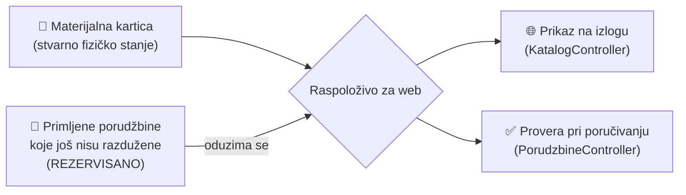

**Zašto postoji**: roba se sa materijalne kartice skida tek pri **knjiženju** računa-otpremnice
(`RacunOtpremnicaService.KnjiziRacunAsync`). Između trenutka kad kupac poruči i trenutka kad se račun
proknjiži postoji prozor u kome roba fizički još stoji na kartici iako je već prodata — bez rezervacije
bi se u tom prozoru mogla prodati proizvoljan broj puta.

**Kako radi**:
- `MaterijalnaKarticaService.GetRaspolozivoZaWebAsync()` = stanje na kartici **minus** količina
  rezervisana u već primljenim porudžbinama.
- Rezervacija se **otpušta** kada je porudžbina `Otkazana`, ili kada je njen vezani račun-otpremnica
  **proknjižen** (`IsKnjizen = true`) — tek tada je roba stvarno otišla sa kartice, pa bi dvostruko
  oduzimanje bilo pogrešno.
- Status `Fakturisana` sam po sebi **ne** otpušta rezervaciju. Fakturisanje sada doduše odmah i knjiži
  račun (§11.8), pa je prozor u praksi kratak — ali ako knjiženje ne uspe, rezervacija ostaje i štiti
  zalihu dok se račun ne proknjiži ručno.
- Kritična sekcija (provera zalihe + upis porudžbine) je serijalizovana kroz
  `WebShopPorudzbinaLockService`, pa dve porudžbine koje stignu istovremeno ne mogu obe proći za
  poslednji preostali komad. In-process brava je dovoljna jer `ERPiApi` radi kao poseban servis po
  firmi (jedan proces = jedna baza).

**Magacin za WebShop** (`WebShopPodesavanja.DefaultMagacinId`, ekran *Podešavanja → WebShop*): sve tri
putanje — prikaz zalihe na izlogu, provera pri poručivanju i kreiranje/knjiženje računa — koriste
**isti** magacin, pa razduženje pri knjiženju ne može promašiti magacin. Ako podešavanje nije
popunjeno, zaliha se čita kao zbir svih magacina, a račun ide na prvi magacin iz šifarnika (staro
ponašanje) — u tom slučaju knjiženje može puknuti ako je roba razbacana po više magacina, pa se
**preporučuje da se magacin eksplicitno podesi**.

**Napomena za administratore**: Dashboard i admin lista artikala u `/admin` namerno prikazuju
**fizičko** stanje sa kartice (ne umanjeno za rezervacije) — administratoru je bitno šta stvarno stoji
u magacinu. Kupac na izlogu vidi raspoloživo umanjeno za rezervacije.

---

## ⭐ 13. Ocene i Recenzije Artikala

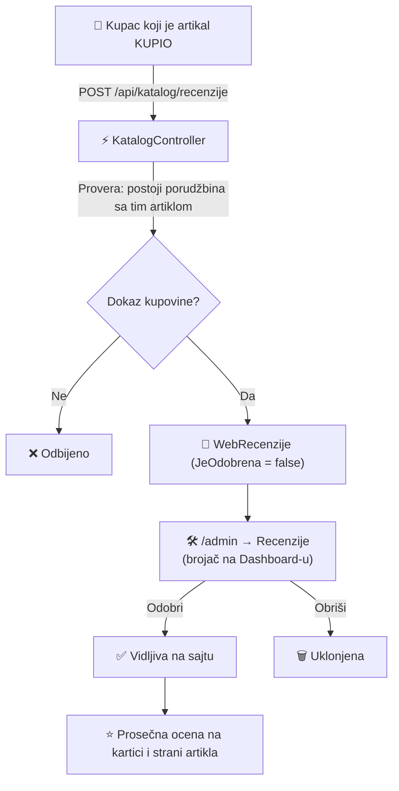

**Ko sme da oceni**: samo prijavljen kupac koji je taj artikal **stvarno naručio** (postoji stavka u
nekoj njegovoj porudžbini koja nije otkazana). Zato sve recenzije nose oznaku **Verifikovana
kupovina**. Isti kupac ne može oceniti isti artikal dva puta. Provera na serveru je autoritativna —
`GET /api/katalog/recenzije/moze/{artikalId}` postoji samo da frontend ne nudi formu koja bi sigurno
bila odbijena.

**Moderacija**: nova recenzija se upisuje kao **neodobrena** i ne vidi se nigde na sajtu — ni njenom
autoru — dok je administrator ne odobri u `/admin → Recenzije`. Neodobrene se ne broje ni u prosečnu
ocenu ni u broj recenzija. Pošto bi bez toga recenzije lako ostale zauvek na čekanju, **Dashboard i
bočni meni prikazuju narandžasti brojač** koliko ih čeka.

**Prikaz**: `ProductCard` pokazuje zvezdice i prosek samo ako artikal ima bar jednu odobrenu
recenziju (bez njih se ne crta ništa — prazne zvezdice bi delovale kao ocena 0). `ProductModal` ima
punu sekciju sa prosekom, listom recenzija i formom za ocenjivanje.

---

## 🚚 14. Kurirske Službe & API Praćenje Pošiljki (PostExpress, DExpress, Bex, Aks)

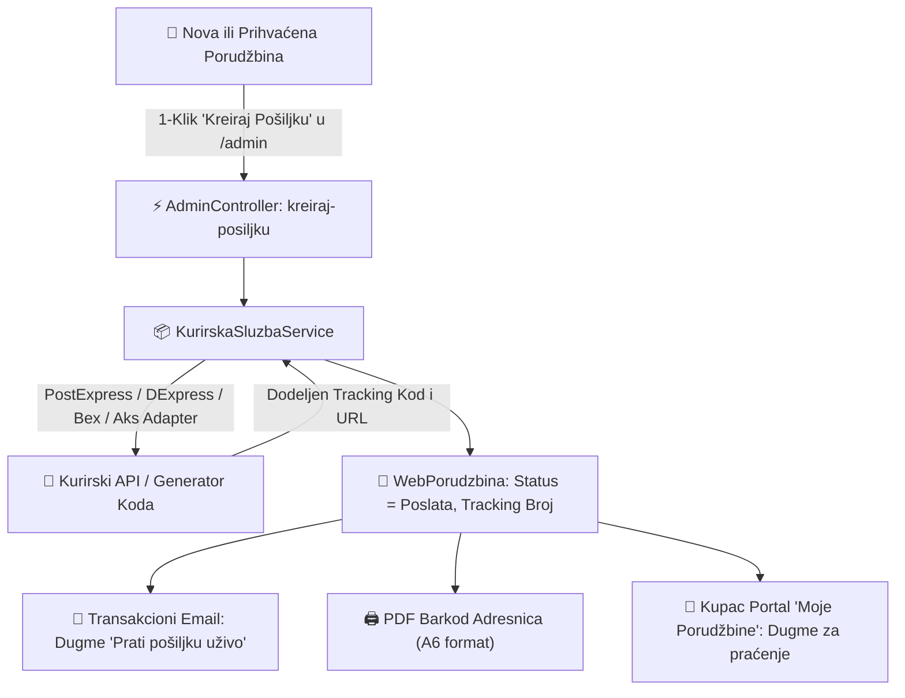

### Podržane Kurirske Službe i Tracking Formati:
1. **PostExpress (Pošta Srbije)**:
   * **Zvanični API portal**: `https://api.posta.rs`
   * **Format tovarnog lista**: `PE...RS` (npr. `PE260815123RS`)
   * **Live Tracking URL**: `https://www.posta.rs/lat/alati/pracenje-posiljke.aspx?broj={KOD}`
2. **DExpress (Daily Express)**:
   * **Zvanični REST API**: `dexpress.rs`
   * **Format tovarnog lista**: `DX...` (npr. `DX2608150012`)
   * **Live Tracking URL**: `https://www.dexpress.rs/rs/pracenje-posiljaka/{KOD}`
3. **Bex Express**:
   * **Zvanični API endpoint**: `https://api.bex.rs:62503/ship/api/Ship/` (`X-AUTH-TOKEN`)
   * **Format tovarnog lista**: `BX...RS` (npr. `BX260815456RS`)
   * **Live Tracking URL**: `https://bex.rs/pracenje-posiljke?broj={KOD}`
4. **Aks Express Kurir**:
   * **Zvanični REST servis**: `aks.rs`
   * **Format tovarnog lista**: `AK...` (npr. `AK2608150012`)
   * **Live Tracking URL**: `https://www.aks.rs/pracenje-posiljke/?broj={KOD}`

## 🎁 15. B2C Korisnički Nalozi & Loyalty Program (Program Lojalnosti)

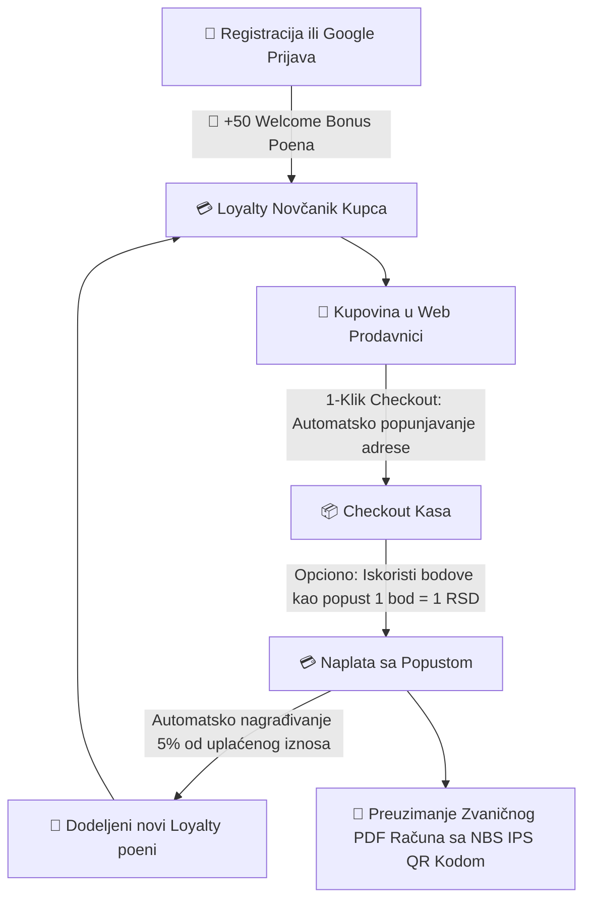

### Ključne Funkcionalnosti:
1. **👤 Korisnički Profili & Registracija**:
   - **Google Prijava**: Brza autentifikacija putem Google naloga (`POST /api/auth/google-login`).
   - **Email / Lozinka**: Standardna registracija fizičkih lica uz dodelu **50 Welcome Bonus Poena**.
   - **Profil & Loyalty Centar Modal**: Prikaz nivoa lojalnosti (*Bronzani*, *Zlatni*, *Platinasti VIP*), stanja bodova, novčane vrednosti u RSD i ličnih podataka.
2. **📍 Sačuvane Adrese & 1-Klik Checkout**:
   - Kupac u profilu definiše primarnu adresu za dostavu, grad, poštanski broj, telefon i specifičnu napomenu za kurira (interfon, sprat).
   - Prilikom odlaska na kasu (`CheckoutModal`), sva polja primaoca se automatski popunjavaju u 1 klik.
3. **🎁 Loyalty Program & Pravila Konverzije**:
   - **Osvajanje poena**: Svakom uspešnom kupovinom kupac osvaja definisani procenat nazad u poenima (podrazumevano 5% od iznosa).
   - **Korišćenje poena**: 1 bod = 1 RSD popusta pri sledećoj kupovini uz prag aktivacije (podrazumevano min. 50 bodova).
   - **Interaktivni Checkout Widget**: Kupac jednim prekidačem na kasi može primeniti sakupljene bodove kao popust i odmah vidi koliko novih bodova osvaja tom kupovinom.
4. **📄 Istorija Porudžbina & Preuzimanje PDF Računa**:
   - Kupac u sekciji *"Moje Porudžbine"* ima uvid u sve prethodne porudžbine, status isporuke, praćenje kurirske pošiljke, izvod utrošenih/osvojenih loyalty bodova, i direktno dugme **"Preuzmi PDF Račun"** (`GET /api/porudzbine/{id}/predracun-pdf`).
## 💳 16. Online Kartično Plaćanje (Payment Gateway & 3D Secure 2.0)

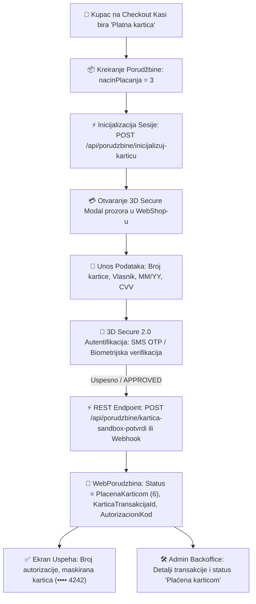

### Ključne Funkcionalnosti:
1. **💳 Podržani Platni Procesori & Gateway Standardi**:
   - **AllSecure / CorvusPay / Payten (Asseco) / NestPay (Banca Intesa, OTP Banka) / Stripe**.
   - Dinamičko potpisivanje zahteva digitalnim heširanjem (**SHA512** i **HMAC-SHA256**) sa tajnim ključem trgovca.
2. **🔐 3D Secure 2.0 Sigurnosni Protokol**:
   - *Mastercard Identity Check*, *Visa Secure* i *DinaCard 3D Secure* kompatibilnost.
   - Zaštita od neovlašćenog korišćenja kartica i drastično smanjenje odbijanja/otkazivanja paketa.
3. **⚡ Interaktivni Payment Modal & Kartični Vizuelizator (`PaymentGatewayModal.tsx`)**:
   - Dinamički 3D prikaz prednje i zadnje strane kartice (Visa / Mastercard / DinaCard) sa efektima i rotacijom pri unosu CVV koda.
   - Prečice za brzi unos testnih kartica za razvoj i testiranje.
   - Simulacija SMS OTP verifikacionog koraka za testiranje 3D Secure 2.0 toka.
4. **🔄 Webhook Endpoint za Automatsku Obradu Transakcija**:
   - `POST /api/porudzbine/kartica-webhook`: [AllowAnonymous] webhook za prijem asinhronih server-to-server notifikacija sa platnih procesora uz proveru digitalnog potpisa.
   - Automatski prebacuje status porudžbine u `WebPorudzbinaStatus.PlacenaKarticom = 6`.
5. **🛠️ CMS & Administracija**:
   - U `/admin` panelu pod sekcijom *"CMS & Podešavanja"* konfiguracija: izbor procesora, Merchant ID, Terminal ID, API Key, Secret HMAC Key i Sandbox/Live mod.
   - U pregledu porudžbina i detaljima prikazani autorizacioni kod, ID transakcije i maskirani broj kartice.

---

## 📱 17. Automatske SMS / Viber Notifikacije Kupcima

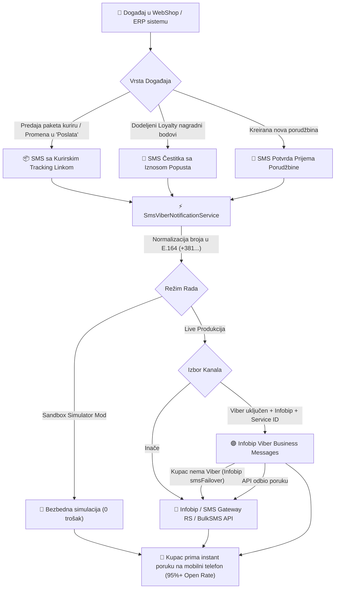

### Ključne Funkcionalnosti:
1. **📱 Podržani SMS & Viber Provajderi**:
   - **Infobip**: Vodeći regionalni i globalni provajder za transakcioni SMS i Viber Business Messaging API.
   - **SMS Gateway RS**: Specijalizovani domaći servis sa direktnim rutama ka svim operaterima u Srbiji (MTS, Yettel, A1).
   - **BulkSMS**: Pouzdan internacionalni SMS gateway za slanje poruka širom sveta.
2. **📞 Automatska Normalizacija Telefonskih Brojeva**:
   - Inteligentno čišćenje unosa kupca (`064/000-0000`, `063 111 222`, `0038165...`) u standardni E.164 međunarodni format (`+381640000000`).
3. **🚀 3 Automatska Scenarija Slanja**:
   - **🚚 Slanje kurirskog paketa:** Čim administrator u Backoffice-u ili ERP-u klikne *"Kreiraj pošiljku"* ili prebaci status u `Poslata`, kupac odmah dobija SMS: *"Poštovani, vaš paket WP-1024 je predat PostExpress-u. Status pratite na: https://posta.rs/... Hvala! ERPi Shop"*.
   - **🎁 Loyalty nagradni bodovi:** Pri registraciji, kupovini ili administratorskoj dodeli poena: *"Čestitamo Marko! Na vaš nalog je dodeljeno +100 Loyalty bodova (100 RSD popusta). Iskoristite ih pri sledećoj kupovini. Vaš ERPi Shop"*.
   - **🛒 Prijem porudžbine:** SMS potvrda sa brojem i ukupnim iznosom odmah po uspešno završenom checkout-u.
4. **🟣 Viber Business Messaging kanal (sa automatskim padom na SMS)**:
   - Uključuje se u `/admin` → *CMS & Podešavanja* (`ViberOmogucen` + `ViberServiceId`). Dostupan je **samo uz Infobip** provajdera — SMS Gateway RS i BulkSMS su čisti SMS gateway-i, pa su polja tada neaktivna.
   - Sva tri automatska scenarija (`PosaljiObavestenje*Async`) idu kroz `PosaljiPorukuAsync` u režimu `ZeljeniKanal.Automatski`: prvo Viber (jeftinije, bez ograničenja od 160 znakova), pa SMS.
   - **Dvostruka rezerva:** u Viber payload ide Infobip-ov `smsFailover` (pokriva kupca koji uopšte nema Viber ili poruku koja nije dostavljena), a ako sam API odbije zahtev, servis sam ponavlja slanje kao SMS. Rezervni SMS se ne šalje ako je SMS kanal izričito ugašen (`SmsOmogucen = false`).
   - Rezultat slanja (`SmsSlanjeRezultat.Kanal`) nosi `"VIBER"` ili `"SMS"` — dakle kojim je kanalom poruka **stvarno** otišla, ne kojim je zatraženo.
   - Test forma u Backoffice-u i podsetnici za napuštene korpe koriste `PosaljiSmsAsync`, koji je namerno vezan za `ZeljeniKanal.SamoSms` — uključen Viber im ne preotima kanal.
5. **🧪 Sandbox Simulator Mod & Interaktivni Test SMS Form**:
   - U `/admin` panelu pod sekcijom *"CMS & Podešavanja"* ugrađen je kontrolni panel sa prekidačem za Sandbox mod (omogućava besplatno testiranje bez trošenja kredita).
    - Forma za slanje probnog SMS-a na bilo koji uneti broj telefona jednim klikom (`POST /api/admin/sms/test-poruka`).

---

## 📈 18. Marketing Automatizacija: Povezani Artikli, Količinski Popusti & Napuštene Korpe

Implementiran je napredni sistem e-commerce marketing automatizacije koji direktno uvećava prosečnu vrednost porudžbine (**AOV - Average Order Value**) kroz Cross-Sell / Up-Sell i vraća do 20% nerealizovanih kupovina kroz automatski oporavak napuštenih korpi (**Abandoned Cart Recovery**).

### Arhitektura Marketing Toka:
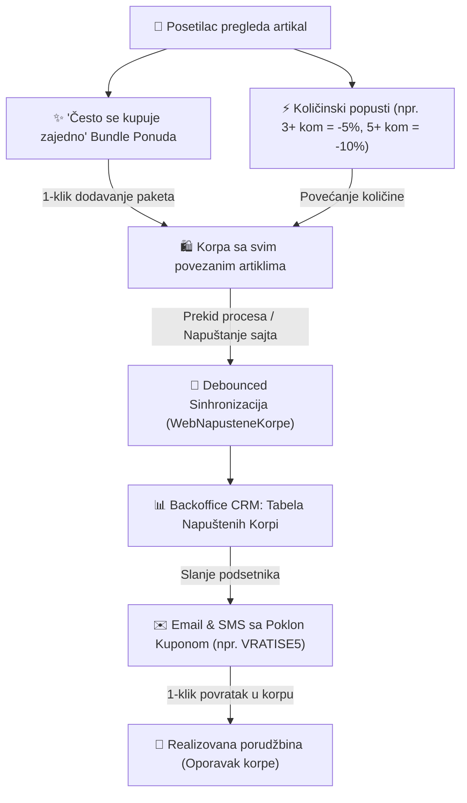

### Ključne Funkcionalnosti:

1. **✨ "Često se kupuje zajedno" (Cross-Sell / Frequently Bought Together)**:
   - Na `ProductModal` detaljnom prikazu proizvoda renderuje se interaktivni paket kompatibilnih artikala sa automatskim proračunom ukupne cene kompleta i jednim tasterom *"Dodaj izabrani komplet u korpu"*.
   - Ukoliko za artikal nisu ručno uneti povezani artikli (`PovezaniArtikliJson`), API inteligentno servira najpopularnije artikle iz iste kategorije ili istaknute proizvode (`GET /api/katalog/proizvodi/{id}/povezani`).
   - **Popust od 10% je stvaran, ne samo prikaz (ispravljeno 19.08.2026, §3du).** Do tada je
     `ProizvodDetalji.tsx` prikazivao "Ušteda 134 RSD (-10%)" i dugme "Kupi komplet uz 10% popusta",
     ali klik je zvao `dodajUKorpu` po punoj ceni za svaki artikal — obećan popust se nikad nije
     primenio, kupac je na checkout-u platio pun iznos. Sad `PorudzbineController.KreirajPorudzbinu`
     pri kreiranju porudžbine sam prepoznaje komplet (`IzracunajKompletClanove`: artikal A ulazi u
     komplet sa B ako je B u `A.PovezaniArtikliJson` I OBA su u istoj porudžbini — dovoljno da samo
     JEDAN od njih navede drugog) i upisuje `KompletPopustProcenat` (10%) na `RabatProcenat` svake
     pogođene stavke — **isto polje** koje već nosi količinski rabat, jače od ta dva pobeđuje
     (`Math.Max`, ne sabiranje, da se popusti ne gomilaju bez granice). `ProizvodDetalji.tsx` i dalje
     prikazuje isti broj kao PREGLED pre porudžbine, ali stvarna cena i dalje dolazi isključivo sa
     servera — frontend joj se ne veruje, isti obrazac kao svuda drugde u ovom API-ju.

2. **🏷️ Količinski Popusti (Volume / Tiered Discounts)**:
   - Proizvodi podržavaju pragove količinskih popusta (npr. 3+ komada = 5%, 5+ komada = 10%, 10+ komada = 15%).
   - Prikaz aktivnog nivoa u realnom vremenu na `ProductModal`, bedž popusta u `CartDrawer` uz transparentan prikaz ukupne uštede na količini (`ukupnaUstedaKolicinskogPopusta`).
   - Server-side validacija u `PorudzbineController.KreirajPorudzbinu` automatski dodeljuje odgovarajući procenat rabata na stavku.

3. **🛒 Oporavak Napuštenih Korpi (Abandoned Cart Recovery)**:
   - **Anonimno i registrovano praćenje:** Generiše se jedinstveni `korpaToken` i sinhronizuje u `WebNapusteneKorpe` tabelu (`POST /api/porudzbine/sinhronizuj-korpu`).
   - **Automatski oporavak:** Čim kupac završi bilo koju porudžbinu, sve njegove prethodno napuštene korpe se automatski označavaju kao oporavljene (`JeOporavljena = true`, `RealizovanaPorudzbinaId = id`).
   - **Backoffice Administracija (`/admin` → 🛒 Napuštene korpe):**
     - Dashboard analitika sa 4 KPI kartice: *Aktivne napuštene korpe*, *Potencijalni izgubljeni prihod*, *Spašene korpe*, i *Stopa konverzije oporavka (%)*.
     - Tabela sa listom kupaca, artiklima, iznosom i statusom.
     - Modal za slanje prilagođenog podsetnika sa generisanim poklon promo kodom (npr. `VRATISE5`) i opcionalnom SMS/Viber notifikacijom.
    - **Email Predložak:** Responsivan HTML email sa slikama, listom artikala, banerom za popust i direktnim linkom za završetak kupovine jednim klikom (`WebShopEmailService.PosaljiPodsetnikZaNapustenuKorpuAsync`).

4. **🔔 „Obavesti me kada bude na stanju" (Back-in-Stock, 20.08.2026, §3dz)**:
   - Na stranici rasprodatog artikla kupac ostavlja email (`ObavestiMeOZalihi.tsx`, anoniman
     `POST /api/katalog/obavesti-me-o-zalihi`). Kada se roba vrati na zalihu, sistem šalje **jedan**
     email sa linkom pravo na artikal (`WebShopEmailService.PosaljiObavestenjeODostupnostiAsync`).
   - **Prijava je jednokratna i ne recikliše se.** Poslata prijava se ne koristi ponovo — kupac koji
     hoće obaveštenje i sledeći put kad artikal nestane ostavlja novu. Prijave starije od 180 dana
     (`ObavestenjaOZalihiService.MaksStarostPrijaveDana`) se preskaču: poruka „vratili smo ga na
     stanje" pola godine kasnije je spam, ne prodaja.
   - **Zašto prolaz nad zalihom, a ne okidač u knjiženju kalkulacije.** Zalihu diže više putanja —
     kalkulacija, ulaz, uvozna kalkulacija, nivelacija, povrat od kupca, prenos između magacina,
     gotov proizvod iz proizvodnje, pa i otkazivanje web porudžbine koje oslobodi rezervaciju — a
     knjiži se iz WPF aplikacije, koja ne deli proces sa API-jem. Okidač na jednom od tih mesta
     ćutao bi na ostalima. Zato `ObavestenjaOZalihiBackgroundService` na svakih **10 minuta** gleda
     **istu** raspoloživost koju vidi katalog (`GetRaspolozivoZaWebAsync` nad web magacinom, dakle i
     minus rezervacije iz neispunjenih porudžbina) i šalje kada kupac zaista može da poruči. Cena je
     zaostatak od najviše jednog intervala.
   - **Neuspelo slanje ne obeležava prijavu.** Kad SMTP padne, red ostaje neposlat i ulazi u sledeći
     prolaz — obeležiti ga tada značilo bi tiho izgubiti kupca bez traga u sistemu.
   - **Backoffice (`/admin` → 🔔 Čekaju robu):** tri KPI kartice (*kupaca čeka*, *spremno za slanje*,
     *poslatih obaveštenja*), spisak **najtraženijih rasprodatih artikala** (potražnja po artiklu —
     lista za nabavku, ne samo za slanje), tabela prijava sa trenutnom raspoloživošću i statusom
     (*Čeka robu* / *Šalje se uskoro* / *Poslato* / *Istekla*), dugme „Pošalji sada" (isti prolaz
     odmah) i brisanje prijave.
   - Prekidač je u CMS-u (`WebShopPodesavanja.ObavestenjaOZalihiOmogucena`, podrazumevano uključen).
     Kad je isključen, forma se ne prikazuje kupcu i ništa se ne šalje — **već prikupljene prijave
     ostaju** i čekaju ponovno uključivanje.
   - Forma se **ne** prikazuje na artiklu koji dozvoljava predbelešku bez zalihe
     (`WebDozvoliNarudzbinuBezZalihe`) — tamo dugme za kupovinu već radi, pa bi nuđenje čekanja
     umesto porudžbine bilo protiv prodaje.

5. **⚡ „Kupi odmah" — ekspresna kupovina jednim klikom (20.08.2026, §3ea)**:
   - Pored „Dodaj u korpu" (stranica artikla, kartica u mreži, sticky mobilna traka) stoji dugme
     koje otvara mini-dijalog `EkspresKupovinaModal.tsx` sa **četiri** polja — ime i prezime,
     telefon, adresa, grad — i šalje porudžbinu za **jedan** artikal, bez prolaska kroz korpu i
     `CheckoutModal`. Email je opcion i skriven dok se ne klikne „Želim i email potvrdu".
   - **Korpa se ne dira.** Artikal se ne dodaje u nju ni pre ni posle — kupac koji je usput skupljao
     druge artikle zatiče korpu netaknutu.
   - **Sve što se ne pita je unapred izabrano:** plaćanje **pouzećem**, isporuka **kurirom**
     (podrazumevana služba iz CMS-a), bez kupona, loyalty poena i Click & Collect-a. Svaki od tih
     koraka bi pojeo razlog zbog kog ovaj tok postoji; ko ih hoće — ide kroz korpu.
   - **Zašto ipak i grad, kad je traženo „samo ime, telefon, adresa".** Bez grada kurirska pošiljka
     nema kome da se adresira (`WebPorudzbina.GradIsporuke`, koristi je i „Kreiraj pošiljku"), pa bi
     ušteda od jednog polja stvarala porudžbine koje se ne mogu poslati.
   - **Ne prikazuje se** u B2B režimu (tamo porudžbina traži PIB, ide na ugovorene cene i može da
     čeka odobrenje ovlašćenog lica ili kreditni limit), na varijabilnom artiklu sa kartice (prvo se
     bira boja/veličina), na rasprodatom artiklu, i kad je **pouzeće isključeno** kao način plaćanja
     (`KatalogController` vraća `EkspresKupovinaOmogucena && DozvoliPlacanjePouzecem`).
   - Prekidač je u CMS-u (`WebShopPodesavanja.EkspresKupovinaOmogucena`, podrazumevano uključen).
     `podrazumevanaPodesavanja.ts` ga drži na `false` dok podešavanja ne stignu sa servera — isti
     razlog kao za načine plaćanja: bolje ne ponuditi nego ponuditi ono što firma ne prima.
   - Uneti podaci se pamte u `localStorage` (`erpi_ekspres_kupac`), pa je **druga** ekspres kupovina
     stvarno jedan klik; prijavljen kupac ih dobija iz naloga. Porudžbina nosi napomenu „Ekspres
     kupovina — potvrditi telefonom" da prodavac na obradi zna da kupac nije birao kurira ni način
     plaćanja.
   - Server strana: `KreirajPorudzbinuRequest.KupacEmail` i `PostanskiBroj` su sada `string?`
     (porudžbina bez emaila je validna — potvrda ide telefonom/SMS-om), a `KreirajPorudzbinu` je
     dobio eksplicitnu validaciju koja je nedostajala: ime i telefon obavezni uvek, adresa i grad
     obavezni za kurirsku isporuku (ranije je prazan string prolazio i pucao tek kod kurira).
   - Čista logika (validacija polja, iznos, telo zahteva, pamćenje podataka) je u
     `utils/ekspresKupovina.ts` i pokrivena sa 17 vitest testova.

---

## 💬 19. Live Chat Podrška & WhatsApp / Viber Widget

Implementiran je višekanalni lebdeći (floating) vidžet u donjem desnom uglu prodavnice koji omogućava instant komunikaciju posetilaca sa prodajom i tehničkom podrškom, postavljanje direktnih pitanja o artiklima i brz kontakt preko popularnih aplikacija za dopisivanje.

### Ključne Funkcionalnosti:

1. **🟢 WhatsApp & 🟣 Viber 1-Klik Direktna Komunikacija**:
   - **WhatsApp Integracija:** Otvara WhatsApp Web ili mobilnu aplikaciju (`https://wa.me/...`) sa automatski predefinisanim tekstom poruke.
   - **Viber Integracija:** Pokreće Viber razgovor (`viber://chat?number=...`) sa brojem podrške definisanim u CMS-u.
   - **Direktan Telefonski Poziv & Email:** `tel:` i `mailto:` prečice za brzu vezu.

2. **🛠️ Interaktivni Panel za Upit o Artiklu**:
   - Kupac na `ProductModal` detaljima proizvoda klikom na *"💬 Pitajte prodavca o ovom artiklu"* automatski otvara chat vidžet u režimu forme sa prenetom slikom, nazivom i šifrom artikla.
   - Posetilac unosi svoje ime, email/telefon i pitanje.
   - Podaci se šalju na backend endpoint `POST /api/katalog/upit` koji automatski generiše profesionalni HTML email obaveštenja i šalje ga službi prodaje (`WebShopEmailService.PosaljiUpitZaArtikalAsync`).

3. **⚙️ Backoffice CMS Konfiguracija (`/admin` → Podešavanja)**:
   - Prekidač za uključivanje/isključivanje vidžeta (`ChatOmogucen`).
   - Podešavanje brojeva za WhatsApp, Viber i fiksni telefon.
   - Podešavanje email adrese za prijem upita kupaca.
   - Radno vreme podrške (prikazuje se u zaglavlju vidžeta uz online indikator).
   - Prilagođavanje poruke dobrodošlice.

---

## 🔍 20. Pametni Quick-Search Modal (Ctrl+K) & Barcode Skener Kamerom

Implementiran je napredni sistem brze pretrage inspirisan modernim Command Palette obrascima (`Ctrl+K` / `Cmd+K` / `/`), kao i optički skener barkodova preko kamere mobilnog telefona ili računara.

### Ključne Funkcionalnosti:

1. **⚡ Globalni Command Palette Modal (`QuickSearchModal.tsx`)**:
   - **Prečice:** Otvara se pritiskom na `Ctrl+K`, `Cmd+K`, taster `/` (kada fokus nije u tekstualnom polju) ili klikom na search traku u zaglavlju.
   - **Tastaturna Navigacija:** Kretanje kroz rezultate strelicama `↑` / `↓`, izbor tasterom `Enter` i zatvaranje sa `ESC`.
   - **Live Rezultati:** Prikazuje sličice proizvoda, šifre, kategorije, cene sa popustima i tačan status stanja na zalihama u realnom vremenu (*"Na stanju: X kom"* / *"Nema na stanju"*).
   - **Brzi Filteri:** Čipovi za instant filtriranje (*"⚡ Svi artikli"*, *"🏷️ Na akciji"*, *"✨ Novo"*, *"📦 Na stanju"*).
   - **Istorija Pretraga:** Automatski pamti nedavne pretrage u `localStorage` za brzo ponavljanje upita.
   - **Brze Prečice:** Direktni linkovi ka Listi želja, Upoređivanju, B2B Portalu i Istoriji porudžbina.

2. **📷 Web Barcode & QR Skener Kamerom (`BarcodeScannerModal.tsx`)**:
   - **Optičko Očitavanje:** Koristi HTML5 `MediaDevices.getUserMedia` i `BarcodeDetector` API za prepoznavanje standarda: **EAN-13**, **EAN-8**, **Code-128**, **Code-39** i **QR Code**.
   - **Vizuelni i Zvučni Odziv:** Animirani laserski nišan, zvučni signal (*880Hz audio beep*) i haptička vibracija mobilnog telefona pri uspešnom očitavanju.
   - **Kontrole:** Prekidač za blic / lampu (Torch) i prebacivanje prednje/zadnje kamere.
    - **Desktop Simulator:** Dugmad sa testnim barkodovima za jednostavnu simulaciju i testiranje bez fizičke kamere.
    - **Automatsko Otvaranje:** Čim kamera detektuje bar-kod, poziva se `GET /api/katalog/barkod/{kod}` i odmah se otvara `ProductModal` sa detaljima pronađenog artikla.

---

## 🌐 21. Višejezičnost i Viševalutnost (Multilingual & Multi-Currency)

Omogućeno je potpuno internacionalno poslovanje WebShop-a ka kupcima iz regiona (BiH, Crna Gora, Hrvatska, Severna Makedonija) i inostranstva (Evropska Unija i svet) uz preklopnike jezika i valuta, live NBS kursnu listu i višejezične atribute artikala i kategorija.

### Ključne Funkcionalnosti:

1. **🇷🇸 🇬🇧 🇩🇪 Preklopnik Jezika (Srpski / English / Deutsch)**:
   - Zaglavlje prodavnice i gornja promotivna traka (`AnnouncementBar.tsx`) sadrže selektor jezika.
   - Izbor jezika se perzistira u `localStorage` (`erpi_shop_lang`).
   - Kompletna lokalizacija korisničkog interfejsa (`LanguageCurrencyContext.tsx`) za navigaciju, korpu, checkout, pretragu, recenzije i korisničku podršku.
   - Višejezični nazivi i opisi artikala (`NazivEn`, `WebOpisEn`, `NazivDe`, `WebOpisDe`) i kategorija (`NazivEn`, `NazivDe`) uz pametni fallback na osnovni jezik.

2. **💱 Preklopnik Valuta (RSD / EUR / USD / BAM) & NBS Kursna Lista**:
   - Kupci mogu pregledati katalog i cene u domaćoj valuti (`RSD`), evrima (`EUR €`), američkim dolarima (`USD $`) i konvertibilnim markama (`BAM KM`).
   - Backend endpoint `GET /api/katalog/kursevi` servira zvanične kurseve Narodne Banke Srbije preko `KursnaListaService` sa pouzdanim fallback vrednostima.
   - Frontend kontekst vrši dinamički preračun (`iznosRsd / kurs`) i formatira iznose prema standardima izabrane valute i lokaliteta (`formatCena`).
   - Cene u korpi, detaljima artikla, popustima i količinskim uštedama se momentalno ažuriraju u izabranoj valuti.

3. **🗄️ Baza Podataka i API DTO Mappings**:
   - Tabele `Artikli` i `WebKategorije` proširene su novim kolonama sa automatskom migracijom (`EnsureDbSchemaUpdated`).
   - DTO modeli `ProizvodDto` i `KategorijaDto` mapiraju i prenose višejezične nazive i opise.

---

## 🔗 22. Adrese Stranica (URL Rute i Deljivi Linkovi)

Prodavnica koristi **React Router** (`BrowserRouter`). Do njegovog uvođenja jedina adresa koju je
aplikacija poznavala bila je `/admin`, i to preko ručnog `window.history.pushState`; sve ostalo
(otvoren artikal, izabrana kategorija, filteri, strana) živelo je u `useState`. Posledice su bile
da se link ka artiklu nije mogao poslati, da je „Nazad" na telefonu izbacivalo iz prodavnice
umesto da zatvori artikal, i da je osvežavanje stranice brisalo sve filtere.

### Rute

| Adresa | Značenje |
| :--- | :--- |
| `/` | Katalog |
| `/kategorija/*` | Katalog filtriran po kategoriji — putanja nosi ceo lanac predaka (`/kategorija/alati/elektricni-alati/busilice`), čita se samo **poslednji** segment (§3do). Stari jednosegmentni linkovi zato i dalje rade, a pogrešan roditelj u putanji se toleriše. Otvaranje nadkategorije prikazuje i artikle iz svih podkategorija. |
| `/proizvod/:sifra` | Otvoren artikal — **deljiv link**, `:sifra` je `SifraArtikla` |
| `/admin` | Backoffice stranica (vidi §11); `#admin` i `#/admin` se preusmeravaju ovde |

### Filteri u upitu

Filteri i stranicenje idu kroz query string, pa preživljavaju osvežavanje i mogu se poslati:

```
/kategorija/alat?q=busilica&brend=Bosch,Makita&minCena=1000&maxCena=5000&sort=naziv&strana=2
```

`q`, `brend` (zarezom razdvojeno), `minCena`, `maxCena`, `akcije=1`, `novo=1`, `naStanju=1`,
`sort` (`cena-rastuce` | `cena-opadajuce` | `naziv`), `strana`. Podrazumevane vrednosti se ne
upisuju u adresu.

⚠️ **Brojčani filteri po atributu (19.08.2026, §3du) NISU u ovoj listi** — namerno ostaju lokalno
stanje u `App.tsx`, ne URL. Dinamičan skup atributa po kategoriji (npr. "Snaga" u Alatima, ništa u
Nameštaju) bi tražio proizvoljne URL ključeve umesto fiksnog skupa gore; posledica je da se ti
filteri gube pri osvežavanju stranice, za razliku od `brend`/cena/kategorija. Vidi „Filter po
brendu i brojčanom opsegu" ispod za pun opis, uključujući stvaran bag koji je ovim istim krugom
zatvoren.

### Odluke koje nisu očigledne

- **Putanja ide u istoriju, upit ne.** Kategorija i artikal su „mesto" u prodavnici i pišu se
  `push`-om, pa Nazad zatvara artikal. Filteri se pišu sa `replace`, jer bi inače prelistavanje
  filtera napravilo desetine unosa kroz koje korisnik mora nazad da bi izašao.
- **Promena bilo kog filtera vraća na prvu stranu**, u istoj izmeni adrese (stara strana ume da
  bude van opsega novog rezultata).
- **Zatvaranje artikla je korak nazad** — osim kad je artikal prvi unos u istoriji (dolazak preko
  deljenog linka), gde bi Nazad značio izlazak sa sajta; tada se ide na `/`.
- **Kategorije stižu asinhrono**, pa se `:slug` ne može odmah prevesti u `WebKategorijaId`. Dok
  traje, katalog se filtrira po samom slugu (`GET /api/katalog/proizvodi?slug=…`), da se ne
  prikaže nefiltriran pa da tek onda „skoči".
- **Artikal iz deljenog linka** se traži prvo među već učitanim artiklima (klik iz kataloga = nula
  dodatnih zahteva); sa servera se dovlači samo kad ga tu nema. Pošto API nema endpoint za
  pojedinačan artikal, ide se preko pretrage pa se uzima tačan pogodak po šifri.

### Veza sa sitemap-om i hostovanjem

`SitemapController` emituje **iste** adrese (`/kategorija/{Slug}`, `/proizvod/{SifraArtikla}`).
**Zatvoreno (§3dv):** kategorija sad nosi celu hijerarhijsku putanju (`SitemapKategorija.Putanja`,
npr. `alati/elektricni-alati/busilice`), izvedenu penjanjem po `RoditeljKategorijaId` do korena —
isto što frontend radi u `kategorijaPutanja.ts` za `<link rel=canonical>`, pa se sitemap i kanonička
adresa više ne razilaze. Do §3dv je ovde stajao samo slug jednog nivoa (radilo je, čita se poslednji
segment, ali je pretraživač video razilaženje).
Ranije je emitovao `/?kat=` i `/?artikal={ArtikalId}` — oblike koje frontend nikad nije obrađivao,
pa je pretraživač za svaki artikal i kategoriju dobijao duplikat početne strane.

Iz istog razloga **varijacije ne ulaze u sitemap**: katalog izlistava samo matične artikle
(`RoditeljArtikalId == null`), pa `/proizvod/{šifra varijacije}` posetiocu javlja da artikal ne
postoji. Filter u `SitemapController` mora da prati filter u `KatalogController`.

Duboki linkovi rade i posle osvežavanja jer `ERPiApi` ima `app.MapFallbackToFile("index.html")`.
Bilo koji drugi način hostovanja statičkog `dist/` mora imati isti SPA fallback, inače
`/proizvod/...` vraća 404.

---

## 🧪 23. Kvalitet Koda: Testovi, Lint i Ponašanje bez Servera

### Katalog se ne izmišlja

`apiService` je ranije na svaku grešku tiho vraćao mock podatke — a `parseJsonResponse` je fallback
vraćao i na `!res.ok`, pa su HTTP 500, pogrešan proxy ili HTML redirect postajali lažan katalog.
Kupac je gledao nepostojeće artikle sa izmišljenim cenama i punio korpu; puklo bi tek na
`kreirajPorudzbinu`, jedinoj metodi koja fallback nikad nije imala.

Sada:
- `dohvatiJson` **baca** `ApiNedostupanError` na mrežnu grešku, HTTP grešku i odgovor koji nije JSON;
- mock se koristi **isključivo u razvoju** (`import.meta.env.DEV`) i uvozi se dinamički, pa ga
  produkcijski build fizički ne sadrži;
- kad katalog ne stigne, prikazuje se `ProdavnicaNedostupna` sa dugmetom „Pokušaj ponovo", a lista
  artikala se **prazni** — nikad se ne zadržavaju stare cene uz poruku o grešci;
- `ThemeProvider` kao polazno stanje koristi `podrazumevanaPodesavanja` (prazan naziv, svi načini
  plaćanja isključeni) umesto ranijeg mock brendinga sa izmišljenim imenom firme.

### Testovi

`npm test` — Vitest + Testing Library (`jsdom`):

| Fajl | Šta pokriva |
| :--- | :--- |
| `src/utils/cena.test.ts` | PDV po stopi artikla (ne fiksnih 20%), akcijska cena `0`/`null`, prednost ugovorene B2B cene, količinski pragovi |
| `src/utils/seoHelpers.test.ts` | Schema.org JSON-LD (Product, Offer, AggregateRating, Review, BreadcrumbList, WebSite, brend i čišćenje HTML-a) |
| `src/context/CartContext.test.tsx` | Dodavanje i spajanje stavki, uklanjanje na količini ≤ 0, zbir sa popustom, `localStorage` |
| `src/hooks/useKatalogUrl.test.tsx` | Preslikavanje filtera u adresu i nazad, reset strane, prevođenje sluga u id, oba načina zatvaranja artikla |

Testovi korpe renderuju u `React.StrictMode` **namerno** — tako radi i `main.tsx`. StrictMode dvaput
poziva funkcije za ažuriranje stanja da bi otkrio nečiste izmene, i upravo je to otkrilo bag u kom
je `dodajUKorpu` menjao postojeći objekat stavke (`[...prev]` kopira niz, ne stavke), pa je
dodavanje jednog komada davalo dva. Test koji ne koristi StrictMode propušta tu klasu bagova.

### Lint

`eslint.config.js` (ESLint 9, flat config) deli pravila namerno: **greška** je samo ono što označava
stvaran bag, **upozorenje** je čistoća koda. Kapija je nula grešaka.

`react-hooks/rules-of-hooks` je greška jer je upravo ta vrsta propusta rušila aplikaciju:
`MobileFilterModal` je imao `if (!otvoren) return null` **iznad** `useMemo`, pa je zatvoren modal
renderovao nula hukova a otvoren jedan — React na to baca „Rendered more hooks than during the
previous render" čim se filter otvori na telefonu.

Svesna odstupanja: prazan `catch {}` je dozvoljen (`allowEmptyCatch`) jer je ovde namerni obrazac;
GA4 i Meta Pixel snippeti u `AnalyticsContext` imaju lokalno isključenje za `arguments`/`.apply`
jer su doslovan vendor kod čiji oblik podatka ne sme da se menja.

### Pristupačnost modala

`useModalPonasanje` daje svim modalima Escape, zamku za fokus, zaključavanje skrola pozadine i
vraćanje fokusa na element sa kog su otvoreni. Hook se kači na postojeći overlay element, pa se
izgled nijednog modala nije menjao. Drži **stek** otvorenih modala — `PaymentGatewayModal` se
otvara unutar `CheckoutModal`, pa Escape zatvara samo gornji, a skrol se otključava tek kad se
zatvori poslednji. `PonudaPdfModal` je izuzet iz zaključavanja skrola jer se štampa
(`body { overflow: hidden }` ume da odseče sadržaj preko jedne strane).

### Stilovi: Tailwind CSS v4

Prodavnica koristi **Tailwind CSS v4**. Nekoliko stvari koje iznenade ako se očekuje v3:

- **`tailwind.config.js` ne postoji.** Tema se konfiguriše u `src/index.css`, kroz `@theme`.
  Tamo su vezane i boje koje admin podešava: `--color-blue-600` i `--color-blue-700` pokazuju na
  `--color-primary-rgb` / `--color-primary-dark-rgb`, a `--color-amber-500` na
  `--color-secondary-rgb`. Te trojke postavlja `ThemeContext` iz `WebShopPodesavanja`, pa promena
  boje u WPF-u menja i dugmad i ivice i gradijente i hover stanja. Modifikatore providnosti
  (`bg-amber-500/20`) v4 rešava kroz `color-mix`.
- **Tamna tema** ide kroz `@custom-variant dark (&:is(.dark *))`; klasu `dark` na `<html>`
  postavlja `ThemeContext`.
- **Lestvica senki je pomerena.** v3 `shadow-sm` po vrednosti odgovara v4 `shadow-xs`, dok v4
  `shadow-sm` odgovara v3 golom `shadow`. Pri migraciji je 54 upotrebe `shadow-sm` preimenovano u
  `shadow-xs` da izgled ostane isti — zvanični `@tailwindcss/upgrade` to **nije** uradio sam, jer
  je projekat imao prilagođen `shadow-xs` token.
- Ostala preimenovanja koja je alat sproveo: `focus:outline-none` → `focus:outline-hidden` (26),
  `bg-gradient-to-*` → `bg-linear-to-*` (39), `rounded` → `rounded-sm` (50), `backdrop-blur-sm` →
  `backdrop-blur-xs` (18), `flex-shrink-0` → `shrink-0`, `aspect-[4/3]` → `aspect-4/3`.
- **Podrazumevana boja ivice** je u v4 `currentcolor` umesto `gray-200`; `index.css` ima sloj koji
  vraća v3 ponašanje, da `border` bez eksplicitne boje ne uzme boju teksta.
- Prilagođeni tokeni iz v3 koji **više nisu potrebni**: `spacing 4.5` (v4 računa `w-4.5` sam) i
  `boxShadow.xs`. Zadržan je samo `--z-index-60`.

---

## 📱 Mobilni UX, CRO i PWA (Progressive Web App)

Preko 70% poseta dolazi sa mobilnih uređaja, stoga je implementiran posvećen paket mobilnih optimizacija:

### 1. Sticky „Dodaj u korpu” lebdeća traka (`StickyAddToCartBar.tsx`)
- Kada kupac skroluje nadole kroz opis, atribute i specifikacije artikla, `IntersectionObserver` prati kada glavno dugme za kupovinu izađe iz vidokruga.
- Na dnu ekrana (iznad `MobileBottomNav`) pojavljuje se fiksna traka sa:
  - Sličicom artikla
  - Nazivom i cenom (uz popuste)
  - Kontrolama za količinu (`-` / `+`)
  - Dugmetom *"U korpu"* uz `flyToCart` animaciju.
- Može se uključiti/isključiti u CMS podešavanjima (`stickyMobilnaKorpaOmogucena`).

### 2. Touch Swipe Galerija & Lightbox Zoom
- Na telefonima i tabletima kupac može listati slike prevlačenjem prsta levo/desno (touch swipe gestovi uz prag od 40px).
- Tačkasti indikatori (dots) prikazuju trenutnu sliku.
- Klik na sliku otvara **Lightbox Zoom modal** preko celog ekrana sa mogućnošću navigacije strelicama i minijaturama.
- Prekidač: `swipeGalerijaOmogucena`.

### 3. PWA (Progressive Web App) Podrška
- `public/manifest.webmanifest`: Definiše boje, ikone i ponašanje u `standalone` režimu.
- `public/sw.js`: Service Worker sa strategijom mrežnog keširanja statičkih resursa i offline fallback-om.
- `PwaInstallPrompt.tsx`: Nenametljiv baner koji osluškuje `beforeinstallprompt` događaj i nudi posetiocu *"Instalirajte na početni ekran"* sa pamćenjem odbijanja u `localStorage` (7 dana).
- Prekidač: `pwaOmogucen`.

### 4. Dugme „Popuni podrazumevano” u CMS-u
- U `/admin` panelu (tab *CMS & Podešavanja*) omogućeno je 1-klik dugme `🔄 Popuni podrazumevano` koje popunjava preporučene vrednosti za brending, hero tekstove, cene dostave, loyalty procente, podršku i mobilne prekidače.

---

## 🎨 Varijante Artikala (Boja / Veličina / Pakovanje / Zapremina)

Omogućeno je grupisanje povezanih artikala u porodicu varijanti:

- **Struktura baze**: Osnovni artikal nosi `JeVarijabilan = true`, a svaka varijanta pokazuje na njega preko `RoditeljArtikalId`. Svaka varijanta je **pun artikal u ERP šifarniku** sa sopstvenom šifrom, bar-kodom, prodajnom cenom, slikama i stanjem na lageru.
- **Katalog & Navigacija**: U katalogu se prikazuje samo jedna kartica (osnovni artikal) da se izbegne dupliranje. Na stranici artikla `VarijanteSelektor.tsx` nudi swatch dugmad za boje (sa hex kodom ili sličicom) i chip dugmad za veličine/pakovanja.
- **Trenutna zamena**: Sve varijante stižu uz roditelja, tako da klik na drugu boju trenutno menja cenu, stanje, barkod i sliku bez ponovnog učitavanja sa servera.

### Ose izbora i redosled dugmadi

- Osa je **atribut iz šifarnika** (`Atribut` / `ArtikalAtributVrednost`) — isti podaci koji hrane fasetirani filter kataloga, pa se ne uvodi drugi, paralelan opis istog svojstva.
- `WebShopVarijanteService.IzracunajOse` uzima kao osu samo atribut po kome se varijante **stvarno razlikuju** (dve ili više vrednosti) **i** kome je `Atribut.KoristiSeZaVarijante = true`. Redosled osa prati `Atribut.Redosled`, a redosled vrednosti unutar ose prati `WebRedosled` varijanti — tako operater kontroliše da „S, M, L, XL” ne ispadne abecedno „L, M, S, XL”.
- **`KoristiSeZaVarijante = false`** razdvaja "Osobine" (Boja/Veličina, postaju dugmad za izbor) od čistih **karakteristika/specova** za prikaz (npr. "Materijal", "Zemlja porekla") koje se nikad ne pretvaraju u kombinacije, čak ni kad se vrednost razlikuje između varijanti iste porodice — po uzoru na PrestaShop-ovu podelu "Osobine" / "Detalji-Karakteristike".
- Boja se crta kao kružni swatch kad postoji `AtributVrednost.BojaHex` (uneto jednom na "Osobine" ekranu), ili — za starije podatke bez šifarničke veze — kad se hex može izvesti iz teksta same vrednosti: zapis `Crna|#111827`, goli `#111827`, ili poznat naziv boje iz tabele u servisu. Nepoznat naziv bez šifarničke vrednosti ostaje obično dugme sa tekstom — hex se nikad ne pogađa.
- **Šifarnik dozvoljenih vrednosti** (`AtributVrednost`, npr. atribut "Boja" → vrednosti "Crna"/"Bela"/"Plava" sa svojim hex-om) postoji da se vrednost bira, ne otkucava iznova — bez njega bi "Crna"/"crna "/"CRNA" na tri artikla postale tri različite vrednosti. Slobodan tekst unet kroz generator varijanti (`VarijanteUredjivac`) se i dalje prihvata: `WebShopVarijanteService.PronadjiIliZavediVrednostAsync` ga poveže sa postojećom šifarničkom vrednošću (bez obzira na veliko/malo slovo) ili je sam zavede, tako da "Osobine" ekran vremenom sam popuni i iz ove ad hoc putanje, ne samo obrnuto.

### Dostupnost i „Rasprodato”

Selektor gleda celu porodicu, ne samo trenutnu varijantu: kombinacija koje nema na stanju se **precrtava sa oznakom „Rasprodato”**, a vrednost koje uopšte nema u porodici je isključena. Klik na boju uvek daje tu boju — ako baš ta veličina uz nju ne postoji, ostale ose se same premeste na najbližu varijantu koja je na stanju.

### Gde se varijante zavode

| Mesto | Šta radi |
|---|---|
| `/admin/artikli/:id` → „Varijante” (`VarijanteUredjivac.tsx`) | Generator kombinacija (Boja × Veličina × …), tabela sa šifrom, bar-kodom, cenom, akcijskom cenom, zalihom i objavom |
| `/admin/osobine` → „Osobine” (`OsobineTab.tsx`) | Šifarnik atributa i njihovih dozvoljenih vrednosti (naziv, tip, hex boja, redosled, da li je osa varijanti ili čista karakteristika) — nezavisno od bilo kog pojedinačnog artikla, po uzoru na PrestaShop „Osobine” |
| ERPiApp → Web katalog → artikal → tab „🎨 Varijante” | Isto, direktno u WPF-u nad istom bazom (`WebShopVarijanteService`) — nema poseban ekran za šifarnik, koristi se web „Osobine” |
| API | `GET/POST /api/admin/artikli/{id}/varijante`, `PUT/DELETE /api/admin/varijante/{id}`, `GET/POST/DELETE /api/admin/atributi`, `GET/POST/DELETE /api/admin/atributi/{atributId}/vrednosti` |

Generisanje se sme pokrenuti dvaput — postojeće kombinacije se preskaču, ne dupliraju. **Uklanjanje varijante koja je imala promet ne briše artikal iz šifarnika** (to bi odnelo istoriju): takav artikal se samo sklanja sa sajta i odvezuje od osnovnog.

### Gde se karakteristike (ne-varijantne osobine) upisuju na artikal

„Osobine” ekran (iznad) je samo **šifarnik** — definiše koji atributi postoje i koje vrednosti dozvoljavaju, nezavisno od bilo kog artikla. Do 19.08.2026 (§3dr) to je bila cela priča za `KoristiSeZaVarijante = false` atribute: postojao je servis koji ume da upiše vrednost na proizvoljan artikal (`WebShopVarijanteService.PostaviOpcijeAsync`), ali ga je pozivao samo generator varijanti — za čistu karakteristiku (npr. „Materijal: Pamuk”) nije postojao nijedan ekran koji bi tu vrednost upisao na sam artikal, samo napomena u UI-ju koja je upućivala na šifarnik i tu stala.

| Mesto | Šta radi |
|---|---|
| `/admin/artikli/:id` → tab „Osnovno” (`KarakteristikeUredjivac.tsx`) | Lista svih atributa iz šifarnika sa `KoristiSeZaVarijante = false`, sa poljem za vrednost (datalist predlaže postojeće šifarničke vrednosti) — upisuje na **ovaj konkretan artikal** |
| API | `GET/PUT /api/admin/artikli/{id}/osobine` — `PUT` prima `{ "Naziv atributa": "vrednost" }`, prazna vrednost briše zapis; poziva isti `PostaviOpcijeAsync` kao generator varijanti, samo nad osnovnim (ne-varijantnim) artiklom |

Nema WPF ekvivalenta — desktop `WebShopVarijanteService` konzumira ovaj isti podatak (za katalog/filter), ali nema poseban dijalog za upis karakteristika na artikal, isto kao ni web „Osobine” šifarnik.

### Masovna izmena karakteristike preko više artikala (19.08.2026, §3ds)

Popunjavanje iste karakteristike (npr. „Materijal”) na desetine artikala jedan-po-jedan kroz
`KarakteristikeUredjivac` je sporo — „Osobine” ekran, na stranici pojedinačnog atributa (`Osobine >
{atribut}`), ima dodatnu sekciju „Po artiklima” (`MasovnaIzmenaOsobine.tsx`, lenjo učitana): tabela
svih ne-varijantnih artikala sa poljem za vrednost po redu, pretraga po šifri/nazivu, „Sačuvaj
izmene (N)” čuva samo izmenjene redove odjednom. API: `GET/PUT /api/admin/atributi/{atributId}/artikli`
(`PUT` prima listu `{ ArtikalId, Vrednost }`).

### Tip „VišeIzbora” — atribut sa više vrednosti odjednom (19.08.2026, §3ds)

Svi ostali tipovi (`Tekst`/`Broj`/`Izbor`/`BojaHex`) čuvaju **najviše jednu** vrednost po
(artikal, atribut) paru — `PostaviOpcijeAsync` to pretpostavlja i tiho bi prepisala/obrisala višak.
Za atribute gde to ne odgovara (npr. „Sertifikati”: CE i RoHS istovremeno) postoji peti tip,
`VišeIzbora`, koji ide potpuno odvojenim putem:

- `WebShopVarijanteService.PostaviViseVrednostiAsync(artikal, atribut, vrednosti)` — upisuje SVE
  vrednosti odjednom, briše one koje više nisu u listi. `PostaviOpcijeAsync` eksplicitno **preskače**
  (`continue`) atribute ovog tipa ako se pozovu njime, da slučajan poziv sa jednostrukog puta
  (masovna izmena, generator varijanti) ne obriše postojeće višestruke vrednosti.
- API: `PUT /api/admin/artikli/{id}/osobine/{atributId}/vise` (telo: `["CE", "RoHS"]`).
  `GET /api/admin/artikli/{id}/osobine` vraća `Vrednosti` (lista) za sve tipove — za obične tipove
  ima 0 ili 1 element, za `VišeIzbora` ceo skup; `Vrednost` (jednina) ostaje `null` za ovaj tip.
- `KarakteristikeUredjivac.tsx` prikazuje čipove (dodavanje Enter/zarez, uklanjanje ×) umesto
  teksta za ovaj tip. Masovna izmena (iznad) i generator varijanti ga **odbijaju** (400) — oba
  pretpostavljaju jednu vrednost po artiklu, pa se `VišeIzbora` atribut ne nudi ni u OsobineTab
  formi kao osa varijanti (prekidač se automatski gasi i zaključava kad se izabere ovaj tip).
- Prikaz na strani proizvoda (`ProizvodDto.Atributi`, `Dictionary<string,string>`) spaja višestruke
  vrednosti zarezom (`KatalogController.MapirajProizvod`) umesto da uzme samo prvu — ranije bi
  `g.First()` tiho odbacio ostatak.

### Predloženi/obavezni atributi po kategoriji (19.08.2026, §3ds, nova tabela `KategorijaAtributi`)

Kategorija (npr. „Alati”) može da predloži ili zahteva određene karakteristike pri unosu artikla u
nju (npr. „Snaga”/„Napon”) — po uzoru na PrestaShop „Feature” po kategoriji. Ovo **vodi** unos, ne
ograničava ga: artikal i dalje sme imati bilo koji atribut iz šifarnika bez obzira na kategoriju,
ništa se ne blokira na snimanju.

| Mesto | Šta radi |
|---|---|
| `/admin/kategorije` → uređivanje kategorije (`KategorijaAtributiUredjivac.tsx`) | Čeklista svih ne-varijantnih atributa; čekiranje bira atribut kao predložen, dodatni prekidač „Obavezan” ga označava kao zahtevan |
| `/admin/artikli/:id` → tab „Osnovno” (`KarakteristikeUredjivac.tsx`) | Uz karakteristike koje kategorija artikla predlaže, značka „Predloženo” (sivo) ili „Obavezno” (žuto popunjeno / crveno prazno) |
| API | `GET/PUT /api/admin/kategorije/{id}/atributi` — `PUT` prima listu `{ AtributId, Obavezan, Redosled }`, potpuno zamenjuje skup preporuka (nezaokačeno se briše) |

Novi entitet `KategorijaAtribut` (`WebKategorijaId`, `AtributId`, `Obavezan`, `Redosled`) — jedinstven
indeks po (kategorija, atribut) sprečava duplikat. Brisanje atributa iz šifarnika (`ObrisiAtribut`)
čisti i ove redove.

### Šta varijante ne menjaju

Porudžbina, rezervacija zalihe, knjiženje računa-otpremnice i izveštaji rade nad varijantom **bez ijedne izmene**, jer sve to već radi nad artiklom. Recenzije i „često se kupuje zajedno” ostaju na osnovnom artiklu — kupac ocenjuje proizvod, ne baš crnu veličinu L — pa `JeKupioArtikalAsync` priznaje i kupovinu varijante kao dokaz kupovine osnovnog artikla.

---

## 🧩 Početna strana — Bento paneli i kalkulator rata (19.08.2026, §3dt)

`BentoGrid.tsx` (odmah ispod hero sekcije na `/`) je imao dva panela sa **tvrdo ukucanim** tekstom
napisanim za jednu konkretnu delatnost (alati/HTZ oprema) — `Kategorija.brojArtikala` postoji
(rekurzivan zbir sa podkategorijama) ali se nije koristio za ova dva panela:

- **Dve „top kategorija” pločice** sada prikazuju **stvarno** dve kategorije trenutnog kataloga sa
  najviše objavljenih artikala (`[...kategorije].filter(brojArtikala > 0).sort(...).slice(0, 2)`) —
  naziv, opis (`Kategorija.opis` ako postoji, inače „N artikala u ponudi”), sopstvena ikonica
  (`Kategorija.ikonica`, isti emoji koji koristi `QuickSearchModal`) i klik direktno na
  `webKategorijaId`, ne pogađanjem odgovarajuće kategorije po nazivu (`naziv.includes('alat')`).
  Namerno **ostaje algoritamsko** (najveće po broju artikala), ne kurirano preko
  `PrikaziUGlavnomMeniju` — admin bira kategorije za top meni iz drugog razloga (navigacija), ne
  nužno onih koje bi hteo istaknute na početnoj.
- **„Besplatna dostava” pločica** je pokazivala uvek isti tekst „> 5.000 RSD” bez obzira na stvarno
  podešen prag — sad čita `WebShopPodesavanja.PragZaBesplatnuDostavu` preko `useTheme()` konteksta
  (već dostupan globalno, bez novih props-a).
- **Kalkulator „Plaćanje na rate”** na strani artikla (`ProizvodDetalji.tsx`) je za SVAKI artikal,
  bez praga, delio cenu na 3/6/12/24 rate i tvrdio „0% kamata (Intesa/NLB)” — konkretna, neproverena
  tvrdnja o bankama bez ijedne stvarne integracije iza nje (za jeftin artikal je ispadalo apsurdno,
  npr. „24 rate po 23 RSD/mes”). Sad: prikazuje se samo iznad `MINIMALNA_CENA_ZA_RATE_RSD` (6.000
  RSD — praktični minimum za bankarske rate na kartici), imena banaka uklonjena, tekst promenjen u
  neutralno „uslove i broj rata potvrđuje vaša banka pri plaćanju karticom”.

Nijedna od ovih izmena ne dira API/šemu — sve je frontend, postojeći podaci (`Kategorija.brojArtikala/opis/ikonica`, `WebShopPodesavanja.PragZaBesplatnuDostavu`) su već stizali sa servera, samo se nisu koristili na ovom mestu.

---

## 🌐 SEO Rich Snippets & Social Share (Google Schema.org & OpenGraph)

Sveobuhvatna optimizacija za pretraživače i deljenje na društvenim mrežama i chat aplikacijama:

### 1. Google Schema.org JSON-LD (`seoHelpers.ts`, `SeoMeta.tsx`)
- **`Product` & `Offer` Schema**: Sadrži `name`, `description`, `image`, `sku`, `mpn`, `gtin` (bar-kod), cenu u RSD, raspoloživost (`InStock`/`OutOfStock`), `NewCondition` i podatke o prodavcu.
- **`AggregateRating` & `Review`**: Ako artikal ima odobrene recenzije, generiše se `aggregateRating` (`ratingValue`, `reviewCount`, `bestRating: 5`) za **prikaz žutih zvezdica direktno u Google rezultatima pretrage**.
- **`BreadcrumbList`**: Prikazuje putanju: Početna → Kategorija → Artikal.
- **`WebSite` & `Organization`**: Globalna pretraga i profil firme.

### 2. OpenGraph & Twitter Cards
- Dinamičko ažuriranje `<head>` tagova na svakoj stranici artikla:
  - `og:title`, `og:description`, `og:image` (apsolutni URL slike), `og:url`, `og:type: 'product'`, `product:price:amount`, `product:price:currency: 'RSD'`.
  - `twitter:card: 'summary_large_image'`, `twitter:title`, `twitter:description`, `twitter:image`.
- Kada se link artikla pošalje na WhatsApp, Viber ili Facebook, automatski se prikazuje vizuelna kartica sa slikom i cenom.

### 3. Social Share Vidžet (`SocialShareModal.tsx`)
- Dugme **„Podeli”** na stranici svakog artikla sa 1-klik akcijama za:
  - 🟢 **WhatsApp** (otvara chat sa porukom, cenom i linkom)
  - 🟣 **Viber** (1-klik prosleđivanje na Viber-u)
  - 📘 **Facebook** (FB share dijalog)
  - 📋 **Kopiraj link** (kopiranje uz notifikaciju)
  - 📲 **Sistemski Share** (na mobilnim uređajima).

---

## 🏢 B2B Veleprodaja: Matrica Varijanti & Slanje Cenovnika na Email

### 1. B2B Matrica za brzo poručivanje varijanti (`B2bMatricaVarijanti.tsx`)
- Na stranici `/b2b/brzo-narucivanje` dostupan je prekidač režima: **Tabelarni unos po šifri** ili **Matrica varijanti**.
- Za izabrani model sa varijacijama (npr. radna odela sa osama Boja i Veličina), generiše se 2D matrica sa:
  - Poljima za unos količine
  - Prikazom stanja lagera po svakoj kombinaciji
  - Zbirovima po redovima i kolonama
  - Brzim dodavanjem (`+1`, `+5`, `+10` po redu)
  - 1-klik dugmetom za dodavanje cele matrice u korpu.

### 2. Slanje personalizovanog B2B cenovnika/lagera na Email
- Na stranici `/b2b/fakture` dodato je dugme **„✉️ Pošalji na Email”**.
- Omogućava B2B partneru da sam sebi na email pošalje najnoviji ažurirani cenovnik u PDF, Excel ili PDF+Excel formatu sa svojim ugovorenim cenama i raspoloživim količinama na lageru.

---

## 🔍 Instant Live Search (Autocomplete pretraga)

Pretraga u realnom vremenu ugrađena direktno u zaglavlje prodavnice (`LiveSearchDropdown.tsx`):
- **Autocomplete meni u realnom vremenu**: Dok kupac kuca (već od 2 uneta slova), otvara se moderan plutajući prozor sa top 6 pogođenih artikala, cenom, slikom i stanjem lagera.
- **Predložene kategorije**: Automatski izdvaja kategorije koje odgovaraju unetom pojmu uz 1-klik prelazak na stranicu kategorije.
- **Tastaturna navigacija**: Strelice `ArrowDown` / `ArrowUp` za izbor stavke, `Enter` za otvaranje i `Escape` za zatvaranje.
- **Mobilna optimizacija**: Identično funkcioniše i u traci za pretragu na mobilnom meniju.

---

## 📦 Kurirske Adresnice & PDF Fakture sa NBS IPS QR Kodom

### 1. Štampa Kurirskih Adresnica (Nalepnica formata A6)
- **`WebPorudzbinaAdresnicaDocument.cs`**: Generiše standardnu A6 nalepnicu sa podacima pošiljaoca, primaoca, otkupninom, masom, brojem paketa i skenabilnim QR kodom.
- U admin panelu (i u listi i u detaljima porudžbine) dostupno je dugme **„Adresnica (A6)”** za 1-klik preuzimanje i štampu.

### 2. PDF Predračun / Faktura sa NBS IPS QR Kodom
- **`WebPorudzbinaPredracunDocument.cs`**: Generiše A4 memorandum sa stavkama i zvaničnim NBS IPS QR kodom za brzo plaćanje putem m-banking aplikacija domaćih banaka.
- **Slanje na Email**: Dugme **„Pošalji na Email”** u detaljima porudžbine šalje kompletnu fakturu direktno na email adresu kupca.

---

## 🔎 Filter po brendu i brojčanom opsegu (19.08.2026, §3du)

`FacetedFilterSidebar.tsx`/`MobileFilterModal.tsx` su odavno imali UI za filter po brendu, ali dva
sloja ispod njega nisu radila:

- **`brendovi` query parametar je stizao do `KatalogController.PreuzmiProizvode`, ali metoda ga
  uopšte nije primala kao argument** — ASP.NET ga je tiho ignorisao, pa checkbox za brend nije
  filtrirao ništa na pravoj prodavnici (radio je samo u offline/mock režimu, koji filtrira lokalno
  nad `mockData.ts`).
- **`sviArtikli` prop** (izvor za `izvuciBrendove()`, listu brendova sa brojem artikala) je za
  običnog B2C posetioca bio prazan niz — vezan je za `proizvodiZaB2b` stanje koje se puni samo kad
  je B2B portal otvoren. Sekcija „Brendovi” se zato retko i prikazivala van B2B moda.

Oboje je ispravljeno u istom krugu: `brendovi` sad filtrira SQL-translatabilno
(`Atribut.Naziv == "Proizvođač" || "Brend"`, isto pravilo imena kao `izvuciBrendove.ts`), a
`sviArtikli` pada nazad na trenutno učitanu stranu (`proizvodi`) kad B2B lista nije popunjena —
isti obrazac fallback-a koji `App.tsx` već koristi za `BentoGrid` prop dve linije iznad.

### Brojčani opseg — nova mogućnost, ne samo ispravka

Atributi tipa `"Broj"` (npr. „Snaga”, „Napon”) do sada nisu imali NIKAKAV filter — čak ni tekstualni
facet nije postojao za proizvoljne atribute, samo posebno-kodiran brend. Sad:

- `GET /api/katalog/brojcani-atributi?kategorijaId=X` vraća sve `Tip = "Broj"` atribute sa
  `PrikaziUFilterima = true` prisutne u kategoriji, sa stvarnim min/max iz artikala u opsegu — bez
  ovoga bočni filter ne bi znao koji opseg uopšte da ponudi.
- `GET /api/katalog/proizvodi?atributOpsezi=Snaga:500:1200,Napon::36` (format `Naziv:min:max`,
  prazna granica = otvoren opseg na tu stranu) filtrira po tim opsezima.
- **Vrednost atributa je TEXT kolona** (slobodan unos, isti razlog zbog kog `cena-rastuce`/
  `cena-opadajuce` sortiranje ide u memoriji — vidi odluku u `CLAUDE.md`/§3do): SQLite provajder ne
  ume da poredi tekst brojevno, pa se filtriranje po opsegu radi identičnim putem kao sortiranje po
  ceni — filtrirani skup (posle kategorije/pretrage/cene/brenda, koji SU SQL-translatabilni) se
  učita u memoriju, pa se tek tu `decimal.TryParse` svaka vrednost i poredi sa opsegom. Artikal bez
  tog atributa ili sa neparsivom vrednošću jednostavno ne zadovoljava opseg, ne baca grešku.
- `KarakteristikeUredjivac`/`OsobineTab` (admin) su nepromenjeni — ovo je čisto čitanje postojećih
  `Tip = "Broj"` vrednosti, ne nova vrsta unosa.

### Šta namerno ostaje van obima

Brojčani opsezi **ne idu kroz URL** (vidi napomenu u §22 iznad) — lokalno stanje u `App.tsx`, gubi
se pri osvežavanju stranice. `samoNaStanju` filter ima isti bag kao brend je imao (parametar se
šalje, `PreuzmiProizvode` ga ne prima) — **primećeno, NIJE ispravljeno u ovom krugu**, van obima
ovog zahteva (bio je konkretno o brendu i brojčanom tipu).


---

## 🔒 Pristup porudžbini bez naloga (JavniToken)

Gost-kupovina ne stvara nalog, pa se pristup sopstvenoj porudžbini ne može vezati za prijavu. `WebPorudzbina.JavniToken` je 32 bajta iz kriptografskog generatora (base64url), izdat jednom pri kreiranju porudžbine i vraćen **samo** u odgovoru na tu porudžbinu (`PorudzbinaOdgovorDto.JavniToken`). Nikad se ne vraća na listama ni na drugim endpointima.

Endpointi koji primaju porudžbinu po `WebPorudzbinaId` (`{id}/predracun-pdf`, `{id}/ips-qr`, `inicijalizuj-karticu`, `kartica-sandbox-potvrdi`) prolaze ako je zadovoljeno bilo šta od:

- poslati token se poklapa sa tokenom te porudžbine (poređenje u konstantnom vremenu),
- pozivalac je prijavljen kao vlasnik (`WebKorisnikId`),
- pozivalac je ovlašćeno lice (`MozeOdobravatiPorudzbine`) iste B2B firme (`PartnerId`),
- pozivalac je admin.

U svim ostalim slučajevima odgovor je `404`, isti kao za nepostojeću porudžbinu — `403` bi potvrdio da porudžbina postoji, pa bi redni ID-jevi ostali upotrebljivi za prebrojavanje prometa. Prazan token se nikad ne poklapa sa `NULL` kolonom, pa porudžbine napravljene pre uvođenja polja ostaju dostupne samo vlasniku i adminu.

**Klijent:** predračun se preuzima autentifikovanim `fetch`-om (`preuzmiMojPredracunPdf`), ne `<a href>`-om — Bearer zaglavlje ne putuje kroz navigaciju linka.

## 🔒 Kartično plaćanje — šta se odbija

- **Webhook** (`POST /api/porudzbine/kartica-webhook`): u live modu je digitalni potpis **bezuslovan**. Bez potpisa → `401`. Bez podešenog `KarticeSecretKey` → `503` (potpis se ne može proveriti, pa se ne veruje na reč). Samo sandbox mod preskače proveru.
- **Sandbox autorizacija** (`POST /api/porudzbine/kartica-sandbox-potvrdi`): postoji **samo** kad je `KarticeSandboxMod` uključen; u live modu vraća `404`. Simulira autorizaciju i upisuje `PlacenaKarticom` bez poziva ka procesoru, pa u produkciji ne sme da postoji.

---

## 🧾 Od web porudžbine do Računa-Otpremnice

Oba puta — ERPiApp (*Web Porudžbine* → „Generiši račun-otpremnicu") i web admin panel
(`POST /api/admin/porudzbine/{id}/kreiraj-fakturu`) — zovu isti `WebPorudzbinaFakturisanjeService`.

**Zaglavlje računa je uvek zbir stavki.** `KnjiziRacunAsync` gradi nalog glavne knjige iz zaglavlja
(2040 duguje `UkupnoZaUplatu`, 6120 potražuje `UkupnoOsnovica`, 4700 potražuje `UkupnoPdv`), pa svako
prepisivanje iznosa iz porudžbine direktno u zaglavlje izbacuje nalog iz ravnoteže. Provere ravnoteže
nema nigde u kodu — nalog se snima kakav jeste.

**Stavke:**

- Robne stavke nose `ArtikalId` i razdužuju magacin.
- Trošak dostave ide kao uslužna stavka „Troškovi dostave" **bez** `ArtikalId`. `TrosakDostave` je
  iznos sa PDV-om, pa se razdvaja na osnovicu i PDV; stopa prati stavku sa najvećom osnovicom.
- Kupon i loyalty popust se dele pro-rata po bruto udelu stavke i ulaze u efektivni `RabatProcenat`,
  da bi popust umanjio osnovicu po odgovarajućoj PDV stopi. Merodavna je `Osnovica` — `RabatProcenat`
  je `decimal(18,2)` i služi za prikaz.

**Partner:** B2B i prijavljeni kupci imaju svog; gost se traži po email adresi, pa se otvara nov
partner sa šifrom `WEB-00001`, `WEB-00002`, …

**Dvostruko fakturisanje** je odbijeno na nivou servisa (`RacunOtpremnicaId` već postoji), ne samo
zatamnjenim dugmetom.

**Plaćeno karticom:** rok plaćanja je datum računa (ne +15 dana), a napomena nosi datum plaćanja i
autorizacioni kod, da faktura ne bi ušla u otvorene stavke i opomene.

---

## 📜 Pravni tekstovi (Uslovi korišćenja, Politika privatnosti, Pravo na odustanak) i Cookie Consent

Zakonski obavezne stranice za srpsku e-trgovinu, CMS-uredive po firmi (isti obrazac kao brending u
`WebShopPodesavanja`) — vidi §3dh u dnevniku (docs/DNEVNIK_2026-08.md) za istoriju odluke.

- **3 nova polja na `WebShopPodesavanja`**: `UsloviKoriscenjaTekst`, `PolitikaPrivatnostiTekst`,
  `PravoNaOdustanakTekst` — čist tekst (bez HTML-a, bez potrebe za sanitizerom), uređuju se u
  `/admin/cms`. Dugme „Popuni podrazumevano" ubacuje gotov srpski pravni predložak (Zakon o
  zaštiti potrošača / zaštiti podataka o ličnosti) **samo kao polaznu tačku** — nije pravni savet,
  svaka firma treba da ga prilagodi (adresa za povrat, specifičnosti delatnosti).
- **Javne stranice** `/uslovi-koriscenja`, `/politika-privatnosti`, `/pravo-na-odustanak`
  (`PravnaStranica.tsx`) — prikazuju tekst sa `whitespace-pre-line`. Prazno polje daje fallback
  poruku umesto praznog ekrana. `Footer.tsx` linkovi vode na njih; ulaze u `sitemap.xml` sa niskim
  prioritetom (`SitemapGenerator.StaticnePravnePutanje`).
- **Cookie-consent baner** (`CookieConsentContext.tsx` + `CookieConsentBanner.tsx`) — kategorije
  Neophodni/Analitika/Marketing u `localStorage`. `AnalyticsContext.tsx` **stvarno gejtuje**
  učitavanje GA4 na pristanak za Analitiku i Meta Pixel na pristanak za Marketing — skripte se ne
  učitavaju dok posetilac ne odluči (ne samo informativna poruka).

---

## 🧾 Fiskalizacija B2C Web Porudžbina

Vidi §3di u dnevniku (docs/DNEVNIK_2026-08.md) za istraživanje i odluku o obimu.

- **Samo B2C** (`WebPorudzbina.JeB2B == false`) — B2B veleprodaja na odloženo plaćanje ostaje
  pokrivena isključivo SEF e-fakturom, kao i pre ove izmene (zakonski druga kategorija od prometa
  na malo).
- **Ugrađeno u „Kreiraj Račun u ERP-u"** (`WebPorudzbinaFakturisanjeService.FakturisiAsync`), ne
  poseban korak — isti redosled kao POS (`PosService.ZakljuciRacunAsync`): kreiraj dokument →
  fiskalizuj (`PfrService.FiskalizujRacunOtpremnicuIzKaseAsync`) → tek na uspeh knjiži. Koristi
  **istu** `Firma.PfrRezim/PfrUrl/...` konfiguraciju kao POS — nema posebnog WebShop PFR podešavanja.
- **Retry, ne trajno zaključavanje**: ako PFR ne odgovori, Račun-Otpremnica ostaje kreiran,
  nefiskalizovan i neknjižen; ponovni klik na isto dugme nastavlja odatle (fiskalizuje ako još
  nije, knjiži ako je fiskalizacija u međuvremenu prošla) umesto da samo javi „već fakturisano".
- Mapiranje načina plaćanja u PFR oznaku: Pouzeće→Gotovina, IPS/Uplatnica→Virman, Kartica→Kartica.
- Web admin (`/admin/porudzbine/:id`) prikazuje zelenu značku „🧾 Fiskalizovano (broj)" pored
  „Fakturisano u ERP-u"; WPF nije menjan — status ide kroz tekst poruke u `MessageBox`, isti
  obrazac kao za neuspelo knjiženje.

**Šta ostaje van obima:** ako je firma na Lokalnom PFR-u, mašina na kojoj `ERPiApi` radi kao servis
mora imati mrežni pristup tom uređaju — postojeće arhitekturno ograničenje.

---

## ↩️ Reklamacije / Povrat Robe

Tok zahteva (prijava → odobrenje/odbijanje → oznaka refundirano) — **bez** automatskog
knjigovodstvenog storna ili PFR refundacije, svesna odluka da se izbegne rizik greške u poreskoj
evidenciji u prvom koraku. Vidi §3dj u dnevniku (docs/DNEVNIK_2026-08.md).

- **2 nove tabele**: `WebReklamacija` (header: porudžbina, kupac, status, razlog, napomena admina,
  datumi) + `WebReklamacijaStavka` (koje stavke/količine — kupac često vraća samo deo porudžbine).
  `ReklamacijaStatus`: `NaCekanju/Odobrena/Odbijena/Refundirana`.
- **Kupac** (`MojePorudzbine.tsx`), na isporučenoj porudžbini, bira stavke + količinu + razlog →
  `POST /api/porudzbine/{id}/reklamacije`. Status čip ostaje vidljiv i posle osvežavanja stranice.
- **Admin** (`/admin/reklamacije`, `ReklamacijeTab.tsx`) — bedž na čekanju u bočnom meniju (isti
  obrazac kao recenzije), filter po statusu, Odobri/Odbij (uz opcionu napomenu)/Označi kao
  refundirano. **Ručni unos** za goste/telefon/email direktno na `/admin/porudzbine/:id`
  (`PorudzbinaDetaljiStranica.tsx`) — gost bez naloga nema „Moje porudžbine" stranicu.
- **Šta ostaje van obima:** „Označi kao refundirano" je samo status — administrator storno i dalje
  pravi ručno u Računi-Otpremnice/POS refundaciji, referencirajući odobrenu reklamaciju. Bez WPF
  ekrana (isti presedan kao recenzije/napuštene korpe/kuponi). Bez validacije 14-dnevnog roka
  (informativan tekst u `/pravo-na-odustanak`, admin ručno proceni).

---

## 🏬 Click & Collect (Preuzimanje u Prodavnici)

Lično preuzimanje porudžbine u magacinu/prodavnici, kao alternativa kurirskoj dostavi. Vidi
§3dk u dnevniku (docs/DNEVNIK_2026-08.md) — zamenjuje ranije potpuno izmišljen prikaz „Dostupnost po
magacinima" na stranici artikla (tri hardkodovana magacina sa izmišljenim količinama).

- **`Magacin.DostupanZaPreuzimanje`** (bool) + `AdresaPreuzimanja`/`GradPreuzimanja`/
  `RadnoVremePreuzimanja`/`TelefonPreuzimanja` — admin eksplicitno bira koji magacini se pokazuju
  na sajtu (namerno odvojeno od `VrstaMagacina == "Maloprodaja"`, jer postoji maloprodajni magacin
  bez šaltera za kupce). Podešava se u `/admin/cms` (`GET`/`PUT /api/admin/magacini-preuzimanje`).
- **`WebPorudzbina`** dobila `NacinIsporuke` (`Kurir`/`Preuzimanje`), `MagacinPreuzimanjaId` (FK),
  `DatumPreuzimanja`, i status `SpremnoZaPreuzimanje` (zamenjuje `Poslata` za ovaj način isporuke).
  `PorudzbineController.KreirajPorudzbinu` za `Preuzimanje` validira da magacin postoji i je
  dostupan, preskače trošak dostave (`TrosakDostave = 0`), i `AdresaIsporuke`/`GradIsporuke` na
  porudžbini postaju adresa **prodavnice**, ne kupca (koriste je i predračun/faktura/email).
- **Checkout** (`CheckoutModal.tsx`): kad postoji bar jedno mesto preuzimanja
  (`GET /api/katalog/mesta-preuzimanja`, javan), nudi prekidač Kurir/Preuzimanje; birana prodavnica
  ide u zahtev, adresa/grad se sakrivaju i ne validiraju, dostava je uvek 0.
- **Admin** (`PorudzbinaDetaljiStranica.tsx`): kartica statusa grana se po `NacinIsporuke` — kurirska
  („Kreiraj pošiljku") ili Click & Collect („Obeleži spremno za preuzimanje" → šalje email/SMS,
  isti prekidač obaveštenja kao kurirsko „poslato"; „Označi preuzeto" → upisuje `DatumPreuzimanja`,
  ne menja status).
- `MojePorudzbine.tsx`/`ProizvodDetalji.tsx` prikazuju stvarna mesta preuzimanja — blok se ne
  prikazuje ako firma nema nijedno otvoreno.

**Šta ostaje van obima:** WPF `WebPorudzbineView` ne zna za `NacinIsporuke`/`SpremnoZaPreuzimanje`
(kompajlira, samo nema Click & Collect dugmad — sav admin rad ide kroz web panel). Bez prikaza
zalihe po magacinu na stranici artikla (i dalje čita samo `DefaultMagacinId`).

## 🏢 Ručno otvaranje B2B/B2C naloga iz admina

Nalog na WebShop-u je do §3dp mogao nastati na samo dva načina: kupac se **sam registruje** pa ga
admin odobri, ili ga **postojeći odobravalac iste firme** doda sa B2B portala
(`B2bController.DodajKorisnikaFirme`). Nijedan ne pokriva najčešći slučaj kod prelaska sa
telefonskog naručivanja: prodavac već ima kupca u Finansijama i hoće da mu otvori pristup, bez
čekanja da se kupac registruje.

**Gde:** `/admin/kupci` → „🏢 Novi B2B nalog", i isto u ERPiApp → *Web & B2B korisnici* → dugme 🏢
(`NoviB2bNalogWindow`). Oba puta zovu `ERPiData.Services.WebShopB2bNalogService` — pravila su na
jednom mestu, pa se dve strane ne mogu razići.

**B2C (19.08.2026, §3dt):** isti ekran ima i dugme „Novi kupac" (bez veze sa ERP šifarnikom
partnera) — otvara običan maloprodajni nalog za kupca koji zove telefonom ili je fizički u radnji.
Isti servis, novi metod `WebShopB2bNalogService.KreirajB2cAsync(email, ime, prezime, telefon,
lozinka)`: bez partnera nema odakle da prepiše ime/prezime, pa su oba obavezna (za razliku od B2B
puta gde nedostajuće ime pada na „Kontakt ‹firma›"). `POST /api/admin/kupci` grana na osnovu toga
da li je `PartnerId` poslat — isti endpoint, isti odgovor (`AdminKreiranKupacDto`), ista email
poruka o pristupnim podacima (`WebShopEmailService` već granala subjekat/link po `JeB2B` i pre ove
izmene).

**Šta se prepisuje sa partnera, a šta se unosi:**

| Sa `Partner`-a (ne unosi se) | Unosi se |
| :--- | :--- |
| `NazivFirme`, `PibFirme`, `MaticniBrojFirme` | Email (predlaže se `Partner.Email`) |
| `Adresa`, `Grad` (iz `PttIMesto`) | Ime i prezime kontakt osobe (opciono) |
| `Telefon` (ako se ne unese drugi) | Telefon (opciono) |

Podaci firme se **uvek** uzimaju sa partnera — nalog otvoren ovim putem po definiciji jeste ta
firma, pa nema razloga da se prekucavaju i vremenom raziđu od šifarnika.

### Odluke koje nisu očigledne

- **Lozinka se generiše** (10 znakova, `RandomNumberGenerator`, bez `0/O/1/l/I` da se ne pogreši
  pri diktiranju telefonom) i šalje kupcu mejlom
  (`WebShopEmailService.PosaljiPristupnePodatkeNalogaAsync`). U bazi je samo PBKDF2 heš — ako mejl
  ne prođe (SMTP firme nije podešen), lozinka se **prikazuje adminu tog trenutka**, jer je to
  jedini put kad postoji u čitljivom obliku. Zato API vraća `lozinka` polje samo kad
  `emailPoslat = false`.
- **Prvi nalog firme je odobravalac porudžbina, svaki sledeći nije** — isto pravilo najmanje
  privilegije koje `B2bController.AzurirajKorisnikaFirme` već brani (firma ne sme ostati bez
  ijednog aktivnog odobravaoca).
- **Partner koji već ima nalog se ne krije nego označava** („— već ima nalog"); u WPF-u se izbor
  takvog partnera traži da se potvrdi. Firma sme imati više naloga (§3ci, tim na B2B portalu), pa
  bi tvrda zabrana bila pogrešna.
- **Ime i prezime su opcioni** — kad se nalog otvara iz šifarnika, kontakt osoba se često ne zna.
  Tada nalog stoji kao „Kontakt ‹naziv firme›" umesto da se izmišlja ime.
- **`Partner.JeKupac` se ne dira.** Lista partnera ima `samoKupci` filter, ali otvaranje naloga ne
  menja zastavice na partneru — upis u ERP šifarnik nije posao ovog ekrana.

---

## 3.39 Web ERP Backoffice & Admin Meni po ugledu na WPF (23.08.2026)

Web Admin panel (`/admin`) u potpunosti verno preslikava organizaciju i enterprise izgled WPF desktop aplikacije:
- **Enterprise Dark Meni**: Tamna pozadina (`#0F172A`), zaglavlje firme sa statusom, podaci prijavljenog operatera/administratora na dnu i `SidebarExpanderStyle` sekcije u akcentovanoj `#38BDF8` boji.
- **Direktno izlaganje ERP pod-menija**: Umesto horizontalnih dugmadi na vrhu pojedinačnih ekrana, sve stavke (Finansije, Robno, Materijalno, Proizvodnja, Osnovna sredstva, Zarade, SEF/Izvodi, Kasa, CMS/Firma) su izložene direktno u bočnom meniju kroz namenske module (`finansijeMeni.tsx`, `magacinMeni.tsx`, `materijalnoMeni.tsx`, `proizvodnjaMeni.tsx`, `sredstvaMeni.tsx`, `zaradeMeni.tsx`).
- **Single-open Accordion**: Otvaranjem bilo koje grupe menija ili izborom stavke, sve ostale grupe se automatski sklapaju.
- **Kodni Paritet**: Potpuni 100% paritet svih 176 WPF XAML prozora i 1.150 C# metoda sa 178 backend REST API endpointa i 680 Web interaktivnih handlera.

